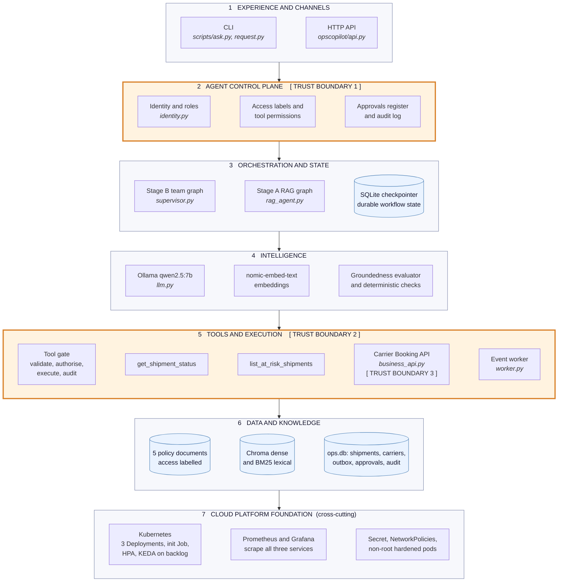
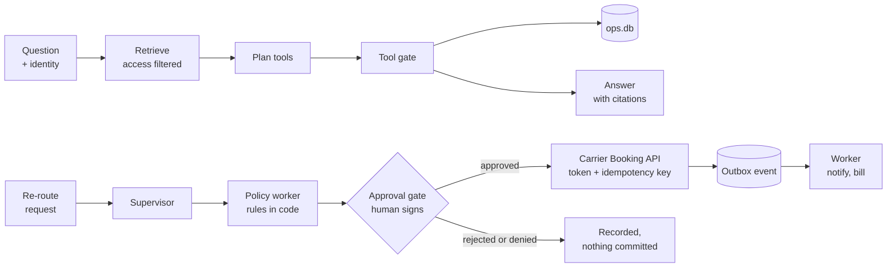
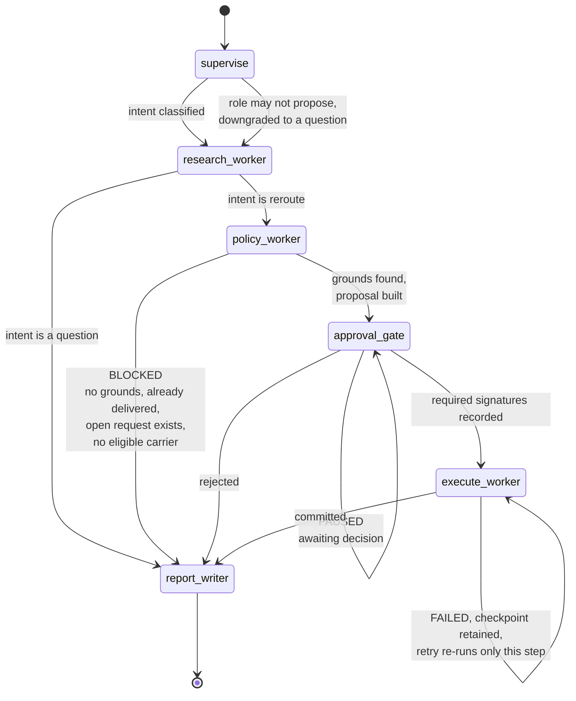
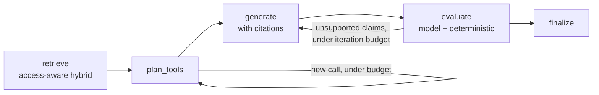
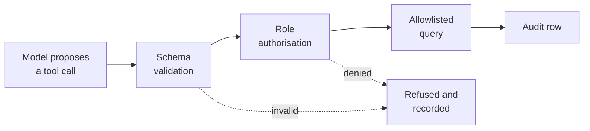

# Capstone Deliverables: Enterprise AI Operations Copilot

**Roll number:** 2023103027
**Name:** Dheirav Prakash
**Course:** Scalable Enterprise Architectural Deployments of Agentic AI Solutions, Industry Oriented Course, CEG Anna University Guindy
**Instructor:** Chandravadhana T.K.

This document presents the five capstone deliverables for the Enterprise AI Operations Copilot. The build prompt that generates the application is in `Operations_Copilot_Build_Prompt.md` and the complete source is in `opscopilot/`.

## The system in one paragraph

Meridian Logistics runs four carriers across five lanes out of Chennai. An operations team member asks the copilot questions such as "which shipments on Chennai to Mumbai are at risk?" and gives instructions such as "re-route SHP-1003, it looks stuck". Answers are grounded in five policy documents and live shipment data, and every claim carries a citation. A re-route changes a system of record, so it is prepared by the agent and committed only after the right human signs it. The whole path from question to evidence to action is traceable under one identifier.

Everything runs locally on a free stack: Ollama for the models, SQLite for state, LangGraph for the agent graphs. There are no API keys in the system.

---

# 1. Architecture Diagram

Layers, components, trust boundaries and integrations. The layers follow the course reference architecture, and each one names the files that implement it.

**Reading the stack.** A request enters at layer 1 and must pass layer 2 before anything else happens: no identity, no service. Layer 3 holds the graphs and the durable state, layer 4 the models, and layer 5 is the only place where anything acts on the world. Layer 6 is read through the allowlisted query service and the access-filtered index, never directly. Layer 7 is cross-cutting and hosts everything above it.

**The paths that matter, in order:**

## Trust boundaries

The three boundaries are where the architecture stops trusting the layer above it, and each is enforced in code rather than in a prompt.

| Boundary | What crosses it | What enforces it |
|---|---|---|
| 1. Identity and policy | A request carrying a user and a role | `api.py` requires both headers and refuses a request without them. Nothing defaults to a role. Roles map to document access labels and tool permissions in `identity.py`. |
| 2. Typed, authorised tool calls | A tool call the model proposed | `tools/shipments.py` validates the arguments against a Pydantic schema, checks the caller's role, runs an allowlisted query, and writes an audit row. The model cannot compose SQL and never holds a credential. |
| 3. The governed business API | An approved re-route | `business_api.py` is a separate service with its own bearer token. It recomputes the approver matrix from the shipment, refuses self-approval, and verifies the claimed signatures against the approvals register before it books anything. |

## Integrations

| Integration | Mechanism | Why this mechanism |
|---|---|---|
| Operations database | Allowlisted query service with fixed parameterised statements, read-only connection for reads | Module 5 rule: no arbitrary SQL in production. The query shape is fixed at build time and only the parameters vary. |
| Carrier booking | Synchronous REST with a bearer token, an `Idempotency-Key` header and a propagated `X-Trace-Id` | A command needs an immediate typed answer, and the idempotency key makes a retry safe. |
| Downstream notification and billing | `ShipmentRerouted` event through a transactional outbox, consumed asynchronously by the worker | A fact that something happened belongs on an event, which lets the consumers scale and fail independently. |
| Knowledge | Access-aware hybrid retrieval, dense plus lexical, fused by reciprocal rank | Read-only grounding with source attribution, filtered by the caller's access label before the model sees anything. |

---

# 2. Agent Workflow Design

Roles, states, tools, handoffs, approvals and failure paths.

## The team graph

## Roles and contracts

Each worker is a node with a typed contract. The contract is what lets the supervisor aggregate results and what makes a failure legible.

| Worker | Responsibility | Input | Output | Failure path |
|---|---|---|---|---|
| `supervise` | Classify the request as a question or a re-route, extract the shipment id, and check the caller may propose a re-route at all | Request text, identity | Intent, shipment id | A role without `propose_reroute` is audited and the request is answered as a question instead |
| `research_worker` | The Stage A RAG graph reused as a worker | Question, identity | Answer, evidence, tool results, citations, evaluator verdict | An unverifiable evaluator releases the answer marked `unverified`, never as grounded |
| `policy_worker` | Decide whether a re-route is permitted, choose the carrier, compute approvers and the idempotency key | Shipment id, evidence | Proposal with justification and citations | Returns a `policy_block` explaining which rule stopped it |
| `approval_gate` | Hold the action until the right humans sign | Proposal | Signatures, decision | An invalid decision is audited as denied and the gate stays open |
| `execute_worker` | Commit through the governed API | Proposal, approval | Request id, status | Raises so the checkpoint is retained; `retry` re-runs only this node |
| `report_writer` | Compose the outcome with evidence and the trace id | All of the above | Report | Not applicable, terminal node |

## The Stage A loop inside the research worker

The two budgets are the loop guard from Module 2. The planner makes at most two passes and at most four tool calls; the evaluator sends a draft back at most three times. Exceeding either ends the run with an explanation and a trace link rather than looping.

## Tools

| Tool | Arguments | Who may call it |
|---|---|---|
| `get_shipment_status` | `shipment_id` matching `SHP-NNNN` | All five roles |
| `list_at_risk_shipments` | optional `lane` | All five roles |
| `propose_reroute` | not a model-callable tool; it is the permission that gates the re-route path | `shift_supervisor`, `ops_manager` |

## Approvals

The approval matrix is SOP-OPS-014 section 3 encoded as code, not as prompt text.

| Condition | Approvers | Signatures required |
|---|---|---|
| Declared value below 50,000 INR | Shift supervisor or operations manager | 1 |
| Declared value 50,000 INR or above | Operations manager | 1 |
| Cold chain shipment | Operations manager **and** quality lead | 2, from two different roles |

Four rules guard the gate, and each one is tested:

1. The decider's role must be in the approver set for that proposal.
2. The requester can never approve their own request.
3. The approval must still be pending; a decided request cannot be re-decided.
4. For a two-signature approval, the second signer must be a different person in a different role.

A decision that fails any of these is recorded as `approval_denied` and the request stays pending for the rightful approver. This matters because the alternative, treating a bad decision as a rejection, would let anyone kill a pending approval.

## State and durability

The team graph checkpoints to SQLite, so a request paused at the gate survives a process restart and can be resumed by a different replica. This is the pod restart scenario from Module 6: critical state is externalised rather than held in pod memory. A failed execute keeps its checkpoint on that node, so the retry re-runs only the commit and never re-asks the model or the human.

---

# 3. Deployment Strategy

Runtime, scaling, resilience, environments and release.

## Runtime

One image serves three roles, selected by the container command. This keeps the build and the supply chain single while letting each role scale independently.

| Deployment | Command | Port | Purpose |
|---|---|---|---|
| `copilot-api` | uvicorn on `opscopilot.api:app` | 8000 | The copilot's HTTP surface |
| `business-api` | uvicorn on `opscopilot.integration.business_api:app` | 8001 | The governed system-of-record operation |
| `copilot-worker` | `python -m opscopilot.worker` | 9100 metrics | Consumes the outbox |

An init Job seeds the database and builds the retrieval indexes on the shared volume before the Deployments start. It seeds only if the database is absent, so a redeploy keeps the audit log.

## Image rules

Built from `requirements.lock` so every image is identical, tagged per commit, non-root user 10001, read-only root filesystem with `/data` and `/tmp` as volumes, all Linux capabilities dropped, `RuntimeDefault` seccomp, no secrets baked in, and a `.dockerignore` that keeps the virtualenv, databases and the environment file out of the build context.

## Scaling

| Component | Signal | Why |
|---|---|---|
| `copilot-api` | CPU at 70 percent, Horizontal Pod Autoscaler | Honest placeholder. The service is I/O bound waiting on the model, so CPU is a weak signal and more replicas only help once the model endpoint itself is scaled. The right target is in-flight requests per pod through a Prometheus adapter. |
| `copilot-worker` | `copilot_event_backlog`, KEDA ScaledObject, one replica per five queued events | Backlog is what actually measures demand for asynchronous work, which is the Module 6 lesson. The minimum is one replica, not zero, because the worker is the process that exports the gauge; at zero nothing would report the backlog that should wake it. |

## Resilience

| Control | Where | What it prevents |
|---|---|---|
| Timeout, three retries, exponential backoff with jitter | Business API client | Synchronised retry storms against a recovering dependency |
| Circuit breaker, opens after three failures, half-opens after 30 seconds | Business API client | Hammering an unhealthy dependency |
| Idempotency key on every booking | Business API | A retried approval booking the same shipment twice |
| Single transaction for the request row, shipment change, event and audit row | `commit_reroute` | A half-applied commit leaving a shipment moved with no event |
| Lease, handle, then acknowledge, with dead lettering after three attempts | Event worker | Losing an event when a worker dies mid-handle, and retrying a poison event forever |
| Per-call model timeout | `llm.py` | A stuck model pinning a server thread indefinitely |
| Externalised checkpoints | LangGraph SQLite saver | Losing an in-flight approval when a pod restarts |
| Kill switch, `ACTIONS_DISABLED` | Execute node | Any further commits during an incident; approved actions are held at the execute step and released by a retry once cleared |

## Environments and release

| Environment | Model | State | Business API |
|---|---|---|---|
| Laptop | Ollama on the host | SQLite files under `data/` | Mounted in-process, so the CLI and tests are a single process |
| Kubernetes, kind | Ollama on the host through the docker bridge | SQLite on a PersistentVolumeClaim | A separate Deployment reached over the network with a token |
| Production, described | A model gateway with routing and version pinning | Postgres and a managed vector store | The real carrier booking service |

Release goes through `deploy/kind-up.sh`, which builds a tagged image, creates the cluster with the NodePorts mapped, discovers the host address for Ollama, generates the API token as a Kubernetes Secret rather than committing one, runs the init Job, applies the Deployments and waits for the rollout. Rollback is `kubectl rollout undo` to the previous image tag. The prompt version is a constant inside the image, so it rolls back with the image; the model name is a ConfigMap value, so changing it is an edit plus a restart.

Quality gates before a release: 38 deterministic tests, 15 of which drive the supervisor graph with a stubbed model, plus a five question golden regression set that runs against the live model and asserts on citations and tool calls rather than wording.

---

# 4. Security Model

Identity, authorization, secrets, privacy, guardrails and audit.

## Identity

Identity arrives with the request as a user and a role, which a gateway sets from validated claims. Every endpoint requires both and nothing defaults to a role, so an unidentified request is refused rather than served as a junior user. The identity travels through every graph node and reaches the tool gate and the retrieval filter. It is never placed in a prompt, because a model that cannot see a credential cannot leak one.

The honest limitation: the copilot trusts the headers and does not validate a token itself. The business API does validate its bearer token. Deriving identity from a signed token is the documented next step.

## Authorization

Authorization is enforced in three places, none of which is the model.

| Layer | Rule |
|---|---|
| Retrieval | Documents carry an access label. The filter applies before fusion, so a confidential document never enters the context of a caller who lacks the label, which also means a prompt injection cannot reach it. |
| Tools | Validate, authorise, execute, audit. Reads are open to all roles; proposing a re-route is not. |
| Read endpoints | The approval inbox is visible to approver roles, a request's checkpoint to its requester and approvers, and the audit and event logs to managers. Evidence outside a viewer's access labels is stripped from what they see. |
| Actions | Retry is a manager action. The business API re-derives the approver matrix itself rather than trusting what the caller claims. |

## Secrets

The system has exactly one secret, the business API token. On a laptop it lives in a gitignored environment file whose example ships no usable value. In Kubernetes the deploy script generates it and creates a Secret, so no token is ever committed. It is mounted only into the two services that need it; the worker and the init Job do not get it. It is not in the image, not in logs and not in audit rows, and the comparison is constant time.

## Privacy

Documents are classified `internal` or `confidential`, and an unlabelled document fails ingestion rather than defaulting to visible. Long-term memory is limited to stable preferences with consent and a retention period. Event payloads and audit rows carry customer account names, not personal data. Retention is seven years for audit rows per the finance policy, 30 days for checkpoints, two days for metrics.

## Guardrails

| Guardrail | Mechanism |
|---|---|
| Prompt injection | Retrieved text and tool results are framed as data, never instructions. Structurally, the planner never sees retrieved text, so an injected document cannot trigger a tool call, and the re-route decision, carrier and approver set are computed in code from the database. |
| Invented citations | A deterministic check rejects any cited section id that does not exist in the retrieved evidence. |
| Unattributed facts | A shipment claim without a tool citation is sent back for revision. |
| Runaway loops | Iteration budget of three, tool-call budget of four, two planner passes, and a graph recursion limit. |
| Consequential actions | A human approval gate before any system-of-record write, with the four gate rules above. |
| Incident response | The kill switch holds every approved action at the execute step. |

## Audit

Every consequential step and every denied attempt is recorded with an actor, an action, a detail payload and the request's trace identifier: tool calls and denials, proposals, approval signatures, approvals, rejections and denied attempts, retries, commits, failures, kill switch holds, and the worker's downstream effects. The trace identifier is minted at intake, restored on every resume, propagated to the business API as a header and carried on the event row into the worker, so one identifier reconstructs the whole path from question to evidence to committed action.

## Responsible AI

Named owner: the operations manager on duty owns every action the copilot commits, and the network control centre owns the procedure it enforces. Risk tier: Approve level for writes, meaning a human signs every system-of-record change, and Supervise level for reads. Appeal: a rejected request can be re-raised, and the audit trail shows who rejected it and why.

---

# 5. Monitoring Dashboard Design

Health, trace, quality, safety, cost and business outcomes. The dashboard is `deploy/grafana-dashboard.json`, four rows, every panel backed by a metric the application actually exports.

## Row 1, AI quality and safety

| Panel | Query | Why it matters |
|---|---|---|
| Task success rate | `copilot_requests_total` by outcome over total | A drop here with healthy infrastructure points at a prompt, model or data change, not at the platform |
| Evaluator verdicts | `copilot_groundedness_total` by verdict | Separates grounded, unsupported and unverified. An evaluator that cannot produce a verdict is counted as unverified, never as grounded |
| Revision loops | `copilot_revisions` histogram, p90 | Rising revisions mean the writer and the evidence are drifting apart |

## Row 2, workflow

| Panel | Query | Why it matters |
|---|---|---|
| Approvals pending | `copilot_approvals_pending` | Shows whether the human gate has become the bottleneck |
| Approval decisions | `copilot_approval_decisions_total` by approve, reject, denied | A rising denied count means people are attempting decisions they are not entitled to make |
| Loop guard trips | `copilot_loop_guard_trips_total` | Each trip is a run that hit a budget instead of finishing |
| Tool calls by result | `copilot_tool_calls_total` by tool and result | Invalid arguments and policy denials are visible per tool |

## Row 3, health, trace and performance

| Panel | Query | Why it matters |
|---|---|---|
| Latency per step, p90 | `copilot_span_seconds` by step | Answers "which step was slow", which a single end-to-end latency number cannot |
| Event backlog and dead letters | `copilot_event_backlog`, `copilot_event_dead_letters` | Backlog drives worker scaling; a dead letter is work that needs a human |
| Events published versus handled | `copilot_events_total` by stage | A widening gap means the consumers are falling behind the producers |

Traces are per-step spans timed in code and emitted as structured log lines carrying the request's trace identifier, so one identifier reconstructs the request across the API, the business API and the worker.

## Row 4, cost and business outcomes

| Panel | Query | Why it matters |
|---|---|---|
| Tokens per step | `copilot_tokens_total` by step and direction | Shows which step is expensive, which is where routing a cheaper model would pay |
| Cost per successful business action | `copilot_tokens_total` over `copilot_successful_actions_total` | Ties spend to delivered value rather than to raw token counts, which is the Module 8 lesson |
| Re-routes committed | `copilot_successful_actions_total` over 24 hours | The business KPI: actions the system actually delivered |
| Prompt and model version | `copilot_build_info` | Every quality movement can be attributed to a version |

## Alerts

| Alert | Condition |
|---|---|
| Quality regression | Task success below 90 percent over 15 minutes |
| Cost runaway | Cost per request doubling against the seven day baseline |
| Loop instability | Loop guard trip rate above 2 percent |
| Stuck work | Any dead-lettered event, or approval age above the escalation guide's response time |

---

# Verification state

Reporting what was actually run rather than what should work.

| Suite | Result |
|---|---|
| Deterministic tests, model stubbed | 38 passed |
| Including the two retrieval tests that need Ollama | 40 passed |
| Golden regression set against the live model | 5 of 5, three consecutive runs |
| Live end-to-end scenario | Team lead denied at start, wrong-role and self-approval refused with the request left pending, kill switch held the approved action, retry committed it, worker handled the one event, audit trail complete under one trace id |
| Docker and Kubernetes | Not executed. Docker, kubectl and kind are not installed on the development machine, which needs root access to change. The manifests and the bring-up script were written to the Module 6 checklist and reviewed, but stage D is design and code rather than a demonstrated run. |

`opscopilot/HANDOFF.md` carries the full record, including the known rough edges.
