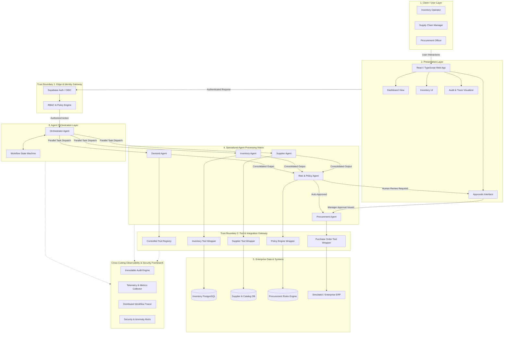
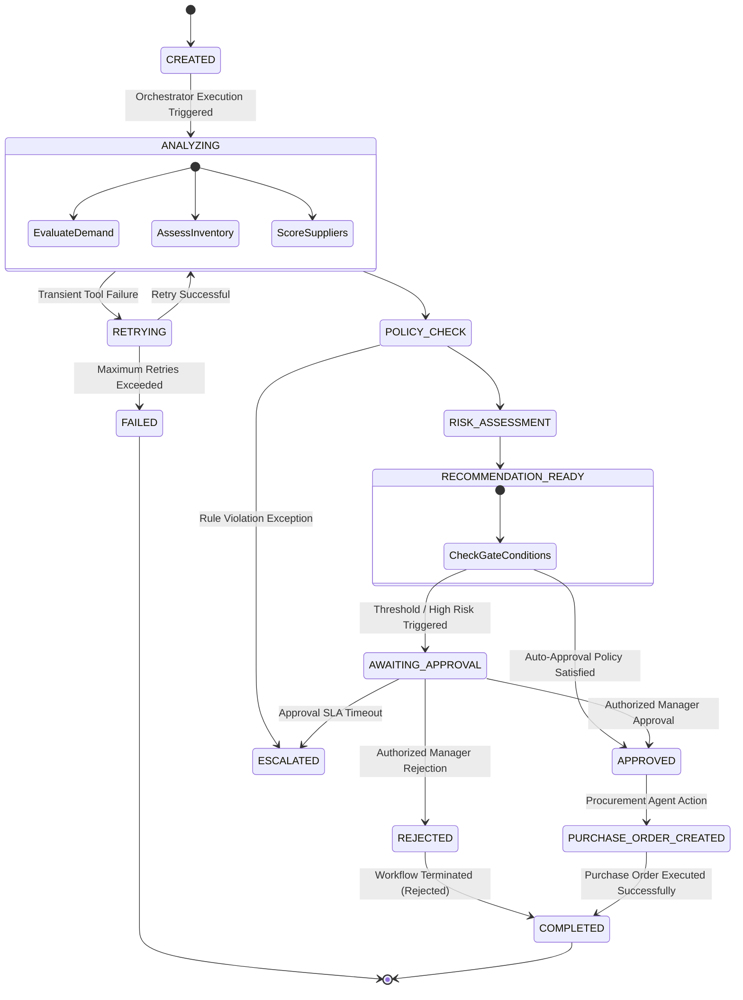
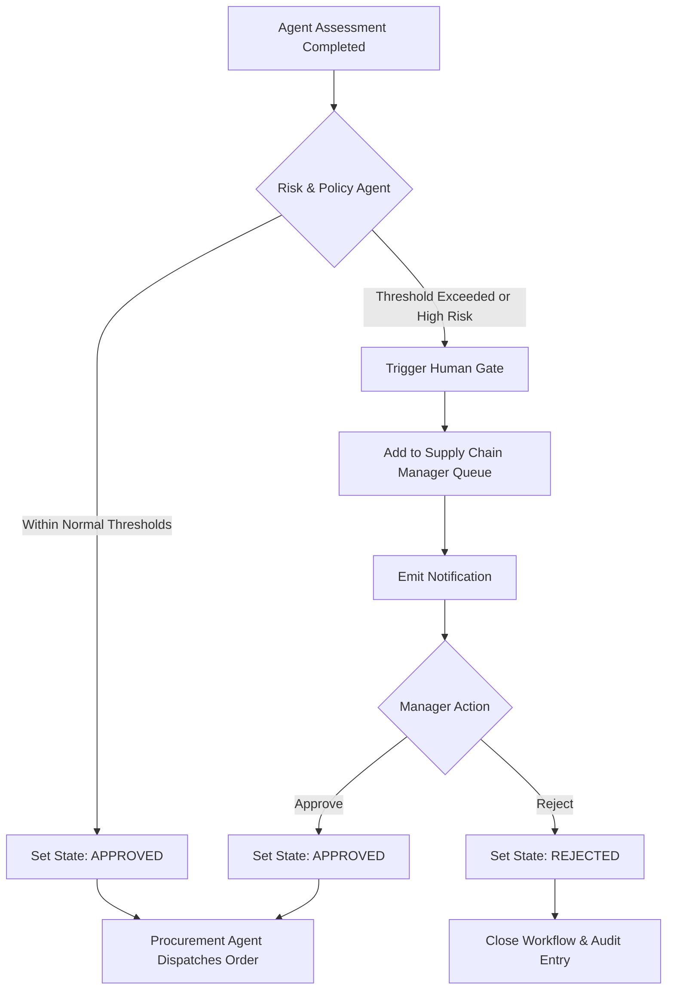
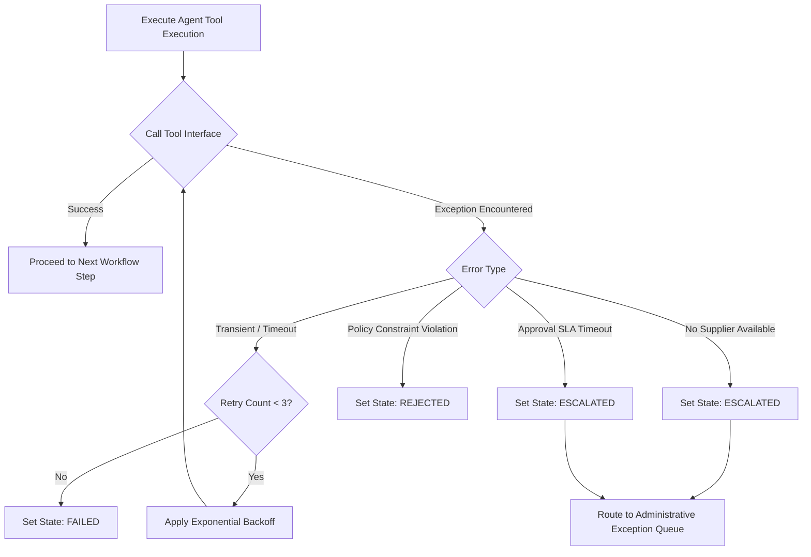
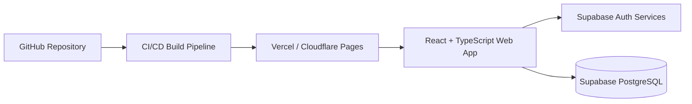
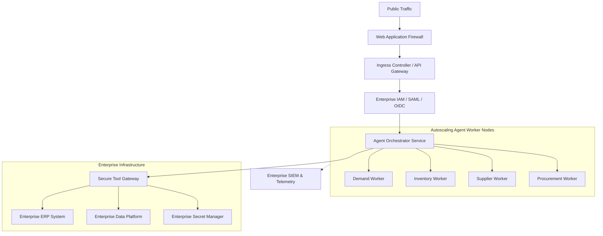
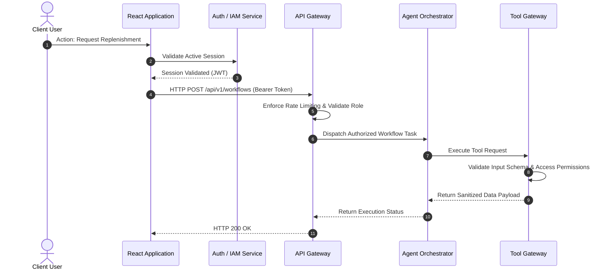
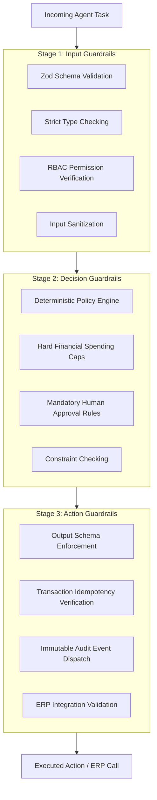
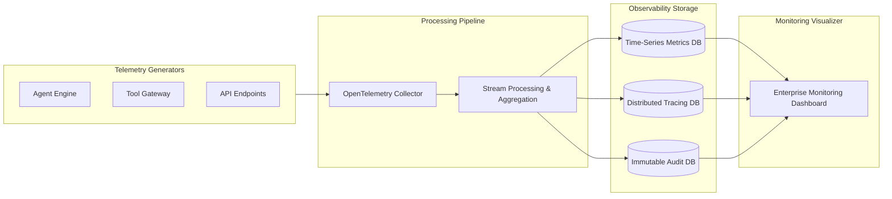
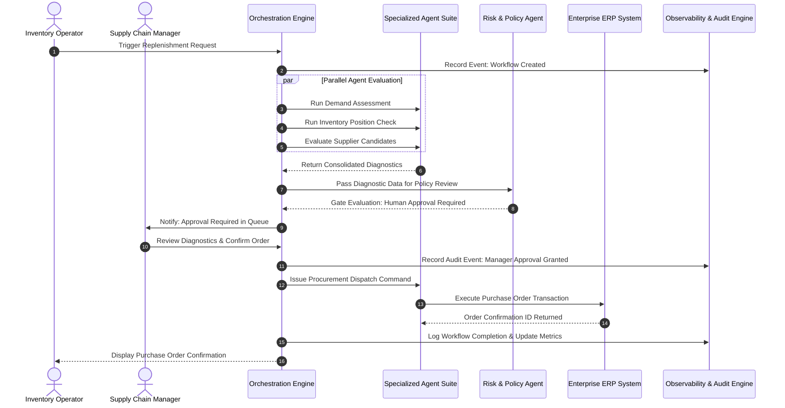

# SupplyChainIQ — Enterprise Agentic AI Architecture Deliverables

**Scalable Enterprise Architectural Deployments of Agentic AI Solutions**

**Project:** SupplyChainIQ — Agentic Inventory & Replenishment Platform

**Architecture Style:** Deterministic Multi-Agent Enterprise Workflow with Optional LLM Enhancement

**Prototype Stack:** React + TypeScript + Supabase PostgreSQL + Supabase Auth

**AI Strategy:** Deterministic agent policies for the prototype; optional LLM integration for natural-language explanations

**Deployment Model:** Cloud-hosted prototype with a production-ready enterprise architecture

## Executive Summary: Capstone Deliverables


| Deliverable                        | Description                                                                                |
| ---------------------------------- | ------------------------------------------------------------------------------------------ |
| **1. Architecture Diagram**        | Layers, components, trust boundaries, cross-cutting concerns, and tool integrations.       |
| **2. Agent Workflow Design**       | Roles, states, tools, handoffs, human approvals, and failure mitigation paths.             |
| **3. Deployment Strategy**         | Runtime environments, horizontal scaling, resilience patterns, and release pipeline.       |
| **4. Security Model**              | Identity, RBAC authorization, defense-in-depth guardrails, and immutable audit logs.       |
| **5. Monitoring Dashboard Design** | System health, agent telemetry, execution tracing, quality, safety, and business outcomes. |


## 1. Architecture Diagram

### 1.1 Multi-Dimensional Architecture Overview

The SupplyChainIQ architecture is structured as a defense-in-depth, request-driven enterprise system.




#### Step-by-Step System Execution Path

1. **Client Request Entry:** User interactions from the React Web App enter through `Trust Boundary 1` where authentication tokens and RBAC permissions are verified.
2. **Orchestration Dispatch:** The authorized request initializes a stateful workflow in the Orchestrator Agent.
3. **Agent Processing Matrix:** The Orchestrator runs Demand, Inventory, and Supplier agents in parallel, feeding consolidated output into the Risk & Policy Agent.
4. **Approval Routing:** High-risk or high-value orders route to the Approvals UI (`AWAITING_APPROVAL`); auto-approved orders proceed directly to the Procurement Agent.
5. **Tool Gateway Execution:** Agents execute actions strictly through controlled Tool Wrappers (`Trust Boundary 2`) to query database resources or trigger ERP purchase orders.
6. **Continuous Governance:** All operations concurrently dispatch metrics, execution traces, and immutable logs to the Observability framework.

### 1.2 Architecture Layers


| Layer                  | Primary Responsibility                                                           | Key Components                                         |
| ---------------------- | -------------------------------------------------------------------------------- | ------------------------------------------------------ |
| **Presentation**       | User interaction, data visualization, approval tasks, and audit logs.            | React, TypeScript, Tailwind CSS, shadcn/ui.            |
| **Identity & Access**  | Authentication, token validation, and granular authorization checks.             | Supabase Auth, JWT validation, RBAC enforcement.       |
| **Orchestration**      | State transition management, parallel agent execution, and exception routing.    | Orchestrator Agent, Workflow State Machine.            |
| **Specialized Agents** | Task-specific evaluation, forecasting, scoring, and policy validation.           | Demand, Inventory, Supplier, Risk, Procurement Agents. |
| **Tool / Integration** | Safe interfaces between autonomous logic and underlying transactional resources. | Input-validated tool wrappers, API connectors.         |
| **Enterprise Data**    | Persistent operational records, stock levels, vendor lists, and purchase orders. | Supabase PostgreSQL, Enterprise ERP.                   |
| **Observability**      | Telemetry, step tracing, audit logging, and performance alert generation.        | OpenTelemetry metrics, audit logger, health dashboard. |


### 1.3 Trust Boundaries

- **Boundary 1 — Edge Gateway & Identity Boundary:** Enforces secure user access.
  - *Controls:* Web Application Firewall (WAF), TLS 1.3 encryption, rate limiting, JWT validation, and RBAC authorization policies.
- **Boundary 2 — Agent Runtime to Enterprise Tools:** Isolates agents from direct data mutations.
  - *Controls:* Least-privilege tool wrappers, strict input schema validation (Zod/JSON Schema), transaction locks, and audit logging.

## 2. Agent Workflow Design

### 2.1 Agent Roles


| Agent                   | Core Function                                                              | Primary Output Artifact        |
| ----------------------- | -------------------------------------------------------------------------- | ------------------------------ |
| **Orchestrator Agent**  | Coordinates workflow execution and routes state transitions.               | Updated Workflow State         |
| **Demand Agent**        | Analyzes historical sales, seasonality, and consumption trends.            | Demand Assessment Vector       |
| **Inventory Agent**     | Calculates current stock levels, safety cushions, and reorder points.      | Inventory Risk Assessment      |
| **Supplier Agent**      | Evaluates vendor capacity, lead times, pricing structure, and reliability. | Supplier Recommendation Matrix |
| **Risk & Policy Agent** | Verifies procurement thresholds, financial limits, and compliance rules.   | Policy & Approval Decision     |
| **Procurement Agent**   | Formats and executes purchase order transactions against ERP APIs.         | Formatted Purchase Order       |


### 2.2 Workflow Lifecycle State Diagram




### 2.3 Workflow States


| State Name               | Operational Context                                                    |
| ------------------------ | ---------------------------------------------------------------------- |
| `CREATED`                | Initial replenishment request initiated via trigger or user action.    |
| `ANALYZING`              | Parallel processing across Demand, Inventory, and Supplier agents.     |
| `POLICY_CHECK`           | Rule processing against enterprise spend and procurement policies.     |
| `RISK_ASSESSMENT`        | Calculation of composite risk score and approval routing requirements. |
| `RECOMMENDATION_READY`   | Aggregation of recommendations and reasoning trace.                    |
| `AWAITING_APPROVAL`      | Suspended state awaiting human intervention in the approval queue.     |
| `APPROVED`               | Request confirmed automatically or by an authorized manager.           |
| `REJECTED`               | Request formally turned down; no downstream order placed.              |
| `PURCHASE_ORDER_CREATED` | Transaction successfully dispatched to ERP system.                     |
| `COMPLETED`              | Execution cycle finalized; state and audit record persisted.           |
| `RETRYING`               | Recoverable error encountered; backoff and retry cycle active.         |
| `ESCALATED`              | Critical error or timeout requiring human administrative review.       |
| `FAILED`                 | Terminal state for unrecoverable technical exceptions.                 |


### 2.4 Agent Tool Matrix


| Tool Wrapper            | Primary Consumer   | Functional Purpose                                                     |
| ----------------------- | ------------------ | ---------------------------------------------------------------------- |
| **Inventory Tool**      | Inventory Agent    | Queries stock levels, reserved items, and warehouse locations.         |
| **Demand History Tool** | Demand Agent       | Fetches historical order logs and seasonal parameters.                 |
| **Supplier Tool**       | Supplier Agent     | Retrieves catalog rates, SLAs, and historical vendor performance.      |
| **Availability Tool**   | Supplier Agent     | Interrogates real-time vendor capacity and availability APIs.          |
| **Policy Tool**         | Risk Agent         | Reads dynamic threshold limits, spend rules, and approval hierarchies. |
| **Risk Matrix Tool**    | Risk Agent         | Calculates multidimensional risk indicators.                           |
| **Purchase Order Tool** | Procurement Agent  | Formats and transmits purchase orders to ERP endpoints.                |
| **Notification Tool**   | Orchestrator Agent | Sends push notifications, emails, and UI webhooks.                     |
| **Audit Tool**          | All Agents         | Appends structured events to the immutable audit database.             |
| **Telemetry Tool**      | Orchestrator Agent | Tracks metric counts, execution latency, and error states.             |


### 2.5 Decision Rules & Logic Formulations

#### Stockout Risk Calculation

```
Projected Stock
  = Current Inventory
  − Expected Demand
  + In-Transit Stock
```

**Stockout Risk Level**

```
HIGH      if  Projected Stock  <  Safety Stock Level

MEDIUM    if  Safety Stock Level  ≤  Projected Stock  <  (Safety Stock Level × 1.5)

LOW       otherwise
```


| Stockout risk level | Condition                                                                          |
| ------------------- | ---------------------------------------------------------------------------------- |
| **HIGH**            | Projected Stock is below Safety Stock Level                                        |
| **MEDIUM**          | Projected Stock is at least Safety Stock Level, and below Safety Stock Level × 1.5 |
| **LOW**             | All other cases                                                                    |


#### Composite Supplier Score

```
Supplier Score
  = (w_price  ×  Price Score)
  + (w_lead   ×  Lead Time Score)
  + (w_rel    ×  Reliability Rating)
```

`w_price`, `w_lead`, and `w_rel` are policy-configured weights that sum to 1.

#### Mandatory Human-In-The-Loop Approval Conditions

Human review is enforced if **any** of the following is true:

```
Approval Required
  =  (Order Value  >  Policy Spending Limit)
  OR (Stockout Risk  =  HIGH)
  OR (Supplier Reliability  <  Minimum Quality Threshold)
  OR (Emergency Flag  =  TRUE)
```


| Gate             | Approval is required when                                   |
| ---------------- | ----------------------------------------------------------- |
| Spend limit      | Order Value exceeds the Policy Spending Limit               |
| Stockout risk    | Stockout Risk is HIGH                                       |
| Supplier quality | Supplier Reliability is below the Minimum Quality Threshold |
| Emergency        | Emergency Flag is TRUE                                      |


### 2.6 Human-in-the-Loop Approval Routing




### 2.7 Exception Mitigation & Failure Paths




## 3. Deployment Strategy

### 3.1 Prototype Architecture




| Component                  | Technical Implementation                 |
| -------------------------- | ---------------------------------------- |
| **Frontend Runtime**       | React, TypeScript, Vite build tool       |
| **UI Components**          | Tailwind CSS, shadcn/ui library          |
| **Authentication System**  | Supabase Auth (JWT, Row-Level Security)  |
| **Database Tier**          | Supabase Managed PostgreSQL              |
| **Agent Module Execution** | TypeScript deterministic execution logic |
| **Version Control & CI**   | GitHub Actions                           |


### 3.2 Target Enterprise Production Architecture




### 3.3 Target Environments

- **Development:** Local sandboxes, isolated developer schemas, mock tool responses, unit and integration test runners.
- **Staging:** Mirror of production topology, connected to sanitized sandbox ERP data, automated load testing, security analysis.
- **Production:** Multi-AZ deployment, enterprise IAM authentication, real-time ERP connectors, HSM-backed secret storage.

### 3.4 Scaling, Resilience, and Release Strategies

- **Horizontal Worker Autoscaling:** Agent workers scale independently based on message queue depth (CPU/memory metrics).
- **Asynchronous Execution Queue:** Workflows run asynchronously via job queues (e.g., Redis/RabbitMQ) to preserve frontend responsiveness.
- **Idempotency Guarantees:** Transactional operations carry unique, deterministic transaction keys generated at workflow creation to prevent duplicate orders.
- **Blue/Green Deployment:** Production releases deploy zero-downtime updates with automated rollback capabilities.

## 4. Security Model

### 4.1 Role-Based Access Control (RBAC) Matrix


| User Role                | View Inventory | Request Replenishment | Review & Approve Orders | Execute PO | Administer Policies |
| ------------------------ | -------------- | --------------------- | ----------------------- | ---------- | ------------------- |
| **Inventory Operator**   | Allowed        | Allowed               | Denied                  | Denied     | Denied              |
| **Supply Chain Manager** | Allowed        | Allowed               | Allowed                 | Denied     | Denied              |
| **Procurement Officer**  | Allowed        | Denied                | Denied                  | Allowed    | Denied              |
| **Administrator**        | Allowed        | Allowed               | Allowed                 | Allowed    | Allowed             |


### 4.2 Security Architecture Sequence




### 4.3 Defense-In-Depth Guardrails Architecture

The system uses a three-stage guardrail architecture to ensure agent behavior stays safe, compliant, and deterministic.




#### Guardrail Categories and Control Specifications


| Stage                   | Security Control     | Technical Enforcement Mechanism                                                      |
| ----------------------- | -------------------- | ------------------------------------------------------------------------------------ |
| **Input Guardrails**    | Schema Enforcement   | Rejects malformed payload structures via Zod/JSON Schema parsing before processing.  |
|                         | Context Isolation    | Injects validated user identity and verified permissions into agent runtime context. |
|                         | Input Sanitization   | Strips potential injection vectors and dangerous string formats.                     |
| **Decision Guardrails** | Hard Spend Limits    | Blocks automated creation of orders exceeding configured currency thresholds.        |
|                         | Policy Conformance   | Evaluates vendor ratings, delivery timelines, and risk factors before approval.      |
|                         | Mandatory HITL Gate  | Suspends execution for human intervention whenever high-risk parameters are met.     |
| **Action Guardrails**   | Output Validation    | Verifies outgoing transaction payloads against strict API target schemas.            |
|                         | Idempotency Lock     | Generates unique hash keys per workflow step to prevent duplicate execution.         |
|                         | Audit Event Emission | Dispatches cryptographically hash-linked audit entries to write-once storage.        |


### 4.4 LLM Strategy & Safety Provisions

If an optional Large Language Model (LLM) is used to generate natural-language explanations, it operates within strict isolation parameters:

- **Read-Only Context:** The LLM receives structured JSON outputs from deterministic modules to build explanations; it has no direct execution privileges.
- **Schema-Constrained Generation:** Language models use structured JSON output formats validated by strict schemas.
- **Deterministic Fallback:** If an LLM call times out, fails schema checks, or hallucinates, the system drops back to deterministic text templates without breaking the core workflow.
- **Zero Data Retention:** External LLM calls strip personal user information and avoid using customer data for model training.

## 5. Monitoring Dashboard Design

### 5.1 Observability Pipeline Architecture




### 5.2 Dashboard Overview Layout

#### Key Operational Performance Indicators

##### System Health Metrics


| Metric Indicator              | Current Value | Target / SLA    | Operational Status   |
| ----------------------------- | ------------- | --------------- | -------------------- |
| **Active Workflows**          | `12`          | < 50 concurrent | Nominal              |
| **Completed Workflows (24h)** | `148`         | N/A             | Operational          |
| **Failed Workflows (24h)**    | `3`           | < 1% error rate | Within Limits (1.9%) |
| **Pending Approvals Queue**   | `7`           | < 15 active     | Normal Queue Depth   |
| **Average Workflow Duration** | `2.4 sec`     | < 5.0 sec       | Optimal              |
| **System Availability**       | `99.98%`      | 99.9% SLA       | SLA Met              |


##### Business Outcome Indicators


| Supply Chain Metric                 | Current Count | Action Threshold | Priority Level  |
| ----------------------------------- | ------------- | ---------------- | --------------- |
| **Low-Stock Items Identified**      | `18`          | 10 items         | Warning         |
| **High Stockout-Risk Flagged**      | `6`           | 0 items          | High Priority   |
| **Replenishments Pending Approval** | `7`           | 5 items          | Action Required |
| **Approved Purchase Orders**        | `31`          | N/A              | Processed       |
| **Rejected Replenishment Requests** | `4`           | N/A              | Audited         |
| **Emergency Replenishment Orders**  | `2`           | < 5 weekly       | Escalated       |


### 5.3 Agent Telemetry Sample View


| Agent Module            | Health Status | Executions (24h) | Tool Error Count | Avg Latency |
| ----------------------- | ------------- | ---------------- | ---------------- | ----------- |
| **Orchestrator Agent**  | Healthy       | 152              | 1                | 240 ms      |
| **Demand Agent**        | Healthy       | 150              | 0                | 180 ms      |
| **Inventory Agent**     | Healthy       | 150              | 1                | 120 ms      |
| **Supplier Agent**      | Healthy       | 148              | 2                | 310 ms      |
| **Risk & Policy Agent** | Healthy       | 148              | 0                | 90 ms       |
| **Procurement Agent**   | Healthy       | 141              | 1                | 220 ms      |


### 5.4 Sample Structured Audit Log Payload

```json
{
  "timestamp": "2026-10-03T10:30:00Z",
  "workflowId": "WF-1042",
  "userId": "usr_987654321",
  "userRole": "SUPPLY_CHAIN_MANAGER",
  "agent": "RiskAndPolicyAgent",
  "action": "EVALUATE_APPROVAL_POLICY",
  "details": {
    "orderValue": 125000,
    "stockoutRisk": "HIGH",
    "approvalRequired": true,
    "policyTrigger": "ORDER_VALUE_THRESHOLD_EXCEEDED"
  },
  "result": "SUCCESS"
}

```

## 6. End-to-End Enterprise Execution Flow




## 7. Prototype-to-Production Evolution Matrix


| Architectural Capability    | Prototype Stage                                               | Production Target Architecture                                                |
| --------------------------- | ------------------------------------------------------------- | ----------------------------------------------------------------------------- |
| **Decision Logic**          | Deterministic policies with optional LLM visual explanations. | Deterministic policies + Enterprise LLM gateway for natural language queries. |
| **Database System**         | Supabase Managed PostgreSQL.                                  | Multi-Region Distributed PostgreSQL / Enterprise Data Platform.               |
| **Authentication Services** | Supabase Auth.                                                | Enterprise SAML 2.0 / Okta / Ping Identity / Azure AD OIDC.                   |
| **Worker Execution**        | Application-level modular handlers.                           | Autoscaling serverless function workers / Kubernetes pods.                    |
| **Workflow Engine**         | Application state machine.                                    | Durable Orchestration Framework (e.g., Temporal, AWS Step Functions).         |
| **Integration Interfaces**  | Simulated API service wrappers.                               | Real-time enterprise connectors (SAP, Oracle, NetSuite).                      |
| **Audit Infrastructure**    | Relational Database Audit Table.                              | Cryptographically verified write-once audit log / SIEM platform.              |


## 8. Enterprise Design Principles

1. **Principle of Least Privilege:** Users and software agents receive only the explicit access rights needed for their assigned duties.
2. **Mandatory Human Oversight:** High-value transactions and elevated operational risks always require explicit human confirmation.
3. **Deterministic Core Logic:** Financial calculations and compliance decisions rely on predictable code paths, not probabilistic predictions.
4. **Comprehensive Auditability:** All state transitions, agent decisions, and tool executions emit immutable, structured audit events.
5. **Resilient Error Recovery:** Built-in retries, fallbacks, circuit breakers, and escalations manage unexpected operational issues safely.
6. **Decoupled Architecture:** Clean separation between user interfaces, execution orchestration, agent modules, integration tools, and databases.
7. **Stateless Scalability:** Worker nodes scale horizontally while persistent databases handle execution state management.
8. **Isolated Tool Execution:** External systems are modified only through input-validated and permission-checked tool wrappers.

## 9. Conclusion

The SupplyChainIQ architecture provides an enterprise-grade blueprint for agent-assisted inventory management. By combining **deterministic policy checks, strict security controls, clear trust boundaries, human-in-the-loop oversight, and full system observability**, the system ensures operational reliability while maintaining a clear path toward enterprise AI integration.