# CampusFlow AI
## Capstone Deliverables
### Scalable Enterprise Architectural Deployment of Agentic AI Solutions

**Student:** Keerthana Kathirvel  
**Roll Number:** 2023103009  
**Application:** CampusFlow AI  
**Deployment:** https://campusflow-ai-ops.lovable.app

---

# 1. Architecture Diagram

## 1.1 Overview

CampusFlow AI follows a layered enterprise architecture consisting of:

1. Presentation Layer
2. Application / Agent Layer
3. Service / API Layer
4. Data Layer

The architecture separates the user interface from agent reasoning, application services and persistent data.

## 1.2 Architecture Components

### Presentation Layer

Responsible for interaction with students, staff, department managers and administrators.

Components include:

- Dashboard
- Report Incident
- AI Triage
- Incident Management
- Incident Details
- Agent Activity
- Monitoring
- Security
- Settings

### Application / Agent Layer

The agent layer contains the CampusFlow AI triage agent.

Responsibilities:

- Validate incident information
- Classify the incident
- Determine priority
- Identify the responsible department
- Generate recommended actions
- Calculate confidence
- Determine whether human approval is required
- Provide reasoning and detected signals

The implementation is contained in:

`src/agent/triageAgent.ts`

### Service / API Layer

The service layer acts as the application boundary between the UI and the underlying incident data.

Responsibilities:

- Incident creation
- Incident retrieval
- Incident status updates
- AI analysis invocation
- Human approval/rejection
- Audit logging
- Input validation

The implementation is contained in:

`src/services/incidentService.ts`

### Data Layer

The current prototype uses an in-memory data store seeded with sample incidents and audit records.

The architecture is designed so that the in-memory implementation can be replaced with:

- REST APIs
- Server functions
- Enterprise database
- Secure backend services

Production database credentials and AI/LLM secrets must remain server-side.

## 1.3 Architecture Flow

```text
+-----------------------------+
|       Users / Actors        |
| Student | Staff | Manager   |
| Administrator              |
+-------------+---------------+
              |
              v
+-----------------------------+
|      Presentation Layer     |
| Dashboard | Incidents       |
| Report | Triage | Monitoring|
| Security | Settings         |
+-------------+---------------+
              |
              v
+-----------------------------+
| Application / Agent Layer   |
|                            |
| CampusFlow AI Triage Agent |
| - Classification           |
| - Priority Assessment      |
| - Department Routing       |
| - Action Recommendation    |
| - Confidence               |
| - Human Approval Decision  |
+-------------+---------------+
              |
              v
+-----------------------------+
|     Service / API Layer     |
|                            |
| Incident Service            |
| Validation                  |
| Incident CRUD               |
| Approval Handling           |
| Audit Logging               |
+-------------+---------------+
              |
              v
+-----------------------------+
|          Data Layer         |
|                            |
| Incident Records            |
| Agent Analysis              |
| Timelines                   |
| Activity Logs               |
| Audit Records               |
+-----------------------------+

1.4 Enterprise Deployment Concept
In a production deployment, the frontend would communicate with secure backend APIs over HTTPS.
The backend would host the agent orchestration and service layer. Persistent incident and audit data would be stored in an enterprise database.
Sensitive credentials such as database credentials and LLM API keys would never be exposed to the frontend.

2. Agent Workflow Design
2.1 Agent Objective
CampusFlow AI uses an incident triage agent to analyze reported campus incidents and determine how they should be routed.
The agent produces:
- Category
- Priority
- Department
- Recommended actions
- Reasoning
- Confidence
- Detected signals
- Approval requirement
- Processing latency
- Model identifier

2.2 Agent Workflow

Incident Received
       |
       v
Validate Input
       |
       v
AI Classification
       |
       v
Priority Assessment
       |
       v
Department Routing
       |
       v
Human Approval?
    /       \
  YES        NO
   |          |
   v          v
Human       Continue
Review      Workflow
   |          |
   +----+-----+
        |
        v
Resolution

2.3 Classification
The agent analyzes the incident title, description and location.
It identifies category signals corresponding to:
- IT
- Infrastructure
- Security
- Maintenance
- Academic
The strongest matching category is selected.
If no strong category signals are detected, the system defaults to Maintenance with reduced confidence and recommends human review.
2.4 Priority Assessment
The agent detects urgency indicators such as:
- Fire
- Smoke
- Injury
- Gas
- Electrical hazards
- Flood
- Security breach
- Intruder
- Outage
- Exam impact
- Stolen property
- Service failure
The urgency score is combined with the reported severity to derive:
- Low
- Medium
- High
- Critical

2.5 Department Routing
The selected category determines the 
responsible department:

Category	Department
IT	IT Services
Infrastructure	Facilities & Estates
Security	Campus Security
Maintenance	Maintenance Operations
Academic	Academic Affairs


2.6 Human-in-the-Loop
Human approval is required when:
- Priority is Critical
- Category is Security
- AI confidence is below 0.70
This prevents high-impact or uncertain AI decisions from being automatically finalized.
The responsible human can:
- Approve the AI recommendation
- Reject the AI recommendation
- Trigger manual triage

2.7 Agent Output
A typical agent result contains:
Category
Priority
Department
Recommended Actions
Reasoning
Confidence
Detected Signals
Approval Requirement
Latency
Model

3. Deployment Strategy
3.1 Current Prototype Deployment
CampusFlow AI is deployed as a web application using Lovable.
Live deployment:
https://campusflow-ai-ops.lovable.app
The application is built using:
- React
- TypeScript
- Vite
- Tailwind CSS
- Component-based frontend architecture

3.2 Production Deployment Architecture
                Internet
                   |
                   v
          +----------------+
          | CDN / WAF      |
          | HTTPS          |
          +-------+--------+
                  |
                  v
          +----------------+
          | Frontend       |
          | React / Vite   |
          +-------+--------+
                  |
                  v
          +----------------+
          | API Gateway    |
          +-------+--------+
                  |
        +---------+---------+
        |                   |
        v                   v
+---------------+   +---------------+
| Agent Service |   | Incident API  |
| AI Triage     |   | Service       |
+-------+-------+   +-------+-------+
        |                   |
        +---------+---------+
                  |
                  v
          +----------------+
          | Enterprise DB  |
          | Incidents      |
          | Audit Logs     |
          +----------------+

          3.3 Scalability
The production architecture can scale horizontally by running multiple instances of:
- Frontend services
- API services
- Agent workers
A load balancer can distribute requests across application instances.
Long-running AI tasks can be moved to asynchronous workers or a message queue.
Caching can be introduced for frequently accessed dashboard data.
3.4 Availability
Production deployment should use:
- Multiple application instances
- Health checks
- Load balancing
- Database backups
- Automated deployment
- Monitoring and alerting
- Failure recovery procedures

3.5 CI/CD
A production CI/CD pipeline can perform:
Code Push
   |
   v
Build
   |
   v
Automated Tests
   |
   v
Security Checks
   |
   v
Container / Application Build
   |
   v
Staging Deployment
   |
   v
Approval
   |
   v
Production Deployment

4. Security Model
4.1 Role-Based Access Control
CampusFlow AI defines four application roles:
Role	Example Responsibilities
Student	Report and view incidents
Staff	Report and manage relevant incidents
Department Manager	Review assignments and approve AI recommendations
Administrator	System administration, security and monitoring


4.2 Authentication
Users should authenticate before accessing protected application functionality.
Production authentication should use a secure identity provider and short-lived authenticated sessions/tokens.

4.3 Authorization
Authorization should be enforced at the backend/service layer rather than relying only on frontend controls.
Actions should be checked against the user's role and permissions.

4.4 Human Approval
Sensitive AI decisions require human approval.
This is particularly important for:
- Critical incidents
- Security incidents
- Low-confidence AI decisions

4.5 Input Validation
Incident submissions are validated before processing.
Validation includes:
- Minimum and maximum title length
- Description length
- Required location
- Valid category
- Valid severity
- Valid reporter information

4.6 Audit Logging
Important operations are recorded in an audit trail.
Audit information includes:
- Audit ID
- Timestamp
- Actor
- Role
- Action
- Target
- Outcome
- IP address
Example:
Actor: Department Manager
Role: Department Manager
Action: incident.approve
Target: INC-02401
Outcome: success

4.7 Secret Management
Sensitive credentials must not be stored in frontend source code.
Examples include:
- LLM API keys
- Database credentials
- Authentication secrets
- Service credentials
These should be stored in secure server-side secret management systems.

5. Monitoring Dashboard Design
5.1 Monitoring Objectives
The monitoring dashboard provides operational visibility into:
- Application health
- AI agent performance
- Incident processing
- API performance
- Errors
- Security events
- Human approvals
- Agent outcomes

5.2 Application Health
Recommended metrics:
- Service availability
- Uptime
- Active requests
- Error rate
- API latency
- Failed requests

5.3 AI Agent Monitoring
Track:
- AI success rate
- Agent executions
- Average agent latency
- Confidence distribution
- Human approval rate
- Rejection rate
- Escalation rate
- Agent outcomes

5.4 Incident Monitoring
Track:
- Total incidents
- New incidents
- Open incidents
- Resolved incidents
- Critical incidents
- Incident volume over time
- Department workload
- Average resolution time
5.5 Security Monitoring
Track:
- Authentication failures
- Authorization failures
- Security incidents
- Audit events
- Suspicious activity
- Rejected actions

5.6 Cost Monitoring
For a production LLM-based implementation, monitor:
- Token usage
- Requests per agent execution
- Cost per incident
- Total AI expenditure
- Model usage

5.7 Monitoring Dashboard Layout

+------------------------------------------------------+
|              CAMPUSFLOW AI MONITORING                |
+----------------+----------------+--------------------+
| System Health  | AI Success     | Avg Agent Latency |
|     99.9%      |     96.8%      |       842 ms      |
+----------------+----------------+--------------------+
| Incident Volume| Approval Rate  | Error Rate         |
|      428       |      31%       |        1.2%        |
+------------------------------------------------------+
|              Incident Trend Chart                   |
+------------------------------------------------------+
|              Agent Performance Chart                |
+------------------------------------------------------+
| Department Workload | Security Events | AI Outcomes |
+------------------------------------------------------+

6. End-to-End Agentic AI Flow
The complete CampusFlow AI flow is:
User Reports Incident
          |
          v
Input Validation
          |
          v
CampusFlow AI Agent
          |
          +--> Classification
          |
          +--> Priority Assessment
          |
          +--> Department Routing
          |
          +--> Recommended Actions
          |
          +--> Confidence Calculation
          |
          v
Human Approval Decision
          |
      +---+---+
      |       |
   Approve  Reject
      |       |
      |       v
      |   Manual Triage
      |
      v
Incident Assignment
      |
      v
Resolution
      |
      v
Timeline + Activity + Audit Log
      |
      v
Monitoring Dashboard

7. Enterprise Architecture Principles
CampusFlow AI demonstrates the following principles:
- Layered architecture
- Separation of concerns
- Agent-based decision support
- Human-in-the-loop governance
- Role-based access control
- Input validation
- Auditability
- Observability
- Secure secret management
- Horizontal scalability
- Production-oriented deployment design

8. Implementation Mapping
Requirement	Implementation
AI Agent	src/agent/triageAgent.ts
Agent Workflow	src/components/agent/AgentWorkflow.tsx
Domain Model	src/types/domain.ts
Incident Service	src/services/incidentService.ts
Monitoring	src/routes/monitoring.tsx
Security	src/routes/security.tsx
Incident Management	src/routes/incidents.index.tsx
AI Triage UI	src/routes/triage.tsx
Incident Reporting	src/routes/report.tsx
Dashboard	src/routes/index.tsx


9. Conclusion
CampusFlow AI demonstrates an enterprise-oriented Agentic AI solution for campus incident management.
The solution combines:
- AI-assisted incident triage
- Automated classification
- Priority assessment
- Department routing
- Recommended actions
- Human approval
- Incident lifecycle management
- Audit logging
- Security controls
- Monitoring and observability
The current implementation provides a functional prototype while the architecture supports migration toward a production deployment with secure backend APIs, persistent databases, scalable agent services and enterprise monitoring.


---

# 10. Visual Evidence

## 10.1 Architecture Diagram

The following diagram illustrates the layered architecture of CampusFlow AI, including the Presentation, Application/Agent, Service/API and Data layers.

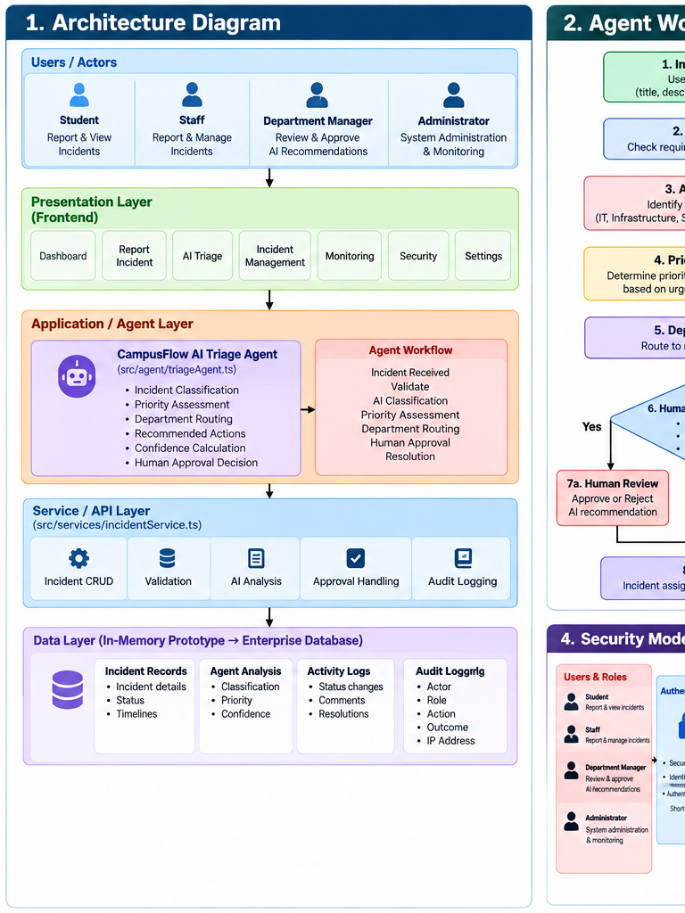

---

## 10.2 Agent Workflow

The following diagram shows the complete agentic workflow from incident submission through classification, priority assessment, routing, human approval and resolution.

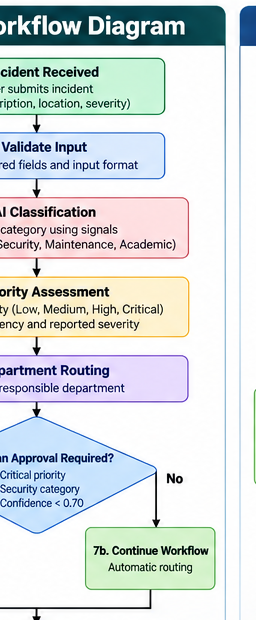

---

## 10.3 Deployment Strategy

The deployment diagram presents the proposed enterprise production architecture, including the frontend, API gateway, agent service, incident API, enterprise database and supporting services.

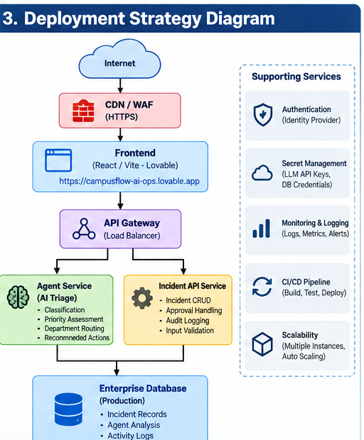

---

## 10.4 Security Model

The security model demonstrates role-based access control, authentication, authorization, application security, human approval and audit logging.

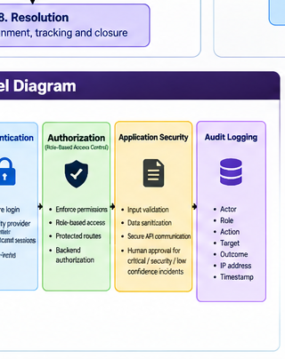

---

## 10.5 Monitoring Dashboard Design

The monitoring design illustrates the key operational, AI, incident, security and performance metrics that should be monitored in a production deployment.

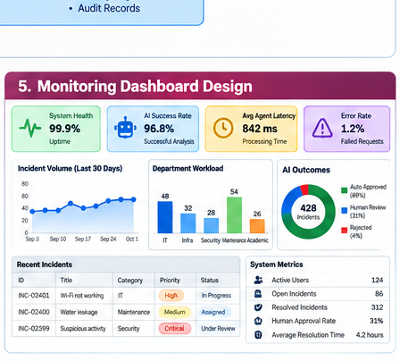

---

# 11. Application Screenshots

## 11.1 CampusFlow AI Dashboard

The dashboard provides an overview of incident volume, priorities, resolution status, department workload and AI activity.

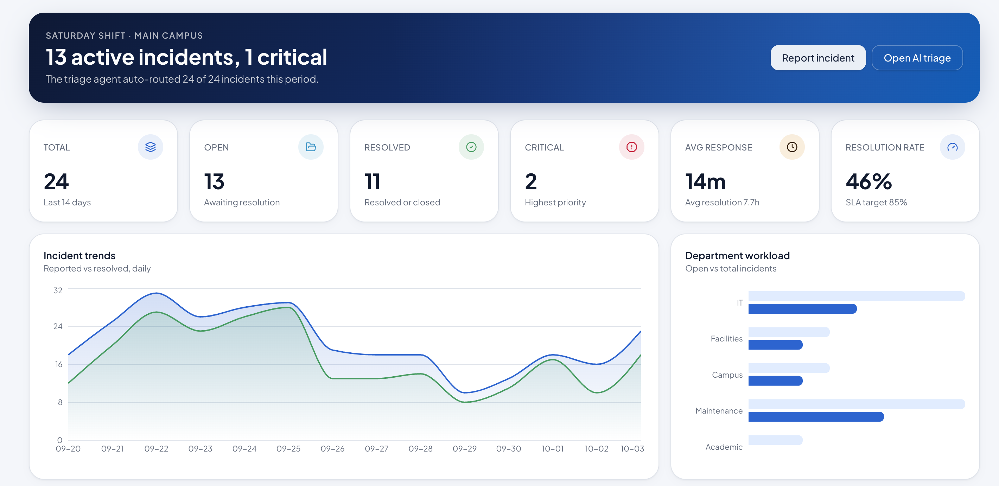

---

## 11.2 Incident Reporting

The incident reporting interface allows users to submit an incident with relevant information such as title, description, location, category and severity.

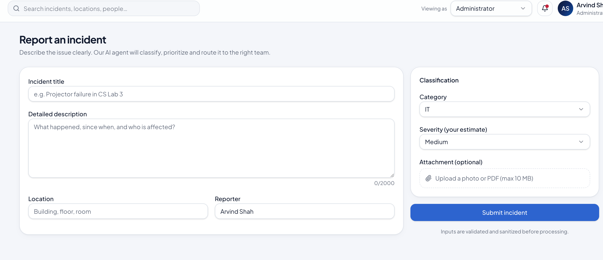

---

## 11.3 AI Triage

The AI Triage interface displays the agent's classification, priority, department routing, recommended actions, reasoning and confidence.

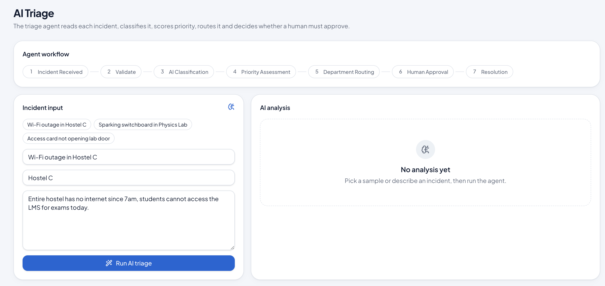

---

## 11.4 Incident Details

The incident details interface provides the incident lifecycle, AI analysis, status, timeline, activity and approval information.

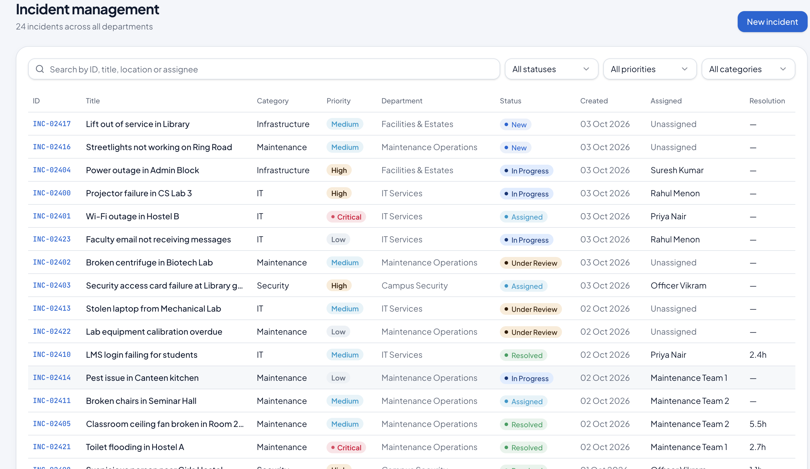

---

## 11.5 Monitoring

The monitoring interface provides visibility into application health, AI activity, incident metrics, performance and operational outcomes.

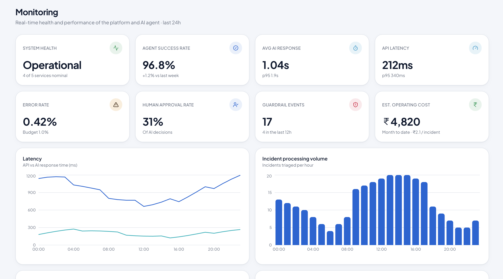

---

## 11.6 Security

The security interface demonstrates the application's security model, roles, permissions, audit information and security controls.

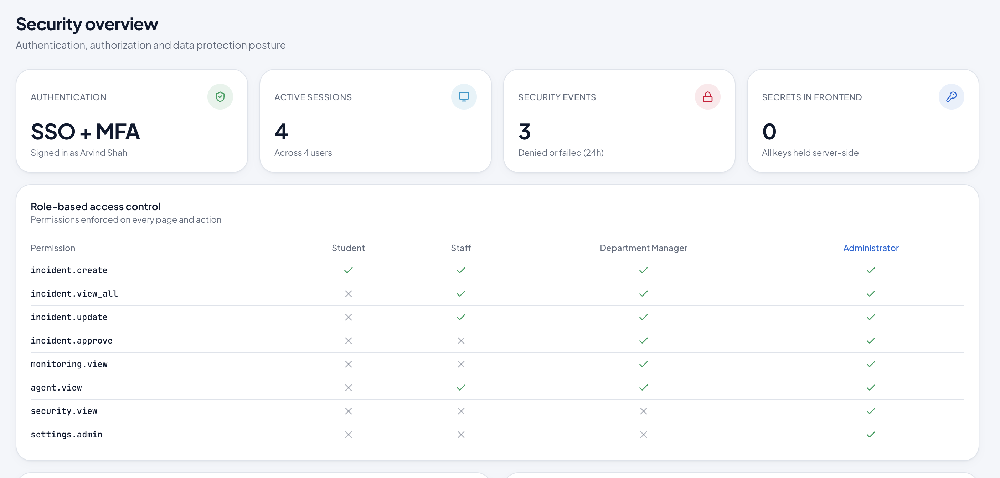

---

# 12. Deliverable-to-Evidence Mapping

| Capstone Requirement | Primary Evidence |
|---|---|
| Architecture Diagram | `01_Architecture_Diagram.png` |
| Agent Workflow Design | `02_Agent_Workflow_Diagram.png` |
| Deployment Strategy | `03_Deployment_Strategy_Diagram.png` |
| Security Model | `04_Security_Model_Diagram.png` |
| Monitoring Dashboard Design | `05_Monitoring_Dashboard_Design.png` |
| Application Implementation | `06_Dashboard_Screenshot.png` – `11_Security_Screenshot.png` |
| Source Code | `../SourceCode/` |
| Live Deployment | `https://campusflow-ai-ops.lovable.app` |

---

# 13. Submission Contents

The final submission contains:

- Capstone deliverables documentation
- Architecture diagram
- Agent workflow diagram
- Deployment strategy diagram
- Security model diagram
- Monitoring dashboard design
- Application screenshots
- Complete application source code
- Lovable generation prompt
- Live deployment link


