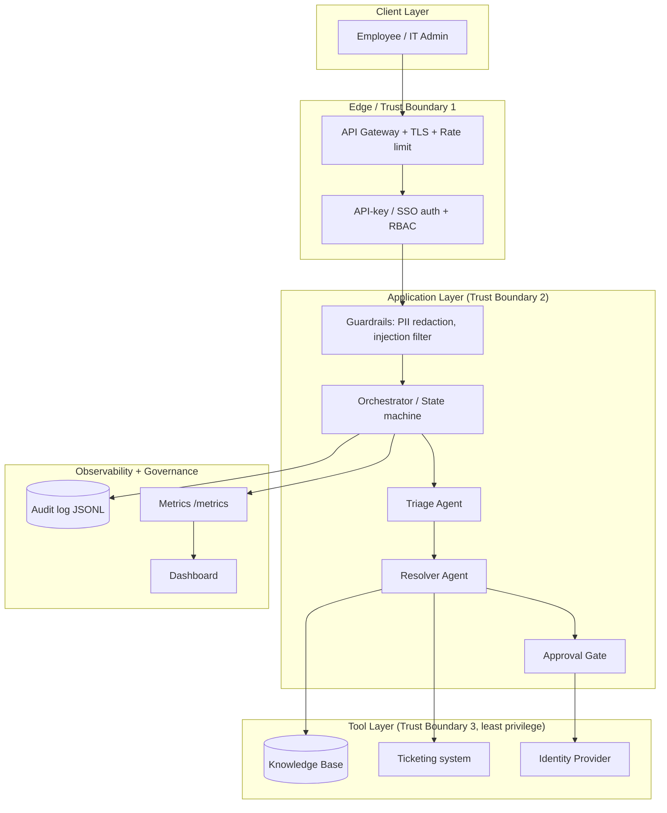
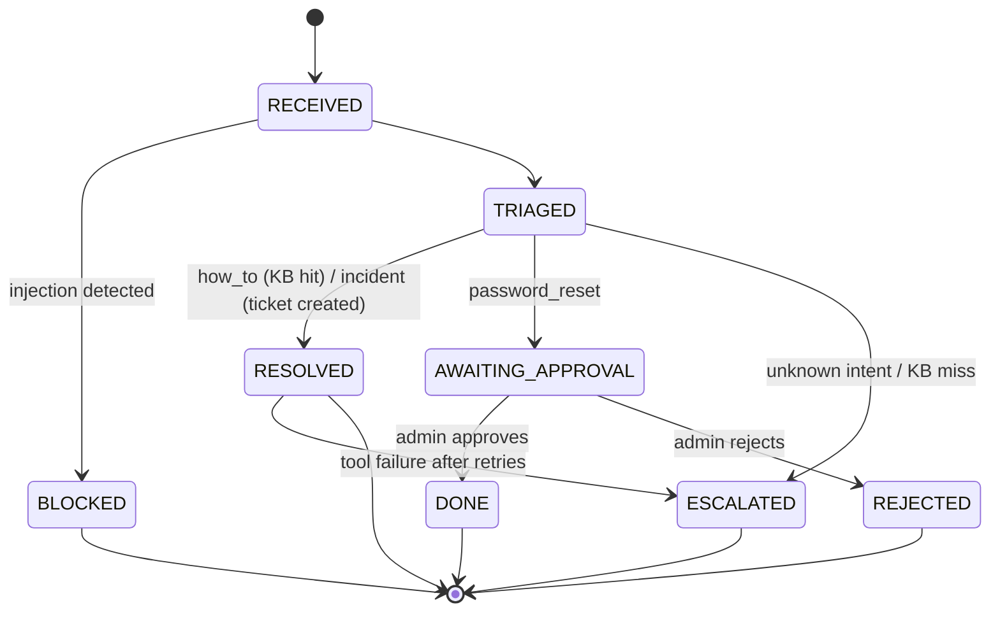

# HelpdeskAI – Capstone Deliverables
**Name:** Prerana  |  **Roll No:** 2023103015
**Course:** Scalable Enterprise Architectural Deployments of Agentic AI Solutions

HelpdeskAI is a multi-agent IT service desk. Employees send natural-language requests; agents triage, resolve, or escalate, and risky actions (password reset) require human approval.

---
## 1. Architecture Diagram



| Layer | Components | Notes |
|---|---|---|
| Client | Web/chat UI, curl | Untrusted |
| Edge | Gateway, auth, RBAC | Trust boundary 1: identity established |
| Application | Guardrails, orchestrator, agents | Trust boundary 2: all input sanitised |
| Tools | KB, ticketing, IdP | Trust boundary 3: scoped credentials per tool |
| Observability | Audit, metrics, dashboard | Append-only, admin-readable |

**Integrations:** ticketing (ServiceNow/Jira, simulated), identity provider (Okta/Entra, simulated), knowledge base, optional LLM provider behind `classify()`.

---
## 2. Agent Workflow Design

**Roles**
| Agent | Responsibility | Tools |
|---|---|---|
| Triage Agent | Classify intent: how_to, password_reset, incident, unknown | none |
| Resolver Agent | Execute the matching flow | `kb_search`, `create_ticket` |
| Approval Gate | Human-in-the-loop for sensitive actions | `reset_password` (after approval) |
| Escalation | Hand off to human agent | ticket / notification |

**State machine**


**Handoffs:** Orchestrator -> Triage -> Resolver -> (Approval Gate | Human).
**Approvals:** only role `it_admin` may approve; decision is audited with admin identity.
**Failure paths:** each tool call retries twice; on persistent failure the request is escalated to a human with the reason recorded. Unknown intents and KB misses also escalate. Injection attempts are blocked and audited.

---
## 3. Deployment Strategy

- **Runtime:** stateless FastAPI container (Python 3.11-slim, non-root user, healthcheck on `/health`). Runs on Kubernetes (or ECS/Azure Container Apps).
- **Scaling:** horizontal pod autoscaler on CPU and request rate (min 2, max 10 replicas). Pending approvals and audit log move to Redis/PostgreSQL when running more than one replica (the demo uses in-memory state and a local file).
- **Resilience:** 2+ replicas across availability zones, readiness/liveness probes, tool retries, graceful escalation to humans, timeouts on all external calls, circuit breaker around the ticketing and IdP integrations.
- **Environments:** `dev` (mock tools, demo keys) -> `staging` (sandbox ticketing/IdP, synthetic load tests) -> `prod` (real integrations, secrets from vault).
- **Release:** GitHub Actions CI: lint, `pytest`, container build and scan -> deploy to staging -> smoke test -> manual approval -> prod via rolling update (or canary 10% -> 100%). Rollback by redeploying the previous image tag; config and secrets are versioned separately.

---
## 4. Security Model

| Area | Control |
|---|---|
| Identity | `X-API-Key` mapped to user and role (production: SSO/OIDC JWT) |
| Authorization | RBAC: `employee` can chat; `it_admin` can approve, read metrics and audit |
| Secrets | Keys from environment variables or a vault; never committed; rotated regularly |
| Privacy | Emails and phone numbers redacted before triage and logging; minimal data retention |
| Guardrails | Prompt-injection pattern blocking, input length limit (2000 chars), allow-listed tools only, human approval for sensitive actions |
| Audit | Append-only JSONL log of triage, blocks, approvals, escalations (who, what, when) |
| Transport | TLS at the gateway; rate limiting against abuse |
| Threats considered | Prompt injection, privilege escalation, data leakage, tool abuse, repudiation |

---
## 5. Monitoring Dashboard Design

Data source: `GET /metrics` (admin) plus the audit log, scraped into Prometheus/Grafana in production.

```
+--------------------------------------------------------------+
| HelpdeskAI Dashboard                         [Last 24h v]    |
+----------------+----------------+----------------+-----------+
| HEALTH         | QUALITY        | SAFETY         | COST      |
| Uptime 99.9%   | Auto-resolve   | Blocked: 3     | $/request |
| Error rate 0.4%| rate 62%       | Injection      | Daily $   |
| Replicas 3/3   | Escalation 18% | attempts trend | Tokens/req|
+----------------+----------------+----------------+-----------+
| TRACE: request volume   | LATENCY: p50 / p95 over time        |
| Outcomes by state (bar) | Tool failure and retry count         |
+-------------------------+--------------------------------------+
| BUSINESS OUTCOMES: tickets deflected, avg time to resolve,     |
| pending approvals, approval turnaround time, CSAT              |
+----------------------------------------------------------------+
```

| Category | Metrics | Alert |
|---|---|---|
| Health | uptime, error rate, replicas | error rate > 2% |
| Trace | per-request trace (RECEIVED -> ... -> final state), audit entries | n/a |
| Quality | auto-resolution rate, escalation rate | escalation > 35% |
| Safety | blocked requests, injection attempts, 403 count | spike > 3x baseline |
| Cost | estimated cost per request, daily spend | budget threshold |
| Business | tickets deflected, time to resolve, approval turnaround | approvals pending > 1h |
