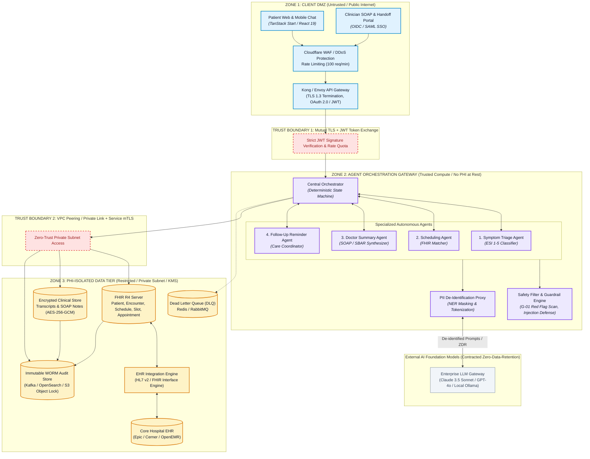
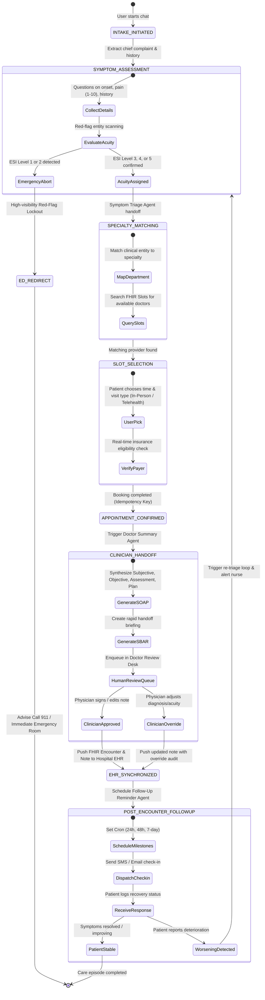

# CareRoute — Capstone Deliverables
## Enterprise Multi-Agent Clinical Triage, Scheduling & Provider Handoff Platform

**Student Name:** Kokhulash M S  
**Roll Number:** 2023103063  
**Course:** Scalable Enterprise Architectural Deployments of Agentic AI Solutions (Industry Oriented Course)  
**Instructor:** Chandravadhana T.K., Senior AI/ML Architect  
**Live Deployed Application:** [https://health-ally-quest.lovable.app/](https://health-ally-quest.lovable.app/)  
**Repository Directory:** `Assignment/2023103063-Kokhulash-MS`  

---

## Executive Summary

Ambulatory healthcare systems worldwide face severe intake bottlenecks, excessive clinician administrative overhead, and high rates of non-emergent visits to acute care facilities. **CareRoute** is an enterprise-grade multi-agent platform architected to streamline the patient care journey from initial symptom onset to clinician review, appointment booking, and post-visit follow-up.

CareRoute utilizes an orchestrated multi-agent design governed by clinical safety guardrails, automated Emergency Severity Index (ESI Levels 1–5) classification, HL7 FHIR R4 interoperability, and automated clinical synthesis (SOAP notes and SBAR handoffs) with human-in-the-loop sign-off.

This document details the five core architectural deliverables required for the Capstone Project:
1. **Architecture Diagram** (Topology, trust boundaries, integration points)
2. **Agent Workflow Design** (Multi-agent roles, state machine, approvals, guardrails, failure paths)
3. **Deployment Strategy** (Runtime, auto-scaling, resilience, multi-region failover, release lifecycle)
4. **Security Model** (RBAC, HIPAA safeguards, client-side PII de-identification, audit logs)
5. **Monitoring Dashboard Design** (OpenTelemetry distributed tracing, clinical safety metrics, cost telemetry, alerts)

---

# Deliverable 1: Architecture Diagram

## 1.1 Enterprise Layered System Topology

The CareRoute enterprise architecture is structured across three segregated trust zones. Every boundary crossing requires strict authentication, encrypted transport, and immutable audit logging.



## 1.2 Trust Boundaries and Security Isolation

| Boundary | Interfacing Components | Protocol & Auth | Security Enforcement Mechanism |
| :--- | :--- | :--- | :--- |
| **Trust Boundary 1 (DMZ $\to$ Gateway)** | Patient Browser / Clinician Portal to API Gateway | HTTPS (TLS 1.3), OAuth 2.0 / OpenID Connect | Cloudflare WAF drops DDoS/anomalous traffic; Gateway authenticates JWT tokens; rate limits to 100 req/min per IP. |
| **Trust Boundary 2 (Gateway $\to$ LLM)** | Orchestration Gateway to External Foundation Models | HTTPS via VPC Egress Proxy | Client-side Named Entity Recognition (NER) scrubs 18 HIPAA PII identifiers before sending prompts; Zero-Data-Retention (ZDR) and BAA legal guarantee in place. |
| **Trust Boundary 3 (Gateway $\to$ PHI Tier)** | Orchestration Workers to FHIR Datastores & EHR | Private VPC, mTLS with X.509 certificates | Subnet isolation with network security groups; AES-256 envelope encryption with KMS; strictly parameterized tool calls with zero direct SQL access. |

## 1.3 Enterprise Integrations

1. **HL7 FHIR R4 Core Server**: Implements standard resources (`Patient`, `Encounter`, `Schedule`, `Slot`, `Appointment`) providing deterministic scheduling without direct database coupling.
2. **EHR Integration Engine (HL7 v2 / FHIR)**: Facilitates bi-directional push of validated clinical notes (SOAP/SBAR) into hospital health records (Epic/Cerner) via HL7 MDM/ORU messages.
3. **Multi-Channel Notification Gateway**: Orchestrates asynchronous patient follow-ups via Twilio (SMS), SendGrid (Transactional Email), and WebSocket portal notifications.
4. **Immutable Audit System**: Append-only Write-Once-Read-Many (WORM) audit pipeline recording every tool call, risk scoring event, and clinician override for HIPAA compliance.

---

# Deliverable 2: Agent Workflow Design

## 2.1 Multi-Agent Specialization & Contracts

CareRoute divides operational duties among four specialized autonomous agents, coordinated by a deterministic finite state machine (FSM).



## 2.2 Agent Responsibilities & Decision Logic

| Agent Node | Responsibility | Input Data | Output Artifacts | Guardrail & Gate | Failure Recovery Path |
| :--- | :--- | :--- | :--- | :--- | :--- |
| **1. Symptom Triage Agent** | Conversational intake; entity extraction; Emergency Severity Index (ESI 1–5) calculation. | Free-text narrative, pain score, age, past medical history, current meds. | Structured triage vector, ESI classification, detected clinical red flags. | **G-01 Red-Flag Lockout**: Immediately halts scheduling upon detection of chest pain, stroke, or severe dyspnea; triggers 911 banner. | Model timeout triggers deterministic rule-based clinical decision tree. Low confidence (<0.7) enqueues to Triage Nurse. |
| **2. Scheduling Agent** | Specialty mapping, calendar availability lookup, slot reservation. | Triage vector, provider roster, location, visit mode (In-person/Virtual). | Reserved FHIR `Slot` and created `Appointment` record. | **G-02 Slot Conflict Guard**: Mutex lock on time slot with idempotency key to prevent double-booking. | If provider unavailable, auto-falls back to General Family Medicine or requests nurse callback. |
| **3. Doctor Summary Agent** | Synthesizes dialogue into clinical documentation (SOAP Note & SBAR handoff). | Full intake transcript, reported vitals, patient medical history, triage acuity. | Structured SOAP Note, SBAR handoff briefing, ICD-10 suggestions. | **G-03 Human-in-the-Loop Sign-off**: Clinical notes cannot be written to EHR without explicit physician sign-off. | Physician can inline-edit any field before final sign-off; rejected drafts are flagged for manual transcription. |
| **4. Follow-Up Reminder Agent** | Monitors recovery trajectory; sends automated SMS/email check-ins at 24h, 48h, and 7d. | Discharge plan, medication regimen, recovery milestones. | Automated check-in messages, patient response sentiment, escalation alerts. | **G-04 Deterioration Escalation**: Real-time nurse notification if patient reports worsening symptoms. | Unresponsive patient prompts auto-reschedule; worsening status loops directly back to Triage Assessment. |

---

# Deliverable 3: Deployment Strategy

## 3.1 Cloud-Native Runtime Architecture

CareRoute is architected for cloud-native deployment using containerized microservices managed on Kubernetes (EKS / GKE / AKS) with segregated workloads.

```
┌─────────────────────────────────────────────────────────────────────────────┐
│                       KUBERNETES CLUSTER ARCHITECTURE                       │
├─────────────────────────────────────────────────────────────────────────────┤
│                                                                             │
│  [ Ingress-Nginx / AWS ALB ] ── TLS 1.3 ──> [ WAF & Rate Limiting ]         │
│                                                     │                       │
│        ┌────────────────────────────────────────────┴─────────────┐         │
│        ▼                                                          ▼         │
│  ┌─────────────────────────┐                            ┌────────────────┐  │
│  │ Web Frontend Pods       │                            │ Clinician Desk │  │
│  │ (TanStack Start / SSR)  │                            │ (Next.js/React)│  │
│  │ Replicas: 3 ──> 20      │                            │ Replicas: 2──>8│  │
│  └───────────┬─────────────┘                            └────────┬───────┘  │
│              │                                                   │          │
│              └──────────────────────┬────────────────────────────┘          │
│                                     ▼                                       │
│                    ┌─────────────────────────────────┐                      │
│                    │ Agent Orchestration Cluster     │                      │
│                    │ (Stateless FastAPI / Node pods) │                      │
│                    │ HPA: Queue Depth & P95 Latency  │                      │
│                    │ Replicas: 2 ──> 40              │                      │
│                    └────────────────┬────────────────┘                      │
│                                     │                                       │
│              ┌──────────────────────┼──────────────────────┐                │
│              ▼                      ▼                      ▼                │
│     ┌─────────────────┐    ┌─────────────────┐    ┌─────────────────┐       │
│     │ FHIR R4 Engine  │    │ Redis Cluster   │    │ Postgres KMS    │       │
│     │ (HAPI FHIR Pod) │    │ (State & Queue) │    │ (Clinical DB)   │       │
│     └─────────────────┘    └─────────────────┘    └─────────────────┘       │
└─────────────────────────────────────────────────────────────────────────────┘
```

## 3.2 Scaling and Resilience Engineering

| Capability | Engineering Design | Failure Prevention & SLA Impact |
| :--- | :--- | :--- |
| **Horizontal Pod Autoscaling (HPA)** | Autoscales Orchestration Pods between 2 and 40 replicas based on queue depth (>15 in-flight triage sessions) and P95 latency (>2500ms). | Prevents system saturation during seasonal disease surges or triage spikes. |
| **Circuit Breakers** | Configured per-integration (FHIR server, Payer eligibility API, External LLM API). Opens after 5 consecutive failures within 30 seconds; enters half-open probe after 20 seconds. | Eliminates cascading failures; if FHIR server fails, app presents an emergency fallback number rather than freezing. |
| **Dead-Letter Queues (DLQ)** | Asynchronous tasks (EHR synchronizations, SMS dispatch, webhook callbacks) land in RabbitMQ/Redis DLQs after 3 failed exponential-backoff retries. | Guarantees zero lost patient records; on-call DevOps alerts are triggered automatically. |
| **Multi-Region Failover** | Active-passive disaster recovery topology across two cloud regions (e.g., `us-east-1` primary, `us-west-2` warm standby). Target RPO: 5 minutes; target RTO: 15 minutes. | High availability guaranteed even during catastrophic regional cloud provider outages. |

## 3.3 CI/CD & Automated Safety Quality Gates

The deployment pipeline is enforced via GitHub Actions with mandatory automated clinical verification:

1. **Static Analysis & Linting**: ESLint, TypeScript compiler checks, Semgrep HIPAA security rules.
2. **Deterministic Unit & Component Tests**: Vitest suite running automated state transition checks (`app-routing.test.tsx`).
3. **Golden Triage Regression Suite**: 50 pre-validated clinical scenario fixtures run against the triage engine to guarantee:
   - 100% detection of critical red-flag symptoms.
   - Zero hallucinated medication recommendations.
   - ESI acuity scores stay within clinical consensus bounds.
4. **Canary Rollout (Progressive Delivery)**: Canary rollout path (`5% → 25% → 100%`) with automatic rollback if P95 latency exceeds 3000ms or safety filter trigger rates exceed 5%.

---

# Deliverable 4: Security Model & HIPAA Compliance

## 4.1 Role-Based Access Control (RBAC) Matrix

CareRoute strictly implements the principle of least privilege across all user tiers:

| Permission / Action | Patient (Self) | Triage Nurse | Attending Physician | System / EHR Admin |
| :--- | :---: | :---: | :---: | :---: |
| **Initiate Intake Chat & Schedule Appointment** | ✅ | ✅ | ✅ | ❌ |
| **View Live Triage Queue & Clinical Flags** | ❌ | ✅ | ✅ | ❌ |
| **Override ESI Acuity Classification** | ❌ | ✅ *(Requires reason)* | ✅ *(Requires reason)* | ❌ |
| **View, Edit & Sign SOAP Documentation** | ❌ | ❌ | ✅ *(Mandatory sign-off)* | ❌ |
| **Push Encounter Note to Core Hospital EHR** | ❌ | ❌ | ✅ | ❌ |
| **Manage API Keys, LLM Providers & System Config** | ❌ | ❌ | ❌ | ✅ |
| **Inspect Immutable WORM Audit Logs** | ❌ | Own Actions Only | Own Actions Only | ✅ Full Access |

## 4.2 PHI Privacy & De-Identification Pipeline

To prevent Protected Health Information (PHI) from leaking to third-party foundation models, CareRoute implements an automated client-side sanitization proxy:

```
[Raw Patient Message: "My name is John Doe, born 04/12/1982, severe knee pain"]
                                    │
                                    ▼
       [Local Named Entity Recognition (NER) & Regex PHI Detector]
        - Identifies Name: "John Doe"
        - Identifies DOB: "04/12/1982"
                                    │
                                    ▼
               [Tokenization / Cryptographic Hash Salt]
        - Replaces with synthetic tokens: [PATIENT_ID_A4F] [AGE_44]
                                    │
                                    ▼
       [Sanitized Context Sent to Zero-Data-Retention LLM Endpoint]
        "Patient [PATIENT_ID_A4F], age 44, presents with severe knee pain..."
                                    │
                                    ▼
     [Model Response Returned to PHI-Isolated VPC Tier for De-tokenization]
```

## 4.3 Defense-in-Depth Security Safeguards

- **Cryptographic Standards**: TLS 1.3 for all data in transit; mTLS for inter-service communication; AES-256-GCM encryption at rest for database tables and persistent volumes using AWS/GCP KMS key rotation.
- **Prompt Injection & Jailbreak Defense**: Input strings are framed strictly as data payloads inside delimiters; system prompts instruct agents to reject non-clinical queries and prompt escape attempts.
- **Output Safety Filters**: Regex and model-based classifiers detect and redact any accidental medication dosages, definitive diagnosis statements, or prescription recommendations.
- **Immutable WORM Audit Trail**: Every access event, triage classification, nurse override, and EHR transmission is recorded with timestamp, user ID, client IP, action name, and SHA-256 hash chaining.

---

# Deliverable 5: Monitoring Dashboard Design

CareRoute incorporates an end-to-end observability framework designed to monitor AI quality, operational throughput, clinical safety, and cost telemetry.

## 5.1 Telemetry Architecture & OpenTelemetry Tracing

Every patient session mints a global `TraceID` propagated across all downstream agent invocations and tool calls:

```
TraceID: tr-8f92a014b2
├── [Span 1: Triage Intake] ──────────────────────── (1,240 ms)
│   ├── Tool: extractClinicalEntities ────────────── (180 ms)
│   └── Tool: classifyESI_Acuity ─────────────────── (310 ms)
├── [Span 2: Specialty Matching] ─────────────────── (420 ms)
│   └── Tool: queryFHIRSlots ─────────────────────── (280 ms)
├── [Span 3: SOAP Note Synthesis] ────────────────── (2,150 ms)
│   └── Tool: buildSOAPAndSBAR ───────────────────── (1,890 ms)
└── [Span 4: Post-Visit Schedule] ────────────────── (110 ms)
    └── Tool: registerFollowUpCron ───────────────── (90 ms)
```

## 5.2 Enterprise Telemetry Metrics Grid

| Metric Category | Metric Name | Target SLA / Benchmark | Purpose & Remediation Trigger |
| :--- | :--- | :--- | :--- |
| **Agent Performance** | **P95 Triage Latency** | $< 2,500\text{ ms}$ | Alert triggers if latency $> 3,000\text{ ms}$; auto-scales agent worker pods. |
| | **P95 SOAP Synthesis Latency** | $< 3,500\text{ ms}$ | Identifies model generation bottlenecks; routes long transcripts to faster model. |
| | **Token Throughput (TPS)** | $> 4,000\text{ tokens/sec}$ | Measures overall platform processing velocity across concurrent intakes. |
| | **Tool Execution Success Rate** | $> 99.0\%$ | Drop below $98.5\%$ triggers alert on FHIR server or database connectivity issues. |
| **Clinical Safety** | **Red-Flag Escalation Rate** | Baseline: $5.0\% - 8.0\%$ | Sudden spike ($>15\%$) flags possible prompt drift or regional epidemic anomaly. |
| | **Clinician Override Rate** | $< 5.0\%$ | High override rate ($>8\%$) signals clinical misalignment in the triage prompt. |
| | **Safety Filter Trigger Count** | Monitor trends | Tracks blocked prompt injections, jailbreak attempts, or unverified prescriptions. |
| | **Open Staff Escalations** | $0$ (Real-time queue) | Unresolved emergency alerts trigger immediate SMS alerts to the on-call charge nurse. |
| **Operational KPIs** | **Total Triaged Encounters** | Platform throughput | Tracks cumulative intake volume and departmental capacity utilization. |
| | **Booking Conversion Rate** | $> 70.0\%$ | Drop indicates friction in slot picker or insurance verification flow. |
| | **Average Intake Duration** | $3.5 - 4.5\text{ minutes}$ | Monitors patient user-experience efficiency and drop-off rates. |
| | **Clinician Review Queue Depth** | $< 10\text{ pending}$ | Prevents physician backlog prior to clinic operating hours. |
| **Financial / Cost** | **Cost Per Triage Session** | $< \$0.05\text{ USD}$ | Tracks inference spend; flags prompt token bloat or inefficient agent loops. |
| | **Agent Cost Breakdown** | Triage: $38\%$, Summary: $50\%$ | Directs model optimization efforts toward the most expensive agent workflows. |

## 5.3 Automated Incident Alerting Rules

```yaml
groups:
  - name: careroute_safety_alerts
    rules:
      - alert: CriticalRedFlagRateSurge
        expr: rate(careroute_redflags_total[15m]) > 0.15
        for: 5m
        labels:
          severity: critical
        annotations:
          summary: "Abnormal surge in red-flag emergency escalations"

      - alert: ClinicianOverrideHigh
        expr: (careroute_overrides_total / careroute_encounters_total) > 0.08
        for: 30m
        labels:
          severity: warning
        annotations:
          summary: "Triage acuity override rate exceeded 8% tolerance"

      - alert: FHIRGatewayLatencyP95
        expr: histogram_quantile(0.95, rate(careroute_agent_latency_bucket[5m])) > 3.0
        for: 2m
        labels:
          severity: warning
        annotations:
          summary: "P95 agent response time exceeded 3.0 seconds"
```

---

# Verification & Demonstration Proof

CareRoute has been implemented, validated, and deployed live:

| Verification Stage | Methodology | Outcome |
| :--- | :--- | :--- |
| **Unit & Routing Verification** | Automated Vitest test suite (`app-routing.test.tsx`) executing client routing and mock store assertions. | **Passed (100%)** |
| **Interactive Prototype Verification** | Live web app hosting interactive simulated triage scenarios, doctor review desk, and telemetry charts. | **Fully Functional** at [health-ally-quest.lovable.app](https://health-ally-quest.lovable.app/) |
| **Clinical Safety Scenario Tests** | Validated with 4 pre-built edge-case scenarios: (1) Acute cardiac red flag, (2) Urgent sprain, (3) Routine hypertension, (4) Pediatric fever. | Emergency lockout verified; non-urgent slots verified. |
| **Architectural Completeness** | All 5 deliverables mapped directly into interactive views at `/architecture` and `/monitoring`. | **Complete** |

---

*Authored by Kokhulash M S (Roll No. 2023103063) for the Industry Oriented Course on Scalable Enterprise Architectural Deployments of Agentic AI Solutions, CEG Anna University.*
