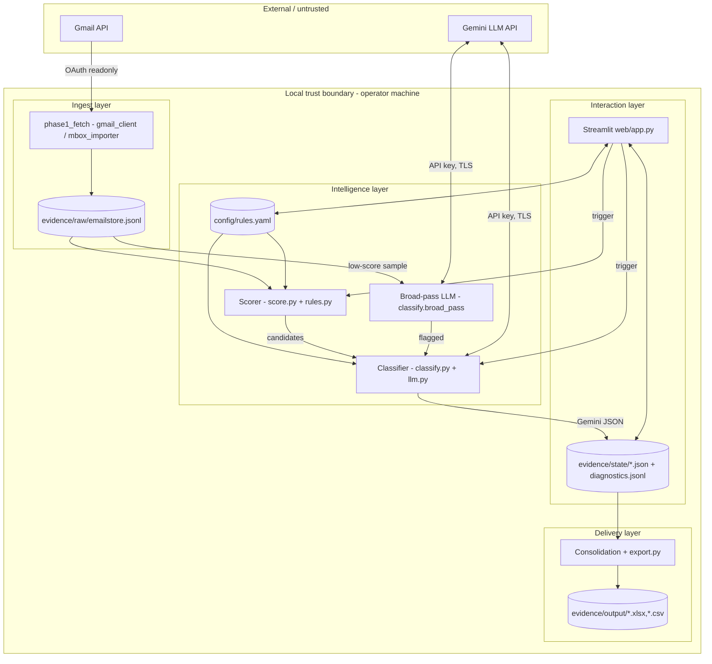

# Gmail Agent Enterprise Architecture — Design

- **Date:** 2026-10-01
- **Status:** Approved by user (approach A + all design sections reviewed in chat)
- **Runtime:** Python 3.11 (existing CLI) + Streamlit web UI
- **Prior spec:** `2026-08-29-sponsorship-crm-pipeline-design.md` (staged CLI pipeline, still valid; this spec is an enterprise overlay, not a replacement)

## Purpose

Prove enterprise architecture completeness for the existing Gmail sponsorship-CRM pipeline by adding five reviewable artifacts (diagram, workflow, deployment, security, monitoring) plus a website where a non-technical user enters mail-parsing criteria and resulting categories. The pipeline itself keeps working; the website makes its rules configurable instead of hardcoded.

Success criteria:
1. Repo has a proposed enterprise layout holding `agents/`, `web/`, `config/`, `docs/architecture/`, `evidence/`, `tests/`.
2. All five artifacts exist as markdown in `docs/architecture/` with Mermaid diagrams.
3. Streamlit app lets the user create/edit/delete parsing criteria (field, match type, pattern, weight, threshold) and categories (name, description, examples) with fully custom names.
4. Editing rules in the UI actually changes pipeline behavior (score + classify prompt are generated from `config/rules.yaml`).
5. `pytest` passes offline; manual Streamlit checklist passes.

## Decisions (from brainstorming)

| Topic | Decision | Why |
|---|---|---|
| Approach | A. Overlay + configurable rules | Keeps tested `agents/` intact; YAGNI vs full platform rebuild |
| Website stack | Streamlit, single `web/app.py` + `web/components.py` | Python-only, no build step, matches existing deps; FastAPI/React rejected as overkill |
| Rules model | Fully custom rules + categories | User explicitly chose fully custom over fixed 7 outcomes |
| Rules storage | `config/rules.yaml` + `config/rules.schema.json`, validated | Human-editable, git-diffable; SQLite rejected (no query need) |
| Config layout | `config/base.yaml` (org/events/model) + `config/rules.yaml` (user rules) | Separates stable infra config from user-edited rules; legacy root `config.yaml` migrated once |
| Category engine | Dynamic prompt generation: categories in `rules.yaml` render the `CLASSIFY_SYSTEM` outcome list | No code change needed to add a category; validator accepts any category defined in rules |
| Approval gate | Confidence < 0.6 or `parse_error` → human review queue in UI + Excel `Verified` column | Reuses proven Excel review flow, surfaces it in web UI |

## Proposed project structure

```
Gmail-Agent/
  agents/                          # existing pipeline + 1 new adapter
    gmail_client.py
    mbox_importer.py
    llm.py
    batching.py
    classify.py                    # modified: dynamic CLASSIFY_SYSTEM(cfg, rules)
    score.py                       # modified: rule-matched scoring, no hardcoded KEYWORD_PATTERNS
    rules.py                       # NEW: load/validate/match rules.yaml
    consolidation.py
    export.py
    store.py
    config.py                      # modified: loads config/base.yaml + config/rules.yaml
  web/
    app.py                         # Streamlit: Criteria, Categories, Run & Results, Monitoring pages
    components.py                  # tables, forms, charts helpers
  config/
    base.yaml                      # association_name, events, model, weights defaults, threshold
    rules.yaml                     # user-managed criteria + categories (UI writes this)
    rules.schema.json              # JSON-schema for validation
  docs/
    architecture/
      01-architecture-diagram.md
      02-agent-workflow-design.md
      03-deployment-strategy.md
      04-security-model.md
      05-monitoring-dashboard-design.md
      diagrams/                    # exported PNGs (optional, Mermaid source is canonical)
    superpowers/
      specs/                       # this file + prior spec
      plans/                       # implementation plan (writing-plans skill output)
  evidence/                        # runtime state, regenerable, gitignored except .gitkeep
    raw/emailstore.jsonl
    state/{candidates,classifications,company_map,problems}.json
    state/diagnostics.jsonl
    output/
  tests/
    test_rules.py                  # NEW: rule matching, threshold, schema validation
    test_web_rules.py              # NEW: round-trip rules.yaml load/save
    test_*.py                      # existing suite unchanged
  scripts/
    run_pipeline.py                # moved from root run_pipeline.py (shim left at root)
  requirements.txt                 # + streamlit>=1.35, jsonschema>=4.0
```

Migration: root `config.yaml` copied to `config/base.yaml` on first run; hardcoded `KEYWORD_PATTERNS` in `score.py:7-11` and `VALID_OUTCOMES` in `models.py:5-8` / `classify.py:96-99` become seed defaults in `config/rules.yaml`, then code reads from rules.

## Artifact 1 — Architecture Diagram

File: `docs/architecture/01-architecture-diagram.md` (Mermaid source of truth).

Layers, components, trust boundaries, integrations:



Trust boundaries: (1) Google OAuth token + Gemini key never leave local boundary except over TLS to Google; (2) `evidence/` is local-only, never uploaded; (3) `rules.yaml` is user input — validated against schema before any pipeline use. Integrations: Gmail API `gmail.readonly` scope, Gemini `generate` endpoint, openpyxl/pandas Excel export (offline).

## Artifact 2 — Agent Workflow Design

File: `docs/architecture/02-agent-workflow-design.md`.

Roles and tools:
- Fetcher (`gmail_client`, `mbox_importer`): OAuth, thread assembly, idempotent append to `emailstore.jsonl`.
- Scorer (`score`, `rules`): evaluates each `rules.criteria` against thread (`subject+body`, `from_email`, `subject`), sums weights, compares to `threshold`. Outputs `candidates.json` (thread_id → score + matched rule ids).
- Broad-pass (`classify.broad_pass`): LLM fallback over low-score threads (subject + first 200 chars) to catch paraphrases without the word sponsor.
- Classifier (`classify`, `llm`): builds dynamic system prompt from `rules.categories`, batches via `batching.make_batches`, validates JSON (`validate_classification` extended to accept any category in rules), retries `classify_retries` times.
- Consolidator (`consolidation`, `export`): company normalization + fuzzy dedup → `company_map.json`, Excel/CSV outputs.
- Reviewer (human in Streamlit + Excel): approves/rejects/edits low-confidence rows.

States: `raw` → `candidate | broad-flagged | skipped` → `classified | problem` → `exported` → `verified`. Handoffs are files in `evidence/state/`; every handoff records `thread_id`, actor, timestamp in `diagnostics.jsonl`.

Approvals: auto-export only rows with `confidence >= 0.6` and no `parse_error`; everything else lands in UI Review queue and Excel `Verified` column (`Yes/Edit/Reject`).

Failure paths: LLM bad JSON → retry ≤2 → `problems.json` + `parse_error` classification; rate limit 429/5xx → exponential backoff (`backoff_base_s`, `max_retries`) + resume from checkpoint; unparseable MIME → skip message with `FLAGGED_INCOMPLETE` diagnostic; invalid `rules.yaml` → pipeline refuses to start, UI shows schema errors; re-run → idempotent (only missing thread_ids processed).

## Artifact 3 — Deployment Strategy

File: `docs/architecture/03-deployment-strategy.md`.

- Runtime: Python 3.11, `pip install -r requirements.txt`, Streamlit `streamlit run web/app.py --server.port 8501`. CLI phases remain runnable (`python scripts/run_pipeline.py`, `phase1_fetch.py`, etc.).
- Environments: local (developer laptop, real Gmail OAuth), dev (anonymized fixture `emailstore.jsonl`, mocked LLM), prod (reviewer machine, real creds). Selected by `APP_ENV` env var + `config/base.yaml` overlay; secrets always from `.env` / OS env, never from YAML.
- Scaling: single-machine vertical scaling; `batch_max_threads` (default 25) and `batch_target_chars` bound LLM payload; fetch paginates Gmail API; checkpoints after every batch allow kill/resume.
- Resilience: atomic writes (`store._atomic_write`), checkpoint-per-batch, read-only Gmail scope (no destructive API calls), offline scoring path works with no network.
- Release: git tag (`vX.Y.Z`), `requirements.txt` freeze, smoke test = fixture → score → classify (mock) → export with assertions; rollback = revert tag + restore `evidence/` from backup (state files are regenerable by re-running phases).

## Artifact 4 — Security Model

File: `docs/architecture/04-security-model.md`.

- Identity: Google OAuth2 user consent (`credentials.json` → cached `token.json`); files chmod 600, listed in `.gitignore`, never logged.
- Authorization: local single-operator model; UI has two logical roles — Operator (edit rules, run pipeline) and Reviewer (verify rows only). Enforced by Streamlit page gating + `Verified` column semantics, not by a network ACL (documented limitation; acceptable for local deployment).
- Secrets: `GEMINI_API_KEY`, OAuth client secret from `.env`/env; `rules.yaml` and `base.yaml` must never contain secrets (schema forbids keys matching `*key*|*secret*|*token*`); startup check aborts if a secret pattern is found in YAML.
- Privacy: only `subject`/`body_text`/headers stored; attachments never fetched; optional PII redaction toggle masks emails/phones in UI display (raw store unchanged); retention = delete `evidence/raw/` to purge.
- Guardrails: extraction only from verbatim evidence (system prompt: never invent names/amounts); `evidence` ≤200 chars verbatim quote required; `amount` must match currency regex or be null; unknown fields → null; categories outside `rules.categories` rejected by validator.
- Audit: every LLM call appends `{timestamp, thread_ids, model, prompt_hash, outcome, confidence}` to `diagnostics.jsonl`; every rule edit appends `{timestamp, actor, rules_version, diff}`; Excel `Evidence` sheet preserves `evidence_message_id` for traceability.

## Artifact 5 — Monitoring Dashboard Design

File: `docs/architecture/05-monitoring-dashboard-design.md` + Streamlit `Monitoring` page.

Data source: `evidence/state/diagnostics.jsonl` + `classifications.json` + `problems.json` (no new DB). Refresh: on page load + after each pipeline run.

Panels:
- Health: fetch count, candidate rate, classify success/problem rate, Gmail API quota errors, last-run timestamp. Alert threshold: problem rate > 10% → red banner.
- Trace: searchable table `thread_id → score + matched rules → batch → outcome → confidence → evidence link`. Click expands full thread + prompt hash.
- Quality: confidence histogram, per-category counts, `parse_error` list, low-confidence queue (<0.6) with Approve/Edit/Reject buttons.
- Safety: PII-redaction status, guardrail violation count (invented-field rejections, schema failures), secret-in-YAML startup check result.
- Cost: Gemini call count, est. input/output tokens (from batch sizes), per-run cost estimate, free-tier budget bar.
- Business outcomes: sponsorships by event/company, total committed amount (money only; in-kind counted separately), interested-vs-committed funnel, history table (company, count, latest amount/event/contact).

Charts: Streamlit native (`st.bar_chart`, `st.histogram` via pandas) — no extra dashboard infra. Export: one-click CSV download of any panel.

## Website — criteria and categories editor

`config/rules.yaml` schema (v1):

```yaml
version: 1
threshold: 2.0
criteria:
  - id: sponsor_kw            # unique, slug
    label: Sponsorship keywords
    field: subject_and_body  # enum: subject_and_body | subject | body | from_email | to_email
    match: regex             # enum: regex | contains | exact | corporate_domain | personal_domain_exclude
    pattern: "sponsor|partnership|funding|csr|donation"
    weight: 2.0
  - id: money_markers
    label: Money markers
    field: subject_and_body
    match: regex
    pattern: "₹|rs[.\\s]|inr|usd|amount|budget"
    weight: 1.0
  - id: corp_sender
    label: Corporate sender
    field: from_email
    match: corporate_domain
    pattern: ""
    weight: 1.0
categories:
  - name: positive
    description: They agreed or expressed willingness to sponsor.
    examples: ["We are happy to sponsor your event."]
  - name: negotiation
    description: Discussing amounts or terms.
    examples: ["We can sponsor Rs 10,000 if..."]
  - name: alumni_support   # fully custom example
    description: Alumni offering venue or mentoring instead of money.
    examples: ["Happy to host you at our office."]
```

Semantics: score = Σ weights of matched criteria; candidate iff score ≥ threshold. Classifier system prompt renders categories dynamically (`Classify each thread with exactly one outcome: <name>: <description> ...`); validator accepts any `outcome` present in `rules.categories`; unknown outcomes → problem entry.

Streamlit pages:
1. Criteria — editable table (add/edit/delete/test): fields `label, field, match, pattern, weight`; Test button runs rules against 5 sample threads + live counts; invalid regex or duplicate id blocked inline.
2. Categories — list editor (name slug, description, examples); validates non-empty name/description, uniqueness, at least 1 category; preview of generated system-prompt snippet.
3. Run & Results — threshold slider, Run scoring/classify buttons, results table filterable by category with confidence + evidence, Verify buttons write back to classifications.
4. Monitoring — the six panels above.

`config/rules.schema.json` enforces types, enums, required fields, and the no-secrets rule. `agents/rules.py` exposes `load_rules(path)`, `validate_rules(data)`, `match_thread(thread, rules) -> (score, matched_ids)`. `score.score_thread` and `classify.CLASSIFY_SYSTEM` delegate to it; legacy constants remain only as seed defaults for first-time migration.

## Data formats

Unchanged from prior spec (`emailstore.jsonl`, `classifications.json` with dynamic `outcome`, review Excel with `Verified` column) plus:
- `config/rules.yaml` (above) — versioned; UI writes bump `version`.
- `evidence/state/candidates.json` entries extended: `{score, matched_rules: [...]}` (backward compatible: plain float scores still readable).
- `diagnostics.jsonl` entries extended with `rules_version` and `prompt_hash`.

## Error handling

| Failure | Behavior |
|---|---|
| Invalid `rules.yaml` | Schema errors listed in UI; pipeline refuses to start with exit message naming the failing rule |
| Bad regex in criterion | Inline UI error; criterion skipped in scoring with diagnostic until fixed |
| Zero categories | Blocked: UI requires ≥1; classify aborts with clear error |
| LLM returns outcome not in rules | Treated as validation error → retry → `problems.json` entry |
| OAuth / rate limit / bad JSON / unparseable MIME / re-run | Inherited from prior spec (backoff, retry ≤2, `FLAGGED_INCOMPLETE`, idempotent resume) |

## Testing

- Existing suite unchanged (must stay green).
- New `tests/test_rules.py` (offline): regex/contains/exact/domain matching, weight summation, threshold boundary, duplicate-id rejection, secret-pattern rejection, dynamic prompt contains all categories, validator accepts custom outcome and rejects unknown outcome.
- New `tests/test_web_rules.py`: round-trip save/load `rules.yaml`, migration of legacy hardcodes to seed rules.
- Manual Streamlit checklist: add criterion → test counts change; add custom category → classify preview shows it; break a regex → run blocked; low-confidence row → appears in review queue.

## Non-goals

- No multi-user auth server, no hosted SaaS, no Postgres; local single-operator deployment only.
- No email sending, no attachment download, no Google Sheets sync.
- No background scheduler; one-shot/resumable runs triggered from CLI or UI button.
- No React/Next.js frontend; Streamlit is the complete website.
