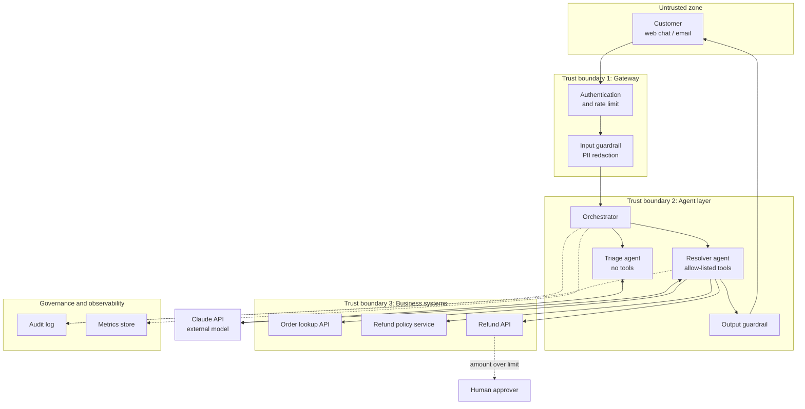
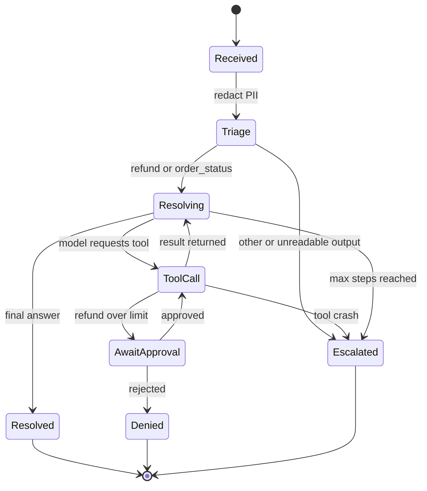
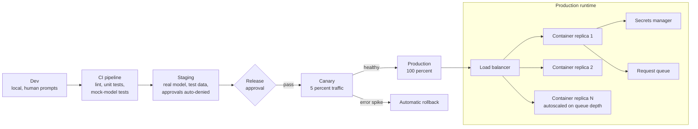
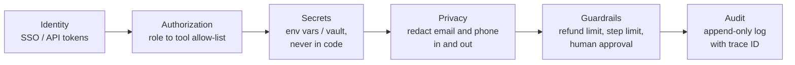
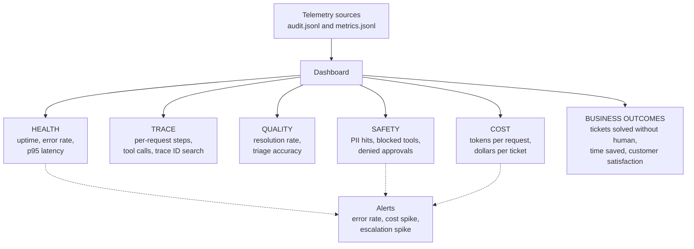

# Capstone Deliverables: Support-Desk Agent

Five artifacts that demonstrate enterprise architecture completeness.
Each diagram matches the code in `1_agentic_support_desk.py`.

---

## 1. Architecture Diagram
*Layers, components, trust boundaries and integrations*

**Reading it:** requests only cross three boundaries in one direction, each with
a check (identity, redaction, tool allow-list). Logs and metrics are written on
the side, so they never block the main flow.

---

## 2. Agent Workflow Design
*Roles, states, tools, handoffs, approvals and failure paths*

| Role | Allowed tools | Handoff |
|---|---|---|
| Triage agent | none | passes `refund` / `order_status` to Resolver, everything else to a human |
| Resolver agent | `lookup_order`, `check_refund_policy`, `issue_refund` | asks the human approver for refunds above the limit |
| Human approver | n/a | approves or denies |

**Failure paths:** bad triage JSON, tool exception, API outage (3 retries),
step limit, and approver rejection. All end in a safe state, never a crash.

---

## 3. Deployment Strategy
*Runtime, scaling, resilience, environments and release*

**Resilience:** stateless containers, retries with backoff, step limit, request
timeouts, and a fallback to human escalation if the model is unavailable.
Configuration comes from environment variables (`APP_ENV`, `MODEL`, limits).

---

## 4. Security Model
*Identity, authorization, secrets, privacy, guardrails and audit*

| Control | Where in the code |
|---|---|
| Least privilege | `ROLE_TOOLS` and `run_tool()` block tools a role should not use |
| Privacy | `redact()` on user input and on the final answer |
| Business guardrails | refund limit and approval enforced inside `issue_refund()`, not in the prompt |
| Secrets | `ANTHROPIC_API_KEY` read from the environment |
| Audit | `audit()` writes every request, tool call, approval and escalation |

---

## 5. Monitoring Dashboard Design
*Health, trace, quality, safety, cost and business outcomes*

**Alert examples:** error rate above 5 percent for 10 minutes, daily cost more
than 2x average, escalation rate above 40 percent, any blocked-tool event.
