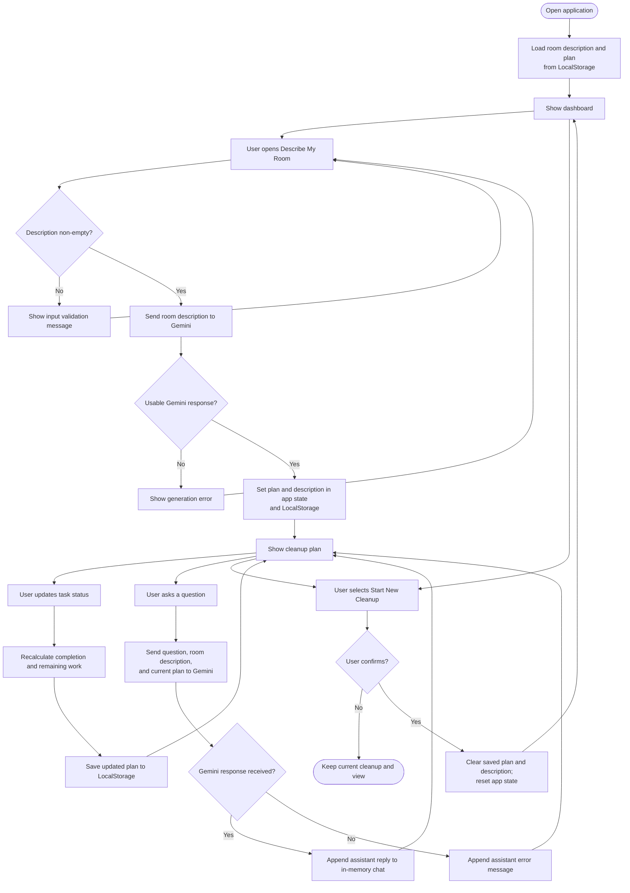

# Room Organization Assistant — Application Workflow

## Overview

The application supports two Gemini-assisted flows: generating a cleanup plan from a room description and answering a user's question about the current plan. Task status changes are handled in the browser and saved as part of the cleanup plan in LocalStorage.

## Workflow Diagram

## Workflow Details

1. At startup, the app loads the saved room description and cleanup plan from browser LocalStorage.
2. The user enters a room description. Blank descriptions are rejected by the input form.
3. The app calls Gemini through `src/services/aiService.ts`. The service requests a JSON cleanup plan and normalizes returned task fields.
4. On success, the app saves the description and generated plan, then displays the cleanup plan. If generation fails, the app displays an error and the user can retry.
5. Task actions update status values (`NOT_STARTED`, `IN_PROGRESS`, or `COMPLETED`). The app calculates progress from completed tasks and saves the changed plan.
6. When the user submits a question, the app sends it with the room description and current plan to Gemini. The assistant response or a recoverable error is added to the chat in memory.
7. Starting a new cleanup requires browser confirmation. Confirmation clears the plan and description and resets the view; cancellation leaves the saved cleanup intact.

## Scope Note

This is a direct request/response interaction with Gemini. It is not an autonomous agent loop and does not include a separate automatic re-planning workflow. The user can edit the room description and request a new generated plan through the existing form.
