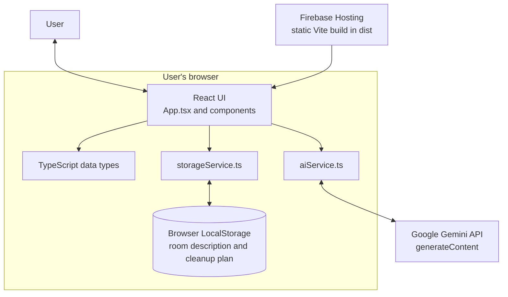

# Room Organization Assistant — System Architecture

## Overview

Room Organization Assistant is a client-side React single-page application. Its React components display the dashboard, room input, cleanup plan, task status controls, and AI chat. The application uses two browser-side services: one calls the Gemini API, and the other reads and writes the cleanup data in LocalStorage.

The Vite build produces static files in `dist`. Firebase Hosting serves those files and rewrites incoming paths to `index.html`. There is no application backend in this architecture.

## Architecture Diagram

## Component Responsibilities

| Component or service | Responsibility |
|---|---|
| `src/App.tsx` | Owns the current view and application state, coordinates components and services, calculates completion progress, and handles task, plan, and cleanup actions. |
| `src/components/Dashboard.tsx` | Displays summary counts, completion percentage, remaining estimated time, and next unfinished task. |
| `src/components/RoomInput.tsx` | Accepts and validates the room description before requesting plan generation. |
| `src/components/CleanupTask.tsx` | Displays one task and exposes task status actions. |
| `src/components/ProgressBar.tsx` | Displays the plan's completion percentage. |
| `src/components/ChatAssistant.tsx` | Displays the room context and in-memory chat interface. |
| `src/services/aiService.ts` | Sends plan-generation and assistant prompts to Gemini and handles/normalizes model responses. |
| `src/services/storageService.ts` | Reads, writes, and clears the room description and plan in browser LocalStorage. |
| `src/types/index.ts` | Defines the shared task, plan, priority, task-status, and chat-message types. |
| Firebase Hosting | Serves the production static files from `dist` and rewrites requests to the SPA entry point. |

## Data Boundaries

- The room description and current cleanup plan are held in browser application state and persisted to LocalStorage.
- Plan generation sends the room description to Gemini.
- Assistant questions send the question, room description, and current plan to Gemini.
- Chat messages exist in React state for the current page session; they are not stored by the LocalStorage service.
- Firebase Hosting serves the static application. It does not run application logic or provide a backend in this project.

## Deployment Shape

Vite builds the client application into `dist`. `firebase.json` configures `dist` as the Hosting public directory and rewrites requests to `/index.html`. This static Hosting arrangement is designed for Firebase Spark/free-tier use. The Gemini API is an external service called directly by the browser.
