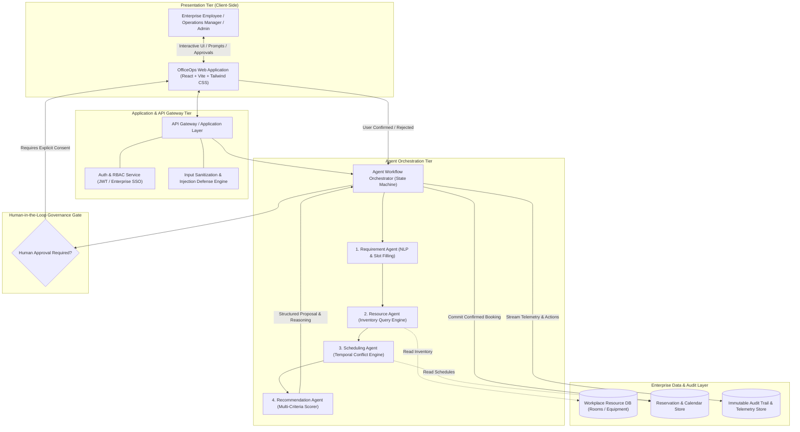
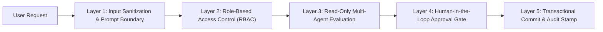

# OFFICEOPS — Enterprise Architecture Documentation
**Scalable Enterprise Architectural Deployments of Agentic AI Solutions**
**Student:** Roopa Varshni R | **Roll Number:** 2023103509 | **Solution:** OfficeOps MVP

---

## 1. High-Level Architecture

The OfficeOps architecture decouples the presentation layer, the orchestration engine, individual specialized micro-agents, and persistent resource/audit databases. This multi-tiered topology prevents hallucinated or unauthorized side-effects on workplace systems while maintaining rapid responsiveness and complete transparency.



---

## 2. Agent Workflow & Execution Pipeline

The core intelligence of OfficeOps is partitioned across four specialized, single-responsibility agents coordinated through a deterministic state machine:

```mermaid
sequenceDiagram
    autonumber
    actor Employee as Requester (Employee)
    participant Orchestrator as Agent Orchestrator
    participant ReqAgent as Requirement Agent
    participant ResAgent as Resource Agent
    participant SchedAgent as Scheduling Agent
    participant RecAgent as Recommendation Agent
    participant HITL as Human-In-The-Loop UI Gate
    participant CalendarStore as Calendar / Reservations Store
    participant AuditLog as Audit & Monitoring Ledger

    Employee->>Orchestrator: 1. Submits Natural-Language Request ("I need a room for 12 people tomorrow at 3 PM with a projector")
    activate Orchestrator
    Orchestrator->>AuditLog: Log Request Ingestion (Pipeline Run ID generated)
    
    Orchestrator->>ReqAgent: 2. Parse request payload
    activate ReqAgent
    ReqAgent-->>Orchestrator: Extracted Structured Requirements {capacity: 12, date: "tomorrow", time: "15:00", equipment: ["projector"]}
    deactivate ReqAgent
    
    Orchestrator->>ResAgent: 3. Query resource inventory for candidates
    activate ResAgent
    ResAgent-->>Orchestrator: Candidate Pool [Room Alpha (cap 15), Innovation Room (cap 20), Conference Hall (cap 30)]
    deactivate ResAgent

    Orchestrator->>SchedAgent: 4. Check calendar availability & detect conflicts
    activate SchedAgent
    SchedAgent-->>Orchestrator: Verified Slots (Room Alpha: Available; Innovation Room: Available; Conference Hall: Conflict at 15:00)
    deactivate SchedAgent

    Orchestrator->>RecAgent: 5. Rank candidates & synthesize justification
    activate RecAgent
    Note over RecAgent: Multi-factor scoring (Capacity Fit 40%, Equipment 30%, Availability 30%)
    RecAgent-->>Orchestrator: Top Recommendation: Room Alpha (Score: 95/100) + Alternatives + Justification
    deactivate RecAgent

    Orchestrator->>HITL: 6. Present Recommendation Card & Score Breakdown to User
    HITL->>Employee: Display proposal: "Approve Room Alpha for Tomorrow 3:00 PM?"
    
    alt User Confirms Booking
        Employee->>HITL: 7a. Clicks "Approve Reservation"
        HITL->>Orchestrator: Explicit Human Approval Token Received
        Orchestrator->>CalendarStore: 8a. Commit Reservation Record (Room Alpha, 15:00, 12 Attendees)
        Orchestrator->>AuditLog: 9a. Log Execution Completed, Status: Confirmed, Actor: Employee
        Orchestrator->>Employee: Output: "Reservation Confirmed! Room Alpha booked."
    else User Rejects or Modifies
        Employee->>HITL: 7b. Clicks "Reject" or "Change Requirements"
        HITL->>Orchestrator: Cancellation Signal
        Orchestrator->>AuditLog: 9b. Log Event: Recommendation Rejected by Human
        Orchestrator->>Employee: Output: "Reservation Cancelled. No changes committed."
    end
    deactivate Orchestrator
```

### Detailed Agent Operational Specs

| Agent | Responsibility | Inputs | Outputs | Failure Mode / Handling |
| :--- | :--- | :--- | :--- | :--- |
| **Requirement Agent** | Normalizes natural language into a strict JSON contract. Extracts attendee count, date relative offsets, time slots, duration, and hardware requirements. | Raw string prompt | `ParsedRequirements` object | If criteria are missing or malformed, marks `intent: AMBIGUOUS` and prompts user for clarification. |
| **Resource Agent** | Queries enterprise facility inventory for physical spaces satisfying minimum capacity and equipment. | `ParsedRequirements` | `CandidateRoom[]` | If required capacity exceeds largest facility (e.g., 50 people requested, max is 30), emits clear capacity overflow diagnostic. |
| **Scheduling Agent** | Evaluates calendar bookings for candidate spaces during requested time bounds; flags room collisions. | `CandidateRoom[]`, Date/Time | `AvailabilityResult[]` (available slots & conflicts) | Flags conflict status on occupied rooms and recommends adjacent available time slots. |
| **Recommendation Agent** | Evaluates candidate rooms using weighted multi-objective scoring formula: $$\text{Score} = w_{\text{cap}} S_{\text{cap}} + w_{\text{eq}} S_{\text{eq}} + w_{\text{avail}} S_{\text{avail}}$$ | `AvailabilityResult[]` | `RecommendationResult` (primary choice, score, reasoning, ranked alternatives) | When zero rooms match all constraints, synthesizes closest partial match and specifies constraint trade-offs. |

---

## 3. Scalable Enterprise Deployment Strategy

### Target Production Topology vs. MVP Implementation

```
┌────────────────────────────────────────────────────────────────────────┐
│ PRODUCTION ENTERPRISE TOPOLOGY                                         │
│                                                                        │
│   CDN / Edge (Cloudflare / CloudFront)                                 │
│      │                                                                 │
│   Frontend Single Page App (S3 / Vercel Edge / Cloud Storage)          │
│      │                                                                 │
│   API Gateway (Kong / AWS API Gateway / Envoy) + OIDC / OAuth2 SSO     │
│      │                                                                 │
│   Microservices (Kubernetes / EKS / GKE)                               │
│     ├── Agent Orchestrator Pods (FastAPI / Node.js)                    │
│     ├── LLM Gateway (Semantic Cache, Guardrails, Rate Limiter)         │
│     ├── Inventory & Scheduling Service                                 │
│     └── Telemetry Collector (OpenTelemetry Daemon)                     │
│      │                                                                 │
│   Data Stores:                                                         │
│     ├── PostgreSQL / Amazon Aurora (ACID transactional bookings)       │
│     ├── Redis Cluster (Distributed locks & session cache)              │
│     └── Datadog / Grafana Loki / OpenSearch (Immutable audit trail)    │
└────────────────────────────────────────────────────────────────────────┘

┌────────────────────────────────────────────────────────────────────────┐
│ MVP IMPLEMENTATION ARCHITECTURE                                        │
│                                                                        │
│   • Frontend & Client Engine: React 18 + TypeScript + Vite + Tailwind  │
│   • Agent Pipeline: Modular TypeScript services with deterministic     │
│     slot-filling, inventory matching, and scoring algorithms           │
│   • State & Persistence: LocalStorage + Reactive Store                 │
│   • Security: Demo RBAC, prompt sanitization, HITL gate                │
│   • Telemetry: Real-time telemetry dashboard & downloadable audit logs │
│   • Packaging: Static web bundle deployment (Vercel, Netlify, Docker)  │
└────────────────────────────────────────────────────────────────────────┘
```

### Component Breakdown

1. **Frontend Presentation**:
   - Single-Page Application (SPA) built with React 18, TypeScript, and Vite.
   - Designed using Tailwind CSS for a dense, responsive, corporate dashboard UX.
   - Deployed on edge CDN (Vercel, Netlify, AWS S3 + CloudFront).
2. **Backend / API Layer**:
   - In production: REST / GraphQL API hosted on containerized Node.js / Python FastAPI behind an API Gateway.
   - In MVP: Synchronous service facade with explicit interfaces mirroring enterprise REST endpoints (`/api/v1/requests`, `/api/v1/rooms`, `/api/v1/audit`).
3. **Agent Orchestration Service**:
   - Implements the sequential pipeline pattern with checkpointing.
   - LLM Gateway integration ready for OpenAI/Gemini/Anthropic LLM backends or local open-source models (vLLM/Ollama).
4. **Database & Persistence**:
   - Relational DB (PostgreSQL) for ACID compliance on room reservations to prevent double bookings via `SELECT ... FOR UPDATE` row locks.
   - Redis for low-latency session caching and distributed mutex locks during tentative booking reservations.
5. **Continuous Integration & Continuous Delivery (CI/CD)**:
   - GitHub Actions pipeline running:
     1. Type checking (`tsc --noEmit`)
     2. Linter / Style validation
     3. Unit tests on agent logic
     4. Automated Docker container build
     5. Zero-downtime deployment to staging/production.
6. **Containerization**:
   - Multi-stage Dockerfile packaging the optimized static assets into an NGINX Alpine runtime container.

---

## 4. Enterprise Security Model



### Key Security Controls

1. **Authentication & Session Management**:
   - Enterprise SSO (SAML 2.0 / OIDC) integration pattern.
   - Pre-configured demo personas:
     - `Employee`: Can query assistant, submit requests, approve own reservations.
     - `Operations Manager`: Can view all requests, adjust facility schedules, override conflicts.
     - `Administrator`: Full system access, audit log export, system configuration reset.
2. **Input Validation & Prompt Injection Defense**:
   - Ingestion sanitization strips malicious script tags and delimiters.
   - Structural boundary guards: User inputs are quarantined as data parameters, never concatenated into agent execution control tokens.
3. **Principle of Least Privilege**:
   - Agents operate in an unprivileged, read-only analytical mode.
   - Agents do not possess direct write or delete permissions on enterprise databases. All side-effects are executed by an authorized transaction service only upon verified human cryptographic signature or UI token confirmation.
4. **Human-In-The-Loop (HITL) Consequential Action Isolation**:
   - **Architectural Policy**: AI agents suggest and rank; humans authorize and commit.
   - Prevents automated financial expenditures, facility lockouts, and schedule hijacking.
5. **Audit Logging & Non-Repudiation**:
   - Every agent execution, input prompt, structured extraction, recommendation score, user approval/rejection, and final booking ID is written to an immutable audit ledger with timestamps and actor IDs.
6. **Secrets & Environment Management**:
   - Zero hardcoded API keys or credentials in codebase.
   - Configured via environment variables (`.env.example` provided for operational portability).

---

## 5. Monitoring & Telemetry Dashboard Design

The OfficeOps Monitoring subsystem provides unified observability across business operations and agent AI performance:

```
┌────────────────────────────────────────────────────────────────────────┐
│ OFFICEOPS MONITORING & AGENT TELEMETRY [SIMULATED DEMO TELEMETRY]      │
├─────────────────┬─────────────────┬──────────────────┬─────────────────┤
│ TOTAL REQUESTS  │ AGENT PIPELINES │ SUCCESS RATE     │ AVG LATENCY     │
│ 128             │ 96              │ 98.4%            │ 240 ms          │
├─────────────────┴─────────────────┴──────────────────┴─────────────────┤
│ AGENT STATUS MATRIX                                                    │
│ • Requirement Agent    [HEALTHY] [COMPLETED: 96] [AVG: 45ms] [ERR: 0%] │
│ • Resource Agent       [HEALTHY] [COMPLETED: 96] [AVG: 62ms] [ERR: 0%] │
│ • Scheduling Agent     [HEALTHY] [COMPLETED: 96] [AVG: 58ms] [ERR: 1%] │
│ • Recommendation Agent [HEALTHY] [COMPLETED: 94] [AVG: 75ms] [ERR: 0%] │
├────────────────────────────────────────────────────────────────────────┤
│ RECENT AUDIT LOG                                                       │
│ [2026-10-04 15:02:11] HITL_APPROVED | Actor: employee | Room Alpha     │
│ [2026-10-04 15:01:58] AGENT_PIPELINE | RunID: AGT-9421 | Score: 95/100 │
│ [2026-10-04 14:45:00] CONFLICT_FLAGGED | Conf Hall | Alternative Shown │
└────────────────────────────────────────────────────────────────────────┘
```

### Monitored Metrics
- **Request Volume**: Total count of workplace tickets and conversational queries.
- **Agent Executions**: Total invocation count per agent subsystem.
- **Success vs. Failure Rate**: Percentage of pipelines that reached a valid recommendation vs. unresolvable conflicts.
- **Average Response Time**: End-to-end latency across the multi-agent pipeline.
- **Pending Approvals**: Real-time counter of proposals awaiting human confirmation.
- **Confirmed Reservations**: Successful bookings committed to the system.
- **Audit Trail**: Real-time log table with filtering and export capabilities.

> **Telemetry Classification Notice**:
> In this MVP implementation, metrics reflect in-session activity and calibrated baseline enterprise simulation data, explicitly labeled as **[SIMULATED DEMO TELEMETRY]** to ensure complete academic and operational integrity.
