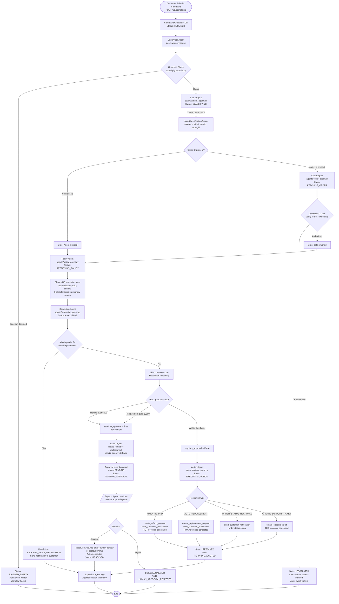
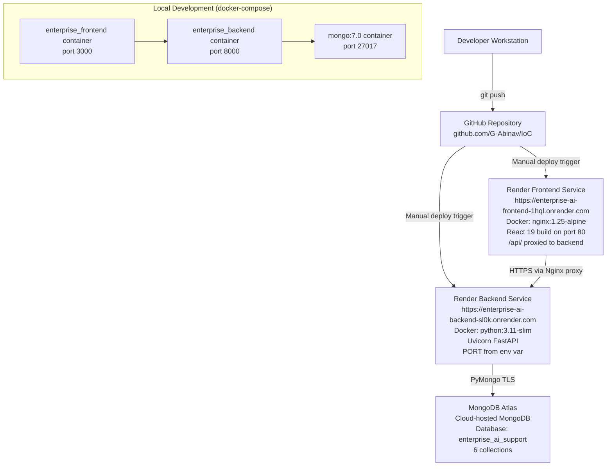
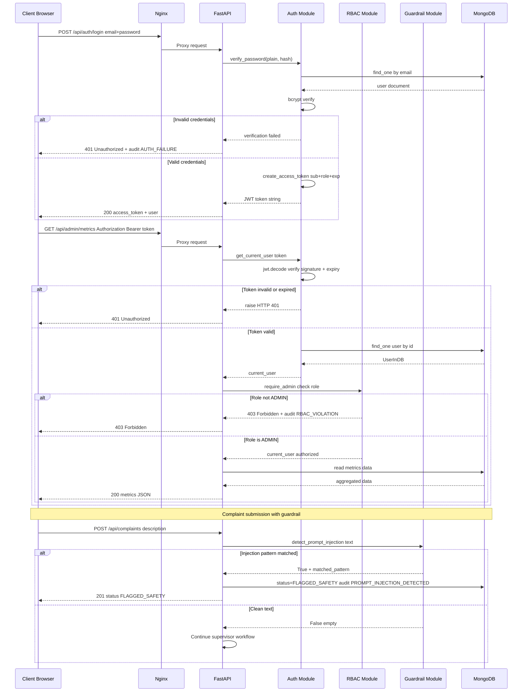
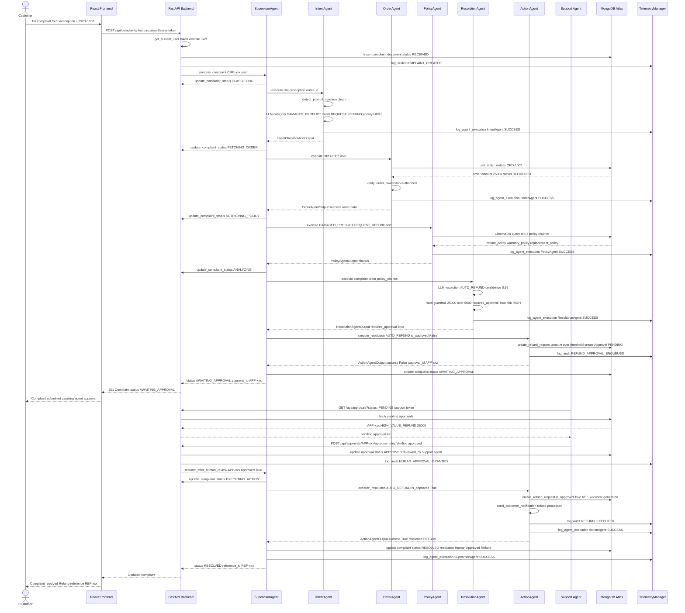
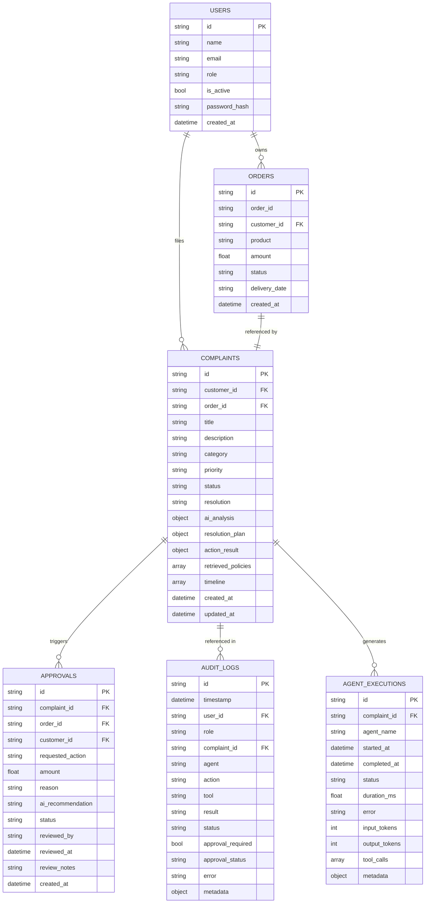

# Enterprise AI Customer Complaint Resolution & Support Agent

**Course:** Scalable Enterprise Architectural Deployments of Agentic AI Solutions – Industry Oriented Course

**Project Type:** Academic Capstone – Industry Oriented

**Technology Stack:** Python · FastAPI · React · Vite · MongoDB · ChromaDB · JWT · Docker · Nginx · Render

**Deployment Platform:** Render (Cloud PaaS) · MongoDB Atlas

**Version:** 1.0.0 · October 2026

---

## Table of Contents

1. [Executive Summary](#2-executive-summary)
2. [Problem Statement](#3-problem-statement)
3. [System Objectives](#4-system-objectives)
4. [Technology Stack](#5-technology-stack)
5. [Deliverable 1 — Enterprise Architecture Diagram](#deliverable-1--enterprise-architecture-diagram)
6. [Architecture Component Description](#7-architecture-component-description)
7. [Deliverable 2 — Agent Workflow Design](#deliverable-2--agent-workflow-design)
8. [Detailed Agent State / Workflow Table](#9-detailed-agent-state--workflow-table)
9. [Deliverable 3 — Deployment Strategy](#deliverable-3--deployment-strategy)
10. [Deployment URLs](#11-deployment-urls)
11. [Deliverable 4 — Security Model](#deliverable-4--security-model)
12. [Deliverable 5 — Monitoring Dashboard Design](#deliverable-5--monitoring-dashboard-design)
13. [End-to-End System Workflow](#14-end-to-end-system-workflow)
14. [Database Architecture](#15-database-architecture)
15. [API Architecture](#16-api-architecture)
16. [User Roles and Access Matrix](#17-user-roles-and-access-matrix)
17. [Error Handling and Reliability](#18-error-handling-and-reliability)
18. [Scalability Strategy](#19-scalability-strategy)
19. [Reliability and Fault Tolerance](#20-reliability-and-fault-tolerance)
20. [Agentic AI Design Principles](#21-agentic-ai-design-principles)
21. [Sample End-to-End Scenario](#22-sample-end-to-end-scenario)
22. [Monitoring and Observability Strategy](#23-monitoring-and-observability-strategy)
23. [Security and Compliance Considerations](#24-security-and-compliance-considerations)
24. [Testing Strategy](#25-testing-strategy)
25. [Local and Production Architecture Comparison](#26-local-and-production-architecture-comparison)
26. [Limitations](#27-limitations)
27. [Future Enhancements](#28-future-enhancements)
28. [Conclusion](#29-conclusion)
29. [References](#30-references)

---

## 2. Executive Summary

Traditional enterprise customer support systems rely heavily on manual triage — a human agent reads the complaint, looks up the relevant order, finds the applicable policy, and proposes a resolution. This process is slow, inconsistent across agents, and difficult to audit. When the number of complaints scales, the bottleneck grows proportionally.

This project addresses that problem by building a fully automated, Agentic AI-driven customer complaint resolution platform. Instead of a monolithic classification engine, the system decomposes every incoming complaint into a sequence of specialized agent tasks: intent classification, order retrieval, policy retrieval via RAG, resolution recommendation, and action execution. Each task is handled by a purpose-built agent that has a narrow, well-defined responsibility and communicates its output to the next agent through a shared workflow context managed by a central Supervisor Orchestrator.

Agentic AI was chosen specifically because complaint resolution is not a single-step problem. It requires conditional branching (should I fetch an order? does this need human approval?), retrieval-augmented reasoning (what does the refund policy say?), and gated execution (no refund above a threshold without human sign-off). A single large-language-model call cannot reliably handle all of that in one shot. The multi-agent architecture allows each agent to specialize and for the supervisor to maintain workflow state, making the overall system more predictable and auditable.

The platform provides three role-based dashboards — one for customers to submit and track complaints, one for support agents to review pending approvals and escalations, and one for administrators to monitor system health, agent telemetry, audit logs, and user management. It is containerized with Docker, deployed to Render's cloud platform, and uses MongoDB Atlas for persistent storage. The ChromaDB vector store holds company policy documents that are retrieved at query time to inform every resolution decision.

---

## 3. Problem Statement

### Traditional Complaint Handling Challenges

In a conventional support centre, every complaint passes through a multi-step manual workflow:

- **Manual triage and classification.** A human agent reads each complaint and decides which category it belongs to. This is slow and inconsistent — the same complaint might be classified differently by different agents on different days.
- **Manual order lookup.** The agent must open a separate system to find the relevant order, delivery date, and order value before deciding on a course of action.
- **Policy lookup difficulties.** Policy documents are typically stored in shared drives or wikis. Finding the exact clause that applies to a damaged-product refund within a warranty period requires the agent to know where to look.
- **Delayed resolution.** The combination of the steps above, plus internal approval chains for high-value actions, can push resolution times from hours to days.
- **Lack of centralized auditability.** Decisions made in email threads or ticketing comments are hard to reconstruct later. There is no single immutable record of what happened and why.
- **Human approval bottlenecks.** Sensitive actions — a large refund, for example — require manager sign-off, but there is no systematic way to route those requests to the right person and confirm completion.

### How This System Addresses the Problems

The platform replaces the manual workflow with an automated multi-agent pipeline that handles classification, order lookup, policy retrieval, and resolution reasoning without human intervention for standard cases. For sensitive actions that exceed configurable financial thresholds (₹5,000 for refunds, ₹10,000 for replacements), the system automatically pauses the workflow and routes the case to the human approval queue. Every state transition, agent execution, tool invocation, approval decision, and authentication event is written to an immutable audit log. The system does not eliminate the human support agent; it elevates that role from routine data-entry work to governance and exception handling.

---

## 4. System Objectives

The following objectives are directly supported by the implemented source code:

- **Automate complaint intake and intake logging.** Every complaint submitted via the frontend is immediately recorded and a `COMPLAINT_CREATED` audit event is written.
- **Classify complaint intent and category.** The Intent Agent uses an LLM (or deterministic demo mode) to assign a category from a fixed set and extract the order ID.
- **Detect and quarantine prompt injection attempts.** The guardrail module inspects complaint text before the LLM is invoked.
- **Retrieve order information with ownership enforcement.** The Order Agent queries the orders collection and verifies that the requesting customer owns the order.
- **Retrieve applicable policy clauses via RAG.** The Policy Agent queries ChromaDB (or falls back to an in-memory lexical index) to return the top-3 relevant policy chunks.
- **Generate a resolution recommendation.** The Resolution Agent synthesizes complaint facts, order data, and retrieved policy clauses to decide the resolution type.
- **Enforce financial guardrails.** Refunds above ₹5,000 and replacements above ₹10,000 are unconditionally routed to human approval regardless of the LLM recommendation.
- **Execute supported business actions.** The Action Agent invokes the appropriate tool: `create_refund_request`, `create_replacement_request`, `create_support_ticket`, or `send_customer_notification`.
- **Implement a Human-in-the-Loop approval gate.** Support agents and admins can approve or reject pending high-value actions, after which the supervisor resumes the workflow.
- **Maintain immutable audit logs.** Every significant system event is recorded with user ID, role, agent name, action, result, and timestamp.
- **Provide role-based dashboards.** Customer, Support Agent, and Admin dashboards each expose only the data and actions appropriate to that role.
- **Support containerized cloud deployment.** The system is packaged in Docker images and deployed to Render, with MongoDB Atlas as the managed database.

---

## 5. Technology Stack

| Layer | Technology | Purpose |
|---|---|---|
| Frontend UI | React 19 + Vite 8 | Single-page application with role-based routing |
| Frontend routing | React Router DOM v7 | Client-side routing with `ProtectedRoute` guards |
| Frontend HTTP client | Axios | REST API calls to the FastAPI backend |
| Frontend icons | Lucide React | Icon library used across dashboards |
| Reverse proxy (container) | Nginx 1.25 | Serves the React build and proxies `/api/` to backend |
| Backend framework | FastAPI (Python 3.11) | RESTful API with async route handlers |
| ASGI server | Uvicorn | Runs the FastAPI application |
| Authentication | PyJWT + Passlib/bcrypt | HS256 JWT token generation and bcrypt password hashing |
| AI / Agent Layer | Custom Python agents | SupervisorAgent, IntentAgent, OrderAgent, PolicyAgent, ResolutionAgent, ActionAgent |
| LLM provider | OpenAI-compatible HTTP API | Configurable; falls back to deterministic demo mode when `DEMO_MODE=true` |
| RAG / Vector store | ChromaDB (persistent) | Stores and retrieves policy document chunks by vector similarity |
| Policy documents | Markdown files | Five company policy documents in `data/policies/` |
| Primary database | MongoDB (via PyMongo) | Stores users, orders, complaints, approvals, audit logs, agent executions |
| Database fallback | In-memory dict store | Automatic fallback when MongoDB is unreachable |
| Containerization | Docker | Separate `Dockerfile.backend` and `Dockerfile.frontend` |
| Local orchestration | Docker Compose | Three-service stack: MongoDB, backend, frontend |
| Deployment | Render (PaaS) | Backend and frontend deployed as separate Render services |
| Managed database | MongoDB Atlas | Cloud-hosted MongoDB in production |
| Secrets / Config | `.env` file + Render environment variables | All secrets injected at runtime, never hardcoded |

---

## Deliverable 1 — Enterprise Architecture Diagram

### 6. Enterprise Architecture Diagram

```mermaid
graph TB
    subgraph CLIENT["Client Layer"]
        BROWSER["User Browser\n(Chrome / Firefox)"]
    end

    subgraph PRESENTATION["Presentation Layer — Render Frontend"]
        REACT["React 19 + Vite\nSPA (frontend/src/)"]
        NGINX["Nginx 1.25\nStatic server + /api/ proxy"]
        REACT --> NGINX
    end

    subgraph SECURITY_LAYER["Security Layer"]
        JWT_GUARD["JWT Bearer Token Validation\n(security/auth.py)"]
        RBAC_GUARD["RBAC Role Checker\n(security/rbac.py)"]
        GUARDRAIL["Prompt Injection Guardrail\n(security/guardrails.py)"]
    end

    subgraph API["API Layer — FastAPI on Render Backend"]
        AUTH_API["auth.py\nPOST /api/auth/login\nPOST /api/auth/register\nGET /api/auth/me"]
        COMP_API["complaints.py\nPOST /api/complaints\nGET /api/complaints\nGET /api/complaints/{id}\ncomplaint action endpoints"]
        APPR_API["approvals.py\nGET /api/approvals\nPOST /api/approvals/{id}/approve\nPOST /api/approvals/{id}/reject"]
        ADMIN_API["admin.py\nGET /api/admin/metrics\nGET /api/admin/agent-metrics\nGET /api/admin/audit-logs\nGET /api/admin/users\nPOST /api/admin/users"]
        ORDERS_API["orders.py\nGET /api/orders\nGET /api/orders/{order_id}"]
        HEALTH["GET /api/health\nGET /api/health/ready"]
    end

    subgraph AGENT_LAYER["Agentic AI Layer"]
        SUPERVISOR["SupervisorAgent\n(agents/supervisor.py)\nMaster Orchestrator"]
        INTENT["IntentAgent\n(agents/intent_agent.py)\nCategory + Order ID"]
        ORDER_AG["OrderAgent\n(agents/order_agent.py)\nOrder Data + Ownership"]
        POLICY_AG["PolicyAgent\n(agents/policy_agent.py)\nRAG Retrieval"]
        RESOLUTION_AG["ResolutionAgent\n(agents/resolution_agent.py)\nResolution Recommendation"]
        ACTION_AG["ActionAgent\n(agents/action_agent.py)\nTool Execution"]
        LLM["LLM Provider\n(services/llm_provider.py)\nOpenAI API / Demo Mode"]
    end

    subgraph TOOLS["Tool / Business Logic Layer"]
        REFUND_T["create_refund_request\n(tools/refund_tools.py)"]
        REPLACE_T["create_replacement_request\n(tools/replacement_tools.py)"]
        SUPPORT_T["create_support_ticket\nupdate_complaint_status\nsend_customer_notification\n(tools/support_tools.py)"]
        ORDER_T["get_order_details\nget_order_status\n(tools/order_tools.py)"]
    end

    subgraph RAG_LAYER["RAG Layer"]
        CHROMA["ChromaDB\n(data/chroma_db/)\nVector Store"]
        POLICIES_MD["Policy Markdown Files\n(data/policies/*.md)\n5 company policies"]
        RETRIEVER["PolicyRetriever\n(rag/retriever.py)"]
        INGESTION["Policy Ingestion\n(rag/ingestion.py)"]
    end

    subgraph HITL["Human-in-the-Loop Gate"]
        APPROVAL_QUEUE["Approval Queue\n(approvals collection)"]
        SUPPORT_REVIEW["Support Agent / Admin\nReview Interface\n(SupportApprovalsPage.jsx)"]
    end

    subgraph DATA["Data Layer — MongoDB Atlas"]
        USERS_COL["users collection"]
        ORDERS_COL["orders collection"]
        COMP_COL["complaints collection"]
        APPR_COL["approvals collection"]
        AUDIT_COL["audit_logs collection"]
        EXEC_COL["agent_executions collection"]
        REPO["GenericCollection Repository\n(database/repository.py)\nMongoDB + in-memory fallback"]
    end

    subgraph MONITORING["Monitoring Layer"]
        TELEMETRY["TelemetryManager\n(monitoring/telemetry.py)"]
        METRICS["MetricsAggregator\n(monitoring/metrics.py)"]
    end

    subgraph INFRA["Infrastructure Layer — Render + GitHub"]
        RENDER_BACK["Render Backend Service\nDocker container\npython:3.11-slim"]
        RENDER_FRONT["Render Frontend Service\nDocker container\nnginx:1.25-alpine"]
        GIT["GitHub Repository\nG-Abinav/IoC"]
        ATLAS["MongoDB Atlas\nCloud Managed DB"]
    end

    BROWSER --> NGINX
    NGINX -->|HTTPS REST| AUTH_API
    NGINX -->|HTTPS REST| COMP_API
    NGINX -->|HTTPS REST| APPR_API
    NGINX -->|HTTPS REST| ADMIN_API
    NGINX -->|HTTPS REST| ORDERS_API

    AUTH_API --> JWT_GUARD
    COMP_API --> JWT_GUARD
    APPR_API --> JWT_GUARD
    ADMIN_API --> JWT_GUARD
    ORDERS_API --> JWT_GUARD

    JWT_GUARD --> RBAC_GUARD
    RBAC_GUARD --> COMP_API
    RBAC_GUARD --> APPR_API
    RBAC_GUARD --> ADMIN_API

    COMP_API -->|POST /api/complaints triggers| SUPERVISOR
    SUPERVISOR --> GUARDRAIL
    SUPERVISOR --> INTENT
    SUPERVISOR --> ORDER_AG
    SUPERVISOR --> POLICY_AG
    SUPERVISOR --> RESOLUTION_AG
    SUPERVISOR --> ACTION_AG

    INTENT --> LLM
    RESOLUTION_AG --> LLM

    POLICY_AG --> RETRIEVER
    RETRIEVER --> CHROMA
    RETRIEVER -->|fallback| POLICIES_MD
    INGESTION --> CHROMA

    ORDER_AG --> ORDER_T
    ACTION_AG --> REFUND_T
    ACTION_AG --> REPLACE_T
    ACTION_AG --> SUPPORT_T

    REFUND_T -->|amount over threshold| APPROVAL_QUEUE
    REPLACE_T -->|amount over threshold| APPROVAL_QUEUE
    APPROVAL_QUEUE --> SUPPORT_REVIEW
    SUPPORT_REVIEW --> APPR_API
    APPR_API -->|resume| SUPERVISOR

    SUPERVISOR --> TELEMETRY
    AUTH_API --> TELEMETRY
    COMP_API --> TELEMETRY
    APPR_API --> TELEMETRY
    ADMIN_API --> TELEMETRY
    RBAC_GUARD --> TELEMETRY

    TELEMETRY --> AUDIT_COL
    TELEMETRY --> EXEC_COL

    METRICS --> COMP_COL
    METRICS --> APPR_COL
    METRICS --> AUDIT_COL
    METRICS --> EXEC_COL

    REPO --> USERS_COL
    REPO --> ORDERS_COL
    REPO --> COMP_COL
    REPO --> APPR_COL
    REPO --> AUDIT_COL
    REPO --> EXEC_COL

    USERS_COL --> ATLAS
    ORDERS_COL --> ATLAS
    COMP_COL --> ATLAS
    APPR_COL --> ATLAS
    AUDIT_COL --> ATLAS
    EXEC_COL --> ATLAS

    GIT --> RENDER_BACK
    GIT --> RENDER_FRONT
    RENDER_BACK --> ATLAS
```



---

## 7. Architecture Component Description

| Component | Responsibility | Technology / File | Interaction |
|---|---|---|---|
| **React SPA** | Renders all user-facing pages; enforces client-side route protection | React 19, Vite, `frontend/src/App.jsx` | Communicates with backend via Axios HTTP |
| **Nginx** | Serves compiled React build; proxies `/api/` requests to the Render backend | Nginx 1.25, `frontend/Dockerfile.frontend` | Sits between browser and FastAPI |
| **FastAPI** | Exposes RESTful API routes; validates request models; coordinates all server-side logic | FastAPI, `backend/main.py` | Central hub for auth, agents, RBAC, telemetry |
| **Auth Router** | Handles registration, login, and `GET /api/auth/me` | `backend/api/auth.py` | Issues JWT; writes login/failure audit events |
| **Complaints Router** | Creates complaints, triggers supervisor, provides complaint CRUD for all roles | `backend/api/complaints.py` | Calls `supervisor_agent.process_complaint()` |
| **Approvals Router** | Lists pending approvals; provides approve/reject/decision endpoints | `backend/api/approvals.py` | Calls `supervisor_agent.resume_after_human_review()` |
| **Admin Router** | Exposes admin-only metrics, audit logs, and user management endpoints | `backend/api/admin.py` | Uses `MetricsAggregator` and `repo` |
| **Orders Router** | Lists and retrieves individual orders with ownership enforcement | `backend/api/orders.py` | Reads `orders` collection via `repo` |
| **JWT Auth** | Password hashing (bcrypt), token creation, token validation, `get_current_user` dependency | PyJWT, Passlib, `backend/security/auth.py` | Called by every protected route via `Depends()` |
| **RBAC** | `require_roles()` factory returns a FastAPI dependency that checks the user's role and logs violations | `backend/security/rbac.py` | Gates access to support, admin, and approval endpoints |
| **Guardrail** | Regex-based prompt injection detection; tool whitelist enforcement; sensitive-data masking for logs | `backend/security/guardrails.py` | Called by IntentAgent before LLM invocation |
| **SupervisorAgent** | Orchestrates the end-to-end workflow; manages state transitions; handles exceptions; routes high-risk cases to approval queue | `backend/agents/supervisor.py` | Calls all five sub-agents in sequence |
| **IntentAgent** | Classifies complaint category, extracts order ID, assigns priority, runs guardrail check | `backend/agents/intent_agent.py` | Calls `llm_provider.generate_completion()` |
| **OrderAgent** | Retrieves order record and validates customer ownership | `backend/agents/order_agent.py` | Calls `get_order_details()` tool |
| **PolicyAgent** | Queries ChromaDB for top-3 relevant policy chunks; falls back to lexical in-memory search | `backend/agents/policy_agent.py` | Calls `policy_retriever.retrieve_relevant_policies()` |
| **ResolutionAgent** | Synthesizes complaint data + order + policy chunks into a resolution; applies hard financial guardrails | `backend/agents/resolution_agent.py` | Calls `llm_provider.generate_completion()` |
| **ActionAgent** | Executes the resolved action by calling the correct business tool | `backend/agents/action_agent.py` | Calls refund, replacement, support, and notification tools |
| **LLM Provider** | Abstraction layer supporting OpenAI-compatible APIs and a deterministic rule-based demo mode | `backend/services/llm_provider.py` | Called by IntentAgent and ResolutionAgent |
| **Policy RAG** | ChromaDB vector search with keyword fallback; ingests Markdown policy files at startup | `backend/rag/retriever.py`, `backend/rag/ingestion.py` | Used by PolicyAgent |
| **Business Tools** | `create_refund_request`, `create_replacement_request`, `create_support_ticket`, `update_complaint_status`, `send_customer_notification`, `get_order_details` | `backend/tools/` | Called by ActionAgent and OrderAgent |
| **Repository** | Unified collection interface abstracting MongoDB reads/writes with an automatic in-memory fallback | `backend/database/repository.py` | Used by every component that touches data |
| **TelemetryManager** | Writes `AuditLog` and `AgentExecution` records to the database on every significant event | `backend/monitoring/telemetry.py` | Called from agents, routers, and RBAC |
| **MetricsAggregator** | Aggregates operational, AI, business, security, and cost metrics from stored records | `backend/monitoring/metrics.py` | Polled by `GET /api/admin/metrics` |
| **Admin Dashboard** | Displays system-wide metrics, user management, agent performance, and audit logs | `frontend/src/pages/admin/AdminDashboard.jsx` | Consumes admin API endpoints |
| **Support Dashboard** | Shows complaint queue and pending approval requests | `frontend/src/pages/support/SupportDashboard.jsx` | Consumes complaints and approvals APIs |

---

## Deliverable 2 — Agent Workflow Design

### 8. Agent Workflow Diagram



### 8.1 Supervisor / Orchestrator

The `SupervisorAgent` (`agents/supervisor.py`) is the master controller for the entire complaint resolution pipeline. When `POST /api/complaints` is called, the FastAPI router immediately calls `supervisor_agent.process_complaint(complaint_id, user)`.

**Responsibilities:**
- Calls each sub-agent in order, passing the accumulated context forward
- Updates complaint status at each step using `update_complaint_status()`
- Detects prompt injection flags returned by the Intent Agent and sets status to `FLAGGED_SAFETY`
- Enforces cross-tenant order access policy by checking the Order Agent's `is_unauthorized` flag
- Checks `resolution_result.requires_approval` and routes to the approval queue if true
- After human approval via `resume_after_human_review()`, rebuilds the action payload from the stored order and approval records and re-invokes the Action Agent with `is_human_approved=True`
- Catches all unhandled exceptions and transitions the complaint to `ESCALATED` status with a human-readable error message

**Inputs:** `complaint_id` (str), `user` (UserInDB)

**Outputs:** A dict with `success`, `status`, `resolution`, `action`, `reference_id`, and optionally `approval_id`

### 8.2 Intent Agent

The `IntentAgent` (`agents/intent_agent.py`) is the first agent to execute in the pipeline. It receives the complaint title, description, and any order ID the customer supplied in the form.

**Step 1 — Guardrail:** Calls `detect_prompt_injection()` on the combined title and description text before any LLM call. A regex scan checks for patterns such as `ignore previous instructions`, `bypass approval`, `reveal secrets`, and HTML `<script>` tags. If a match is found, the agent returns an `IntentClassificationOutput` with `security_flag` set, and the supervisor halts the workflow.

**Step 2 — LLM Classification:** Calls `llm_provider.generate_completion()` with a structured system prompt instructing the model to output a JSON object. The LLM (or deterministic demo engine) returns:

| Field | Possible Values |
|---|---|
| `category` | REFUND, REPLACEMENT, DAMAGED_PRODUCT, WRONG_PRODUCT, ORDER_STATUS, PAYMENT_ISSUE, DELIVERY_ISSUE, PRODUCT_ISSUE, GENERAL_SUPPORT, OTHER |
| `intent` | REQUEST_REFUND, REQUEST_REPLACEMENT, CHECK_ORDER_STATUS, REPORT_DEFECT, GENERAL_INQUIRY, etc. |
| `priority` | LOW, MEDIUM, HIGH, CRITICAL |
| `order_id` | Extracted ORD-XXXX string or null |
| `confidence` | Float 0.0–1.0 |

The explicit order ID supplied by the customer via the form always overrides any ID the LLM might extract.

### 8.3 Order Agent

The `OrderAgent` (`agents/order_agent.py`) calls the `get_order_details()` tool which queries the `orders` MongoDB collection. Before returning data, `verify_order_ownership()` from `security/rbac.py` is invoked — if the complaint's customer does not own the order, the agent sets `is_unauthorized=True` and the supervisor escalates the complaint without proceeding further.

Tool calls logged: `["get_order_details"]`

### 8.4 Policy / RAG Agent

The `PolicyAgent` (`agents/policy_agent.py`) constructs a query string from the category, intent, and complaint text, then calls `policy_retriever.retrieve_relevant_policies(query, top_k=3)`.

**Retrieval flow:**
1. The retriever first tries ChromaDB (`chromadb.PersistentClient` at `data/chroma_db/`). ChromaDB uses its default embedding model for semantic vector search and returns the top-k document chunks with distance scores.
2. If ChromaDB is unavailable or returns no results, the retriever falls back to a keyword overlap scorer that runs against the in-memory list of chunks pre-loaded from the five Markdown policy files.

**Policy documents available:**
- `customer_support_policy.md`
- `refund_policy.md`
- `replacement_policy.md`
- `shipping_policy.md`
- `warranty_policy.md`

Each chunk carries a `document_name`, `section`, `text`, and `relevance_score`. These chunks are passed directly to the Resolution Agent.

### 8.5 Resolution Agent

The `ResolutionAgent` (`agents/resolution_agent.py`) receives the complaint text, category, intent, full order dict, and the list of policy chunks. It formats a single rich prompt and calls the LLM.

**Hard guardrails applied after LLM response:**
- If the order amount exceeds `HIGH_VALUE_REFUND_THRESHOLD` (default ₹5,000) and the resolution involves a refund, `requires_approval` is unconditionally set to `True` regardless of what the LLM returned.
- If the order amount exceeds `HIGH_VALUE_REPLACEMENT_THRESHOLD` (default ₹10,000) and the resolution involves replacement, same enforcement applies.
- If the resolution is `ORDER_STATUS_RESPONSE`, `requires_approval` is forced to `False`.

Possible resolutions: `AUTO_REFUND`, `AUTO_REPLACEMENT`, `ORDER_STATUS_RESPONSE`, `CREATE_SUPPORT_TICKET`, `HUMAN_REVIEW`, `REJECT_REQUEST`, `REQUEST_MORE_INFORMATION`.

### 8.6 Action / Tool Layer

The `ActionAgent` (`agents/action_agent.py`) maps resolution strings to tool function calls:

| Resolution | Tool(s) Called | Reference Generated |
|---|---|---|
| `AUTO_REFUND` | `create_refund_request()`, `send_customer_notification()` | `REF-xxxxxxxx` |
| `AUTO_REPLACEMENT` | `create_replacement_request()`, `send_customer_notification()` | RMA reference |
| `ORDER_STATUS_RESPONSE` | `send_customer_notification()` | — |
| `REQUEST_MORE_INFORMATION` | `send_customer_notification()` | — |
| `CREATE_SUPPORT_TICKET` (default) | `create_support_ticket()`, `send_customer_notification()` | `TCK-xxxxxxxx` |

All tool names are validated against the whitelist in `security/guardrails.py` (`ALLOWED_TOOLS` set).

### 8.7 Human-in-the-Loop (HITL)

**When approval is required:**
The Resolution Agent returns `requires_approval=True` because the action amount exceeds the configured financial threshold (₹5,000 for refunds, ₹10,000 for replacements), or because the LLM assessed risk as `HIGH`.

**Approval record creation:**
The `create_refund_request()` or `create_replacement_request()` tool creates an `Approval` document with status `PENDING` in the `approvals` collection, then returns `approval_required=True`. The supervisor sets the complaint status to `AWAITING_APPROVAL` and returns.

**Who can approve:**
`SUPPORT_AGENT` and `ADMIN` roles. Customers are blocked at the RBAC layer (HTTP 403).

**What happens after approval:**
`POST /api/approvals/{id}/approve` is called. The approval record is updated to `APPROVED`, a `HUMAN_APPROVAL_GRANTED` audit event is written, and `supervisor_agent.resume_after_human_review()` is called. The supervisor re-invokes the Action Agent with `is_human_approved=True`, which bypasses the threshold check inside the tool and executes the action. The complaint status is set to `RESOLVED`.

**What happens after rejection:**
`POST /api/approvals/{id}/reject` updates the approval to `REJECTED`, a `HUMAN_APPROVAL_REJECTED` audit event is written, and the supervisor sets the complaint status to `ESCALATED`.

**Duplicate execution prevention:**
If an approval record is not in `PENDING` status, the approve/reject endpoints return HTTP 400 Bad Request.

### 8.8 Failure Handling

| Scenario | Current Behavior |
|---|---|
| Complaint not found | Returns `{"success": False, "error": "not found"}` |
| Prompt injection detected | Workflow halted; status → `FLAGGED_SAFETY`; audit event written |
| Cross-tenant order access | Workflow halted; status → `ESCALATED`; audit event written |
| Order not found | Supervisor continues without order data; resolution set to `REQUEST_MORE_INFORMATION` if category requires an order |
| Agent exception | `try/except` in supervisor catches all exceptions; status → `ESCALATED` |
| Tool failure | `ActionAgentOutput(success=False)` returned; complaint status set to `FAILED` |
| MongoDB unreachable | `GenericCollection` falls back silently to in-memory dict store |
| Unauthenticated request | HTTP 401 |
| Insufficient role | HTTP 403; violation logged to telemetry |
| Invalid approval state | HTTP 400 if not `PENDING` |

---

## 9. Detailed Agent State / Workflow Table

| Step | Agent / Component | Input | Processing | Output | Next Step |
|---|---|---|---|---|---|
| 1 | Complaints Router | HTTP POST body (description, order_id, title, category) | Creates Complaint document; writes COMPLAINT_CREATED audit event | Complaint ID, status RECEIVED | Supervisor Agent |
| 2 | Supervisor Agent | complaint_id, UserInDB | Orchestrates workflow; sets status CLASSIFYING; calls Intent Agent | Overall workflow result | Intent Agent |
| 3 | Intent Agent | complaint_id, title, description, explicit_order_id | Guardrail scan → LLM classification → IntentClassificationOutput | category, intent, priority, order_id, security_flag | Order Agent (if order_id) or Policy Agent |
| 4 | Order Agent | complaint_id, order_id, user | Calls get_order_details(); verifies ownership; status FETCHING_ORDER | OrderAgentOutput with order dict or unauthorized flag | Policy Agent |
| 5 | Policy Agent | complaint_id, category, intent, complaint_text | Queries ChromaDB or lexical fallback; status RETRIEVING_POLICY | Up to 3 policy chunk dicts with relevance scores | Resolution Agent |
| 6 | Resolution Agent | complaint_id, complaint text, order dict, policy chunks | LLM prompt → resolution type; hard guardrail threshold check; status ANALYZING | resolution, reason, requires_approval, confidence, risk_assessment, action_payload | Approval gate check |
| 7 | Supervisor (approval gate) | requires_approval boolean | If True: calls Action Agent with is_approved=False to create approval record; sets status AWAITING_APPROVAL | Approval ID stored in DB | Human review or Action Agent |
| 8 | Action Agent | complaint_id, resolution, action_payload, user, is_human_approved | Calls the correct business tool; sends customer notification | ActionAgentOutput with success, action, reference_id, message | Status update |
| 9 | Support Agent (HITL) | Approval record | Approve or reject via POST /api/approvals/{id}/approve or reject | Approval record updated; supervisor resumed | Supervisor resumes |
| 10 | Supervisor (post-approval) | complaint_id, approval_id, is_approved, reviewer_user | If approved: calls Action Agent with is_human_approved=True. If rejected: sets ESCALATED. | Final status RESOLVED or ESCALATED | Telemetry log |
| 11 | TelemetryManager | All events throughout workflow | Writes AuditLog and AgentExecution records to DB | Immutable audit trail | End |

---

## Deliverable 3 — Deployment Strategy

### 10. Deployment Strategy

#### Deployment Architecture Diagram



### 10.1 Source Control

- **Platform:** GitHub
- **Repository:** `https://github.com/G-Abinav/IoC`
- **Structure:**

```
IoC/
├── backend/              # FastAPI application
│   ├── agents/           # Six agent modules
│   ├── api/              # Five API router modules
│   ├── database/         # MongoDB connection + repository
│   ├── models/           # Pydantic data models
│   ├── monitoring/       # Telemetry + metrics
│   ├── rag/              # ChromaDB ingestion + retrieval
│   ├── security/         # Auth, RBAC, guardrails
│   ├── services/         # LLM provider abstraction
│   ├── tools/            # Business tool functions
│   ├── config.py         # Centralised settings via pydantic-settings
│   └── main.py           # FastAPI app entry point
├── frontend/             # React 19 + Vite SPA
│   ├── src/
│   │   ├── api/          # Axios client
│   │   ├── components/   # Navbar, Sidebar, WorkflowTimeline, etc.
│   │   ├── context/      # AuthContext
│   │   ├── pages/        # admin/, customer/, support/ page trees
│   ├── Dockerfile.frontend
│   └── vite.config.js
├── data/
│   ├── chroma_db/        # ChromaDB persistent vector store
│   └── policies/         # Five Markdown policy documents
├── tests/                # Three test files
├── scripts/              # seed_database.py
├── docs/                 # Internal architecture notes
├── Dockerfile.backend
├── docker-compose.yml
├── requirements.txt
└── .env.example
```

### 10.2 Backend Deployment

- **Docker base image:** `python:3.11-slim`
- **Build steps:** Install system build tools → `pip install -r requirements.txt` → copy source
- **Entrypoint:** `uvicorn backend.main:app --host 0.0.0.0 --port ${PORT:-8000}`
- **Port:** Read from the `PORT` environment variable (Render injects this automatically)
- **Platform:** Render Web Service configured to use `Dockerfile.backend` at the repository root
- **On startup:** The lifespan handler checks if the `users` collection is empty and calls `seed()` to populate a baseline demonstration dataset

### 10.3 Frontend Deployment

- **Build stage:** `node:20-alpine` runs `npm run build` (Vite) producing a `dist/` folder
- **Serve stage:** `nginx:1.25-alpine` serves `dist/` with an inline Nginx configuration:
  - `location /` — serves `index.html` for all routes (SPA single-entry routing)
  - `location /api/` — proxies to `https://enterprise-ai-backend-sl0k.onrender.com` with correct forwarding headers
- **Port:** Container port 80
- **Platform:** Render Web Service using `frontend/Dockerfile.frontend`

### 10.4 Database Deployment

- **Service:** MongoDB Atlas (cloud-managed MongoDB)
- **Database name:** `enterprise_ai_support`
- **Collections:** `users`, `orders`, `complaints`, `approvals`, `audit_logs`, `agent_executions`
- **Connection:** Backend connects using the `MONGODB_URI` environment variable (a TLS-enabled Atlas connection string). A 1.5-second connection timeout is set so that if Atlas is unreachable the application falls back to in-memory mode rather than crashing.
- **Security:** The Atlas connection string is stored as a Render environment secret. It is not committed to the repository.

> **Note:** The `.env` file contains local development defaults only. It is listed in `.gitignore` and is not pushed to GitHub. Production secrets are managed exclusively through Render's environment variable configuration.

### 10.5 Environment Configuration

| Variable | Purpose | Default / Example |
|---|---|---|
| `PORT` | Uvicorn listen port (injected by Render) | `8000` |
| `HOST` | Bind address | `0.0.0.0` |
| `ENVIRONMENT` | Runtime environment label | `development` / `production` |
| `JWT_SECRET` | HMAC secret used to sign and verify JWTs | *(secret — stored in Render)* |
| `JWT_ALGORITHM` | JWT signing algorithm | `HS256` |
| `ACCESS_TOKEN_EXPIRE_MINUTES` | Token lifetime | `720` (12 hours) |
| `MONGODB_URI` | Full MongoDB Atlas connection string | `<MONGODB_URI>` |
| `DATABASE_NAME` | MongoDB database name | `enterprise_ai_support` |
| `DEMO_MODE` | `true` = deterministic demo; `false` = live LLM | `true` |
| `LLM_PROVIDER` | LLM provider hint | `openai` |
| `LLM_API_KEY` | API key for OpenAI (empty in demo mode) | *(secret)* |
| `LLM_MODEL` | Model name | `gpt-4o` |
| `CHROMA_PERSIST_DIR` | Path to ChromaDB persistence directory | `./data/chroma_db` |
| `POLICIES_DIR` | Path to policy Markdown files | `./data/policies` |
| `HIGH_VALUE_REFUND_THRESHOLD` | Maximum automated refund amount (INR) | `5000.0` |
| `HIGH_VALUE_REPLACEMENT_THRESHOLD` | Maximum automated replacement value (INR) | `10000.0` |
| `REPLACEMENT_ELIGIBILITY_DAYS` | Days after delivery within which replacement is eligible | `7` |
| `REFUND_ELIGIBILITY_DAYS` | Days after delivery within which refund is eligible | `14` |

### 10.6 Containerization

**Backend image (`Dockerfile.backend`):**

```dockerfile
FROM python:3.11-slim
WORKDIR /app
RUN apt-get update && apt-get install -y build-essential curl
COPY requirements.txt .
RUN pip install --no-cache-dir -r requirements.txt
COPY . .
EXPOSE 8000
CMD ["sh", "-c", "uvicorn backend.main:app --host 0.0.0.0 --port ${PORT:-8000}"]
```

**Frontend image (`frontend/Dockerfile.frontend`) — Multi-stage:**
1. **Builder stage:** `node:20-alpine` installs npm dependencies and runs `vite build`
2. **Production stage:** `nginx:1.25-alpine` serves the compiled `dist/` with inline Nginx configuration for SPA routing and API proxying

**Docker Compose (local development):**

`docker-compose.yml` defines three services:
- `mongodb` — `mongo:7.0` with a health check and a named volume for data persistence
- `backend` — built from `Dockerfile.backend`, depends on MongoDB health check, binds port 8000
- `frontend` — built from `frontend/Dockerfile.frontend`, depends on backend, exposes port 3000

### 10.7 CI/CD

There is no automated CI/CD pipeline configured in the repository (no GitHub Actions workflows were found in the source). Deployments to Render are triggered **manually** from the Render dashboard or by using Render's manual deploy option after pushing to the connected branch.

---

## 11. Deployment URLs

| Service | URL |
|---|---|
| **Frontend (Production)** | https://enterprise-ai-frontend-1hql.onrender.com |
| **Backend API (Production)** | https://enterprise-ai-backend-sl0k.onrender.com |
| **Backend API Docs (Swagger UI)** | https://enterprise-ai-backend-sl0k.onrender.com/docs |
| **GitHub Repository** | https://github.com/G-Abinav/IoC |

> **Note:** Render free-tier services spin down after inactivity. The first request after a period of inactivity may take 30–60 seconds to receive a response while the container restarts.

---

## Deliverable 4 — Security Model

### 12. Security Architecture



### 12.1 Authentication

**Registration (`POST /api/auth/register`):**
Public endpoint. Accepts `name`, `email`, and `password`. The client-supplied `role` field (if present) is strictly ignored — the backend always assigns `Role.CUSTOMER`. The password is hashed with bcrypt via Passlib's `CryptContext`. A JWT access token is returned. A `CUSTOMER_REGISTRATION` audit event is written.

**Login (`POST /api/auth/login`):**
Accepts `email` and `password`. The user record is fetched by email, and bcrypt verification is performed. If verification fails, a `AUTH_FAILURE` audit event is written and HTTP 401 is returned. If the account is deactivated, an `AUTH_DEACTIVATED_USER` audit event is written and HTTP 403 is returned. On success, a JWT is generated containing `sub` (user ID), `email`, and `role`. A `USER_LOGIN_SUCCESS` audit event is written.

**JWT Token:**
- Algorithm: HS256
- Expiry: 720 minutes (12 hours, configurable)
- Payload: `{"sub": user_id, "email": email, "role": role_value, "exp": expiry_timestamp}`
- Signed with `JWT_SECRET` from environment

**Token Validation:**
Every protected route depends on `get_current_user()`, registered as an OAuth2 Bearer dependency. If the token is missing, malformed, or expired, HTTP 401 is returned.

### 12.2 Role-Based Access Control

Three roles are defined in `backend/models/user.py`:

| Role | Description | Route Access |
|---|---|---|
| `CUSTOMER` | Self-registered end user | Auth routes, own complaints, own orders |
| `SUPPORT_AGENT` | Created by admin only | All customer routes + approvals, complaint action endpoints |
| `ADMIN` | Created by admin only | All support routes + all `/api/admin/*` endpoints |

Convenience RBAC dependencies in `security/rbac.py`:

```python
require_customer = require_roles([Role.CUSTOMER, Role.SUPPORT_AGENT, Role.ADMIN])
require_support  = require_roles([Role.SUPPORT_AGENT, Role.ADMIN])
require_admin    = require_roles([Role.ADMIN])
```

Every RBAC violation is logged to telemetry as `UNAUTHORIZED_ROLE_ACCESS_BLOCKED`.

### 12.3 API Security

- All protected endpoints declare `Depends(get_current_user)` or a role-specific dependency
- Missing or invalid token → HTTP 401
- Insufficient role → HTTP 403
- The `ProtectedRoute` component in `App.jsx` guards frontend routes with an equivalent role check, redirecting unauthorized users to `/unauthorized`

### 12.4 Data Isolation

**Complaint isolation:** In `GET /api/complaints`, if `current_user.role == Role.CUSTOMER`, the query is unconditionally filtered to `{"customer_id": current_user.id}`. In `GET /api/complaints/{id}`, the backend verifies `complaint.customer_id == current_user.id`. Violations return HTTP 403 and write a `UNAUTHORIZED_COMPLAINT_ACCESS` audit event.

**Order isolation:** In `GET /api/orders`, customer queries are filtered to `{"customer_id": current_user.id}`. In `GET /api/orders/{order_id}`, `verify_order_ownership()` checks whether the customer owns the order. Cross-tenant access returns HTTP 403 and writes an `UNAUTHORIZED_ACCESS_ATTEMPT` audit event.

**Agent-level order isolation:** Inside the Supervisor workflow, `OrderAgent.execute()` also calls `verify_order_ownership()`. If the order does not belong to the complaint's customer, the agent flags `is_unauthorized=True` and the supervisor escalates the complaint.

### 12.5 Human Approval Security

High-risk business actions are gated behind a mandatory human review. The thresholds are configurable:

- `HIGH_VALUE_REFUND_THRESHOLD` = ₹5,000 (default)
- `HIGH_VALUE_REPLACEMENT_THRESHOLD` = ₹10,000 (default)

When a threshold is exceeded, the business tool creates an `Approval` record with `status=PENDING`. Only `SUPPORT_AGENT` or `ADMIN` roles can call the approve or reject endpoints. Attempting to approve from a `CUSTOMER` token returns HTTP 403. Once an approval is actioned, re-submitting the same approval ID returns HTTP 400 (preventing duplicate execution). Every approval decision is recorded in the audit log.

### 12.6 Secrets Management

- All secrets (`JWT_SECRET`, `MONGODB_URI`, `LLM_API_KEY`) are stored as Render environment variables and are not committed to the repository
- The `.env.example` file provides a reference with placeholder values and is safe to commit
- The actual `.env` file is excluded via `.gitignore`
- The `TelemetryManager` uses `mask_sensitive_data()` before writing any string values to audit logs, masking credit card numbers, JWT tokens, and password fields

### 12.7 CORS

**Current implementation:**

```python
app.add_middleware(
    CORSMiddleware,
    allow_origins=["*"],   # Permits all origins
    allow_credentials=True,
    allow_methods=["*"],
    allow_headers=["*"],
)
```

The current CORS configuration is **fully permissive**. This is acceptable for a development/demonstration deployment but is not production-safe.

**Recommended hardening (not yet implemented):** Replace `allow_origins=["*"]` with an explicit whitelist such as `["https://enterprise-ai-frontend-1hql.onrender.com"]`.

### 12.8 Security Threats and Mitigations

| Threat | Potential Impact | Current Mitigation | Recommended Improvement |
|---|---|---|---|
| Unauthorized API access | Data leak, unauthorized actions | JWT validation on all protected routes; HTTP 401 on missing/invalid token | Rate limiting per IP; refresh token rotation |
| Privilege escalation via registration | Attacker self-assigns ADMIN role | Registration always assigns CUSTOMER regardless of client payload | Already mitigated |
| JWT theft | Impersonation of victim user | HTTPS in transit; tokens expire in 12 hours | Short-lived access tokens + refresh tokens; HttpOnly cookie storage |
| Credential brute force | Account takeover | bcrypt password hashing | Rate limit login endpoint; account lockout after N failures |
| Cross-tenant data access | Customer views another customer's data | customer_id filter enforced server-side; audit event on violation | Already mitigated |
| Prompt injection | Adversarial complaint manipulates LLM output | Regex guardrail before LLM call; flagged complaints quarantined | Semantic injection detection |
| Unauthorized business action | Refund issued without authorization | Financial threshold guardrail forces human approval; RBAC blocks customer from approvals | Already mitigated |
| API abuse / denial of service | Service unavailability | None currently implemented | Rate limiting middleware |
| Database credential exposure | Full database compromise | Atlas URI stored in Render secrets; not in repository | MongoDB Atlas IP allowlist |
| Secret leakage in logs | JWT tokens or passwords logged | mask_sensitive_data() applied to all audit log string values | Secrets scanner in CI |
| CORS abuse | Cross-site API calls | None (currently allow_origins=*) | Restrict to frontend origin |

---

## Deliverable 5 — Monitoring Dashboard Design

### 13. Monitoring Dashboard Design

The monitoring capability is built from two complementary layers: the `TelemetryManager` writes records to the database in real time, and the `MetricsAggregator` reads and aggregates those records to serve the admin dashboard.

### 13.1 System Health

The backend exposes two health check endpoints accessible without authentication:

- `GET /api/health` — returns `status`, `version`, `service`, `environment`, `demo_mode`, and `database` (either `mongodb_live` or `autonomous_in_memory_repository`)
- `GET /api/health/ready` — returns `database_connected` boolean and the list of registered agents

### 13.2 Agent Monitoring

`GET /api/admin/agent-metrics` (Admin only) returns the following per-agent breakdown from the `agent_executions` collection:

| Metric | Description |
|---|---|
| `agent_name` | One of: SupervisorAgent, IntentAgent, OrderAgent, PolicyAgent, ResolutionAgent, ActionAgent |
| `invocations` | Total number of times this agent was called |
| `success_rate` | Percentage of calls where status == SUCCESS |
| `failure_count` | Number of non-success executions |
| `avg_duration_ms` | Average execution time in milliseconds |
| `tool_calls` | Total number of tool invocations made by this agent |
| `last_status` | Status of the most recent execution |

### 13.3 Complaint Monitoring

`GET /api/admin/metrics` returns the following operational metrics from the `complaints` collection:

| Metric | Description |
|---|---|
| `total_complaints` | Total complaint count |
| `open_complaints` | Complaints in active processing states |
| `resolved_complaints` | Complaints with status RESOLVED |
| `escalated_complaints` | Complaints with status ESCALATED |
| `pending_approvals` | Approvals with status PENDING |
| `failed_workflows` | Complaints with status FAILED |
| `auto_resolution_rate` | Percentage of complaints resolved without human approval |
| `escalation_rate` | Percentage of complaints escalated |

### 13.4 Human Approval Monitoring

`GET /api/approvals` (Support Agent / Admin) returns all approval records. Each approval record contains:

- `requested_action` (e.g., `HIGH_VALUE_REFUND`, `HIGH_VALUE_REPLACEMENT`)
- `amount` — the value requiring approval
- `customer_name` — enriched from the users collection
- `ai_recommendation` — the AI resolution text
- `status` — `PENDING`, `APPROVED`, `REJECTED`
- `reviewed_by` — email of the reviewing agent
- `reviewed_at` — timestamp of the review decision
- `review_notes` — reviewer notes

### 13.5 Audit Monitoring

`GET /api/admin/audit-logs` (Admin only) returns audit records sorted by timestamp descending.

Audit events currently logged:

| Event Action | Triggered By |
|---|---|
| `AUTH_FAILURE` | Failed login attempt |
| `AUTH_DEACTIVATED_USER` | Deactivated user login attempt |
| `USER_LOGIN_SUCCESS` | Successful login |
| `CUSTOMER_REGISTRATION` | New customer registered |
| `COMPLAINT_CREATED` | Customer submits a complaint |
| `PROMPT_INJECTION_DETECTED` | Guardrail fires on complaint text |
| `UNAUTHORIZED_COMPLAINT_ACCESS` | Customer tries to access another's complaint |
| `UNAUTHORIZED_ACCESS_ATTEMPT` | Customer tries to access another's order |
| `UNAUTHORIZED_ROLE_ACCESS_BLOCKED` | RBAC role violation |
| `REFUND_APPROVAL_ENQUEUED` | High-value refund held for human review |
| `REFUND_EXECUTED` | Refund successfully processed |
| `HUMAN_APPROVAL_GRANTED` | Support agent approved an action |
| `HUMAN_APPROVAL_REJECTED` | Support agent rejected an action |
| `SUPPORT_AGENT_ESCALATE` | Support agent manually escalated a complaint |
| `SUPPORT_AGENT_RESOLVE` | Support agent manually resolved a complaint |
| `SUPPORT_AGENT_REQUEST_INFO` | Support agent requested more information |
| `SUPPORT_TICKET_CREATED` | Support ticket generated |
| `ADMIN_CREATE_USER` | Admin created a new user |
| `ADMIN_ROLE_CHANGE` | Admin changed a user's role |
| `ADMIN_ACTIVATE_USER` / `ADMIN_DEACTIVATE_USER` | Admin toggled user active status |

Security metrics aggregated from audit logs:

- `auth_failures` — count of AUTH_FAILURE events
- `unauthorized_requests` — count of BLOCKED events
- `blocked_tool_calls` — count of blocked tool invocations
- `prompt_injection_attempts` — count of PROMPT_INJECTION_DETECTED events

### 13.6 Dashboard Wireframe

```
+------------------------------------------------------------------+
|  Enterprise AI – Admin Monitoring Dashboard                      |
+----------+---------------+------------------+-------------------+
|  Users   |  Complaints   | Pending Approvals|   Agent Status    |
|  (total) |  (total)      |  (PENDING count) |  (success rate %) |
+----------+---------------+------------------+-------------------+
|  Operational Metrics          |  AI / Agent Performance         |
|  ─────────────────────────    |  ─────────────────────────      |
|  Open Complaints: X           |  Total Agent Executions: X      |
|  Resolved: X                  |  Avg Duration ms: X             |
|  Escalated: X                 |  Success Rate: X%               |
|  Auto-Resolution Rate: X%     |  RAG Retrievals: X              |
|  Failed Workflows: X          |  Total Tool Calls: X            |
+-------------------------------+---------------------------------+
|  Security Metrics                                                |
|  Auth Failures: X  |  RBAC Violations: X  |  Injections: X     |
+------------------------------------------------------------------+
|  Cost Metrics (when live LLM enabled)                            |
|  Input Tokens: X  |  Output Tokens: X  |  Est. Cost USD: X     |
+------------------------------------------------------------------+
|  User Management Table (AdminDashboard.jsx)                      |
|  Name | Email | Role | Active | Created | Actions               |
+------------------------------------------------------------------+
|  Per-Agent Metrics (AdminAgentMetricsPage.jsx)                   |
|  Agent Name | Invocations | Success% | Avg ms | Tool Calls      |
+------------------------------------------------------------------+
|  Audit Log Table (AdminAuditLogsPage.jsx)                        |
|  Timestamp | Action | User | Role | Status | Result             |
+------------------------------------------------------------------+
```

---

## 14. End-to-End System Workflow



---

## 15. Database Architecture

The `Repository` class in `backend/database/repository.py` provides a unified interface for six collections. When MongoDB Atlas is connected all reads and writes go through PyMongo. When Atlas is unreachable each `GenericCollection` maintains an in-memory dict store as an automatic fallback.



---

## 16. API Architecture

| Method | Endpoint | Purpose | Auth Required | Minimum Role |
|---|---|---|---|---|
| `POST` | `/api/auth/register` | Register a new customer | No | — |
| `POST` | `/api/auth/login` | Login and receive JWT | No | — |
| `GET` | `/api/auth/me` | Get current authenticated user profile | Yes | Any |
| `GET` | `/api/health` | Service health check | No | — |
| `GET` | `/api/health/ready` | Readiness check with agent list | No | — |
| `POST` | `/api/complaints` | Submit a new complaint (triggers agent workflow) | Yes | Any |
| `GET` | `/api/complaints` | List complaints (customers see own; support/admin see all) | Yes | Any |
| `GET` | `/api/complaints/{id}` | Get complaint detail | Yes | Any (own for customers) |
| `POST` | `/api/complaints/{id}/process` | Re-trigger supervisor agent on a complaint | Yes | Any (own for customers) |
| `GET` | `/api/complaints/{id}/timeline` | Get complaint workflow timeline | Yes | Any (own for customers) |
| `POST` | `/api/complaints/{id}/escalate` | Manually escalate complaint | Yes | SUPPORT_AGENT, ADMIN |
| `POST` | `/api/complaints/{id}/resolve` | Manually resolve complaint | Yes | SUPPORT_AGENT, ADMIN |
| `POST` | `/api/complaints/{id}/request-info` | Request more info from customer | Yes | SUPPORT_AGENT, ADMIN |
| `POST` | `/api/complaints/{id}/ticket` | Create internal support ticket | Yes | SUPPORT_AGENT, ADMIN |
| `GET` | `/api/orders` | List orders (customers see own; support/admin see all) | Yes | Any |
| `GET` | `/api/orders/{order_id}` | Get order by ID (ownership enforced) | Yes | Any |
| `GET` | `/api/approvals` | List approval requests | Yes | SUPPORT_AGENT, ADMIN |
| `GET` | `/api/approvals/{id}` | Get single approval record | Yes | SUPPORT_AGENT, ADMIN |
| `POST` | `/api/approvals/{id}/approve` | Approve a pending action | Yes | SUPPORT_AGENT, ADMIN |
| `POST` | `/api/approvals/{id}/reject` | Reject a pending action | Yes | SUPPORT_AGENT, ADMIN |
| `POST` | `/api/approvals/{id}/decision` | Approve or reject via single endpoint | Yes | SUPPORT_AGENT, ADMIN |
| `GET` | `/api/admin/metrics` | Get aggregate dashboard metrics | Yes | ADMIN |
| `GET` | `/api/admin/agent-metrics` | Get per-agent telemetry breakdown | Yes | ADMIN |
| `GET` | `/api/admin/audit-logs` | Get audit log records | Yes | ADMIN |
| `GET` | `/api/admin/users` | List all users | Yes | ADMIN |
| `POST` | `/api/admin/users` | Create a privileged user | Yes | ADMIN |
| `PATCH` | `/api/admin/users/{id}/role` | Change user role | Yes | ADMIN |
| `PATCH` | `/api/admin/users/{id}/status` | Activate/deactivate user account | Yes | ADMIN |

---

## 17. User Roles and Access Matrix

| Feature / Action | CUSTOMER | SUPPORT_AGENT | ADMIN |
|---|---|---|---|
| Register (public) | ✓ | — | — |
| Login | ✓ | ✓ | ✓ |
| View own profile | ✓ | ✓ | ✓ |
| Submit complaint | ✓ | ✓ | ✓ |
| View own complaints only | ✓ | — | — |
| View all complaints | — | ✓ | ✓ |
| View complaint timeline | ✓ (own) | ✓ | ✓ |
| Re-trigger agent on complaint | ✓ (own) | ✓ | ✓ |
| Escalate complaint | — | ✓ | ✓ |
| Manually resolve complaint | — | ✓ | ✓ |
| Request more info on complaint | — | ✓ | ✓ |
| Create internal support ticket | — | ✓ | ✓ |
| View own orders only | ✓ | — | — |
| View all orders | — | ✓ | ✓ |
| View approval queue | — | ✓ | ✓ |
| Approve high-value action | — | ✓ | ✓ |
| Reject high-value action | — | ✓ | ✓ |
| View admin metrics | — | — | ✓ |
| View agent telemetry | — | — | ✓ |
| View audit logs | — | — | ✓ |
| List all users | — | — | ✓ |
| Create support/admin user | — | — | ✓ |
| Change user role | — | — | ✓ |
| Activate/deactivate user | — | — | ✓ |

---

## 18. Error Handling and Reliability

### Currently Implemented

| Scenario | Backend Response | Notes |
|---|---|---|
| Missing or invalid JWT | HTTP 401 | `get_current_user` dependency |
| Insufficient role | HTTP 403 + role details | RBAC violation also logged to telemetry |
| Resource not found | HTTP 404 descriptive message | Complaints, orders, approvals |
| Duplicate email on registration | HTTP 409 | |
| Duplicate approval execution | HTTP 400 | Prevents double-execution |
| Prompt injection detected | HTTP 201 but status `FLAGGED_SAFETY` | Complaint quarantined in-system |
| Cross-tenant order access | HTTP 403 + audit event | Both at API and Agent level |
| Agent exception | Complaint status ESCALATED; error text stored in resolution field | Global try/except in supervisor |
| Tool failure | ActionAgentOutput success=False; complaint status FAILED | |
| MongoDB unreachable | Silent fallback to in-memory store | Logged at WARNING level |
| Unhandled server exception | HTTP 500 generic message | Global exception handler in main.py |

### Recommended Enterprise Improvements

- Retry with exponential back-off for database write failures
- Agent-level timeout enforcement (currently no timeout on LLM calls)
- Dead-letter queue for complaints that fail multiple processing attempts
- Structured error codes in API responses for client-side differentiation
- Rate limiting on the login and register endpoints

---

## 19. Scalability Strategy

### Currently Implemented

- **Stateless authentication:** JWT tokens carry user identity and role. No server-side session state.
- **Separate frontend and backend services:** Can be scaled independently on Render.
- **Async request handling:** FastAPI and Uvicorn use Python's `asyncio`.
- **Repository abstraction with fallback:** The `GenericCollection` layer allows the database tier to be swapped without changing agent code.

### Future Scalability Enhancements

- **Horizontal backend scaling:** Multiple backend instances behind a load balancer. Stateless JWT already supports this.
- **MongoDB Atlas scaling:** Atlas supports vertical scaling and sharding.
- **Async task queue:** Replace the synchronous supervisor call inside the POST handler with Celery + Redis so that complaint submission returns immediately.
- **Agent workload distribution:** With a task queue, individual agent steps could be distributed across worker processes.
- **Caching:** Policy chunks cached in Redis to avoid repeated ChromaDB queries.
- **CDN for frontend:** Serve the React build through a CDN for lower global latency.
- **Observability:** Add Prometheus metrics endpoint + Grafana dashboards.

---

## 20. Reliability and Fault Tolerance

### Currently Implemented

- **MongoDB connection fallback:** If Atlas is unreachable on startup, the system silently operates in in-memory mode.
- **LLM fallback (demo mode):** If the LLM API returns a non-200 response, the `LLMProvider` catches the exception and falls back to the deterministic demo agent.
- **Global exception handler:** Catches all unhandled exceptions, returns HTTP 500, and logs the error.
- **Supervisor exception handler:** Sets the complaint to `ESCALATED` rather than leaving it in a partially processed state.

### Recommended Future Improvements

- Retry with exponential back-off for LLM calls
- Circuit breaker to prevent cascade failures
- Message queue for decoupled agent execution
- Agent timeout enforcement
- Health checks integrated with Render's health check URL configuration
- Rate limiting on complaint submission endpoint
- Distributed tracing with OpenTelemetry

---

## 21. Agentic AI Design Principles

| Principle | Implementation in This Project |
|---|---|
| Autonomous task decomposition | The supervisor breaks a single "resolve this complaint" problem into six sequential sub-tasks |
| Agent specialization | Each agent has a single responsibility: classify, retrieve, reason, execute |
| Tool usage | Agents call named whitelisted tools rather than directly manipulating the database |
| Context sharing | The supervisor passes accumulated context (intent output, order dict, policy chunks) to each subsequent agent |
| Policy retrieval (RAG) | The PolicyAgent retrieves company-specific policy clauses from ChromaDB at query time |
| Decision making | The ResolutionAgent synthesizes multi-source evidence and selects from a defined set of resolution types |
| Human-in-the-Loop | High-risk decisions are explicitly gated and the workflow only resumes after a human acts |
| State transitions | The `ComplaintStatus` enum defines a formal set of states stored in the complaint document and timeline array |
| Guardrails | Regex prompt injection check before LLM call; hard financial thresholds override LLM judgment; ALLOWED_TOOLS whitelist |
| Auditability | Every agent execution recorded in `agent_executions`; every user and system action written to `audit_logs` |

---

## 22. Sample End-to-End Scenario

**Complaint:** A customer receives a high-value ergonomic mechanical keyboard (order ORD-1002, value ₹25,000) with defective key switches after two days of use. They want a refund.

**Step 1 — Complaint submission.**
The customer logs in, navigates to New Complaint, enters the description and order ID ORD-1002, and submits. The backend creates complaint CMP-xxxxxxxx with status RECEIVED and writes a COMPLAINT_CREATED audit event. The supervisor agent is immediately invoked.

**Step 2 — Intent classification.**
The supervisor sets status to CLASSIFYING and calls the IntentAgent. The guardrail finds no injection patterns. The LLM classifies the complaint as `category=DAMAGED_PRODUCT`, `intent=REQUEST_REFUND`, `priority=HIGH`, extracts `order_id=ORD-1002`.

**Step 3 — Order retrieval.**
The supervisor sets status to FETCHING_ORDER and calls the OrderAgent for ORD-1002. The order is found with `amount=25000.0`, `status=DELIVERED`. Ownership is verified — the order belongs to the authenticated customer.

**Step 4 — Policy retrieval.**
The supervisor sets status to RETRIEVING_POLICY and calls the PolicyAgent. ChromaDB is queried. The top-3 chunks returned are from `refund_policy.md`, `warranty_policy.md`, and `replacement_policy.md`.

**Step 5 — Resolution reasoning.**
The supervisor sets status to ANALYZING and calls the ResolutionAgent. The LLM recommends `AUTO_REFUND`. The hard guardrail checks: `25000 > 5000`, so `requires_approval` is unconditionally forced to `True` with `risk_assessment=HIGH`.

**Step 6 — Approval gate.**
Because `requires_approval=True`, the supervisor calls the ActionAgent with `is_human_approved=False`. Inside `create_refund_request()`, the threshold check fires and creates an `Approval` record APP-xxxxxxxx with `status=PENDING`. The complaint status is set to `AWAITING_APPROVAL`.

**Step 7 — Human review.**
A support agent opens the Support Approvals page. They see the pending HIGH_VALUE_REFUND for ₹25,000 with the AI recommendation. The agent clicks Approve and enters notes.

**Step 8 — Post-approval execution.**
`POST /api/approvals/APP-xxxxxxxx/approve` fires. The approval record is updated to APPROVED. A HUMAN_APPROVAL_GRANTED audit event is written. The supervisor's `resume_after_human_review()` is called. The ActionAgent executes with `is_human_approved=True`, generates reference REF-xxxxxxxx, and sends a customer notification.

**Step 9 — Resolution.**
The complaint status is set to RESOLVED. The resolution field is updated. A REFUND_EXECUTED audit event is written. The customer can see the resolution and refund reference number.

---

## 23. Monitoring and Observability Strategy

### Current Implementation

The application implements internal application-level monitoring through:

1. **TelemetryManager:** Writes structured `AuditLog` and `AgentExecution` records to MongoDB on every significant event.
2. **MetricsAggregator:** Aggregates operational, AI, business, security, and cost metrics and exposes them through `GET /api/admin/metrics` and `GET /api/admin/agent-metrics`.
3. **Python logging:** Standard `logging.basicConfig` configured with `INFO` level and structured format. Logs are visible in the Render service log stream.
4. **Health endpoints:** `/api/health` and `/api/health/ready` expose service status and database connectivity.

### Recommended Enterprise Improvements

| Tool | Purpose | Status |
|---|---|---|
| **Prometheus** | Expose numeric metrics as a scrape endpoint | Not implemented |
| **Grafana** | Visualize Prometheus metrics in real-time dashboards | Not implemented |
| **OpenTelemetry** | Distributed tracing across agents | Not implemented |
| **Centralized logging (ELK/Loki)** | Aggregate logs from multiple backend instances | Not implemented |
| **Alerting** | Email/Slack/PagerDuty on high error rates or queue depth | Not implemented |
| **SIEM integration** | Forward audit events to a security information platform | Not implemented |

---

## 24. Security and Compliance Considerations

The following security principles are addressed conceptually or implemented in the current system:

- **Least privilege:** RBAC ensures each role accesses only the endpoints appropriate to it. Public registration is locked to the CUSTOMER role.
- **Data minimization:** Complaint data includes only what is necessary for resolution. Audit logs mask sensitive values.
- **Auditability:** All significant user and agent actions are recorded in the `audit_logs` collection with timestamp, user ID, role, and outcome. No delete endpoint exists for audit logs.
- **Authentication:** All requests to protected resources require a valid non-expired JWT.
- **Authorization:** RBAC is enforced at the FastAPI dependency level. The backend never trusts the client's claimed role.
- **Secret management:** JWT_SECRET and MONGODB_URI are stored as Render environment variables, separate from the source code.
- **Human approval as a security control:** High-value financial actions require explicit human authorization.
- **Secure API access:** All production communication is over HTTPS. Nginx enforces HTTPS at the frontend container level.
- **Database security:** MongoDB Atlas provides TLS encryption in transit.

> **Note:** This project has not been formally assessed against GDPR, ISO 27001, SOC 2, or any other compliance standard.

---

## 25. Testing Strategy

Three test files are present in the `tests/` directory. No CI runner was found in the repository, so execution results cannot be verified from the source alone.

| Test File | Test Area | What Is Tested | Status |
|---|---|---|---|
| `test_platform.py` | Health check | GET /api/health returns 200 and status=healthy | Implemented; execution result not verified |
| `test_platform.py` | Auth profiles | GET /api/auth/me returns correct role for each user type | Implemented; execution result not verified |
| `test_platform.py` | RBAC protection | Customer and Support blocked from admin metrics (403) | Implemented; execution result not verified |
| `test_platform.py` | Order tenant isolation | Customer's order list contains only their own orders | Implemented; execution result not verified |
| `test_platform.py` | RAG policy retrieval | query_policies() returns structured chunks | Implemented; execution result not verified |
| `test_platform.py` | Low-value auto-resolution | Complaint for ORD-1001 resolves automatically without HITL | Implemented; execution result not verified |
| `test_platform.py` | High-value HITL approval | Complaint for ORD-1002 triggers approval, agent approves, complaint resolves | Implemented; execution result not verified |
| `test_platform.py` | Prompt injection guardrail | Adversarial complaint text lands in FLAGGED_SAFETY | Implemented; execution result not verified |
| `test_platform.py` | Audit logs and agent metrics | Admin retrieves audit logs and agent metrics | Implemented; execution result not verified |
| `test_rbac_and_features.py` | Registration role enforcement | role=ADMIN in registration still receives CUSTOMER | Implemented; execution result not verified |
| `test_rbac_and_features.py` | Customer RBAC — admin endpoints | Customer token returns 403 on all admin and approval endpoints | Implemented; execution result not verified |
| `test_rbac_and_features.py` | Customer data isolation | Complaint list filtered to customer's own ID | Implemented; execution result not verified |
| `test_rbac_and_features.py` | Cross-tenant order access | Customer blocked from another customer's order | Implemented; execution result not verified |
| `test_rbac_and_features.py` | Support agent access | Support agent can list approvals, view complaints, resolve complaints | Implemented; execution result not verified |
| `test_rbac_and_features.py` | Support agent RBAC boundary | Support agent blocked from /api/admin/users | Implemented; execution result not verified |
| `test_rbac_and_features.py` | Admin user management | Admin creates support/admin users; audit logs sanitized | Implemented; execution result not verified |
| `test_e2e_rbac_approval.py` | Negative security tests A-J | Unauthenticated (401); Customer on admin/approval (403); Support on admin (403) | Implemented; execution result not verified |
| `test_e2e_rbac_approval.py` | Admin creates SUPPORT_AGENT | Admin-created user can authenticate and access approvals | Implemented; execution result not verified |
| `test_e2e_rbac_approval.py` | Full HITL lifecycle | High-value complaint → AWAITING_APPROVAL → support approves → RESOLVED; audit logged | Implemented; execution result not verified |
| `test_e2e_rbac_approval.py` | Duplicate approval prevention | Second approval of same record returns 400 | Implemented; execution result not verified |

---

## 26. Local and Production Architecture Comparison

| Aspect | Local Development | Production |
|---|---|---|
| **Frontend** | Vite dev server (`npm run dev`) on port 5173 with HMR | Docker container (nginx:1.25-alpine), compiled static build on port 80 |
| **Backend** | `uvicorn backend.main:app --reload` on port 8000 | Docker container (python:3.11-slim), port from $PORT env var |
| **Database** | mongo:7.0 Docker container via docker-compose, port 27017 | MongoDB Atlas cloud service (TLS-encrypted) |
| **Database fallback** | In-memory dict store if Docker MongoDB not running | In-memory dict store if Atlas unreachable |
| **RAG** | ChromaDB in ./data/chroma_db/ on local disk | ChromaDB in /app/data/chroma_db/ inside backend container (ephemeral on Render free tier) |
| **API proxy** | Direct call to localhost:8000 | Nginx location /api/ proxies to the Render backend service URL |
| **CORS** | Permissive allow_origins=* | Same — permissive (hardening recommended) |
| **Secret management** | .env file loaded by python-dotenv | Render environment variable secrets |
| **Demo mode** | DEMO_MODE=true (default) | DEMO_MODE=true on Render (configurable) |
| **Deployment** | docker-compose up | Manual trigger on Render dashboard |
| **Three-service orchestration** | Docker Compose | Three separate Render services + MongoDB Atlas |

---

## 27. Limitations

The following limitations are present in the current implementation:

1. **Demo mode LLM:** The production deployment runs with `DEMO_MODE=true`. Agent reasoning uses deterministic keyword-based rules rather than a live LLM. The system is designed to accept a real OpenAI-compatible API key but no live key is configured in the public deployment.

2. **Synchronous agent execution:** The supervisor agent runs synchronously inside the POST `/api/complaints` request handler. Large complaint volumes would block Uvicorn workers. A task queue is needed for production scale.

3. **Ephemeral ChromaDB on Render:** Render's free-tier services do not support persistent disk volumes. The ChromaDB vector store may not persist across Render service restarts. The in-memory lexical fallback handles this, but semantic vector search quality degrades without ChromaDB.

4. **Permissive CORS:** `allow_origins=["*"]` is set. This is not production-safe.

5. **No CI/CD pipeline:** There are no GitHub Actions workflows. Deployments are manual.

6. **No rate limiting:** The login, register, and complaint submission endpoints have no rate limiting.

7. **Fixed token lifetime:** JWT tokens expire after 720 minutes (12 hours). There is no refresh token mechanism.

8. **Single-region deployment:** Both Render services are deployed in a single region with no redundancy.

9. **Free-tier infrastructure constraints:** Render free-tier services have cold-start delays and memory limits. MongoDB Atlas free tier limits cluster size.

10. **No advanced observability:** There is no Prometheus, Grafana, OpenTelemetry, or distributed tracing.

11. **No production-grade rate limiting or WAF:** The API is unprotected against DDoS or automated attack traffic.

12. **In-memory notification simulation:** `send_customer_notification()` logs to the database but does not send an actual email or push notification.

---

## 28. Future Enhancements

All items in this section are proposed improvements, none of which are currently implemented.

### AI Enhancements
- Integrate a live LLM (GPT-4o, Gemini 1.5, or Claude) in production with API key management via a secrets vault
- Implement agent planning with multi-turn reasoning for complex complaint scenarios
- Improve RAG with a more capable embedding model and hybrid search (BM25 + vector)
- Add LLM-based semantic prompt injection detection alongside the current regex approach
- Add confidence scoring thresholds — route low-confidence resolutions to human review
- Implement agent memory to correlate a customer's complaint history

### Infrastructure Enhancements
- Deploy to Kubernetes (EKS, GKE, or AKS) for autoscaling and rolling updates
- Add a message queue (RabbitMQ or AWS SQS) for async agent execution
- Add Redis for session caching and ChromaDB result caching
- Configure autoscaling based on request volume
- Multi-region deployment for global availability

### Security Enhancements
- Restrict CORS to the specific frontend origin
- Implement OAuth2 / OIDC-based SSO (Google, Microsoft Entra ID)
- Add multi-factor authentication for admin and support agent accounts
- Rate limit login and complaint submission endpoints
- Store secrets in HashiCorp Vault or AWS Secrets Manager
- Add a Web Application Firewall (WAF)
- Replace long-lived JWT with short-lived access tokens plus refresh tokens

### Monitoring Enhancements
- Expose a /metrics Prometheus endpoint connected to a Grafana dashboard
- Add OpenTelemetry tracing across all agent steps
- Ship application logs to a centralized log aggregation system
- Configure alerting rules for high approval queue depth or elevated error rates
- Integrate with a SIEM for security event correlation

---

## 29. Conclusion

This project demonstrates a practical, end-to-end implementation of an Agentic AI-based enterprise customer complaint resolution system. The core business problem — slow, inconsistent, and unauditable manual complaint handling — is addressed through a six-agent pipeline that classifies intent, retrieves order data, queries a policy knowledge base via RAG, recommends a resolution, enforces configurable financial guardrails, and executes authorized business actions, all within a single synchronous request lifecycle.

The Human-in-the-Loop design is a core architectural feature rather than an afterthought. Every resolution involving a financial amount above the configured threshold is unconditionally paused and routed to a human approval queue. The supervisor workflow resumes only after a user with the SUPPORT_AGENT or ADMIN role explicitly approves or rejects the action. This design recognizes that an AI system operating on financial decisions must have meaningful human governance checkpoints.

Enterprise security is addressed through multiple layers: bcrypt password hashing, HS256 JWT authentication, role-based access control enforced at the FastAPI dependency layer, strict data isolation for customers, regex-based prompt injection detection, a tool whitelist, and immutable audit logging of every significant event. The limitations of the current configuration — notably permissive CORS and the absence of rate limiting — are documented honestly.

The deployment architecture demonstrates cloud-native principles: containerized services, a managed database tier, separate frontend and backend deployments, and configuration through environment variables. The stateless JWT authentication design means the backend can be horizontally scaled without shared session state.

The agent telemetry system provides meaningful operational visibility: per-agent invocation counts, success rates, average latency, tool call counts, and security event aggregates are available to administrators through the monitoring dashboard. While the current implementation does not include Prometheus or Grafana, the data model and API layer are in place for those additions.

Taken together, the system meets all five mandatory capstone deliverables — Architecture Diagram, Agent Workflow Design, Deployment Strategy, Security Model, and Monitoring Dashboard Design — and provides a working demonstration of how Agentic AI can be applied to a real enterprise support problem with appropriate governance, security, and observability.

---

## 30. References

- FastAPI Documentation — https://fastapi.tiangolo.com/
- Uvicorn Documentation — https://www.uvicorn.org/
- Pydantic v2 Documentation — https://docs.pydantic.dev/
- React Documentation — https://react.dev/
- React Router v7 Documentation — https://reactrouter.com/
- Vite Documentation — https://vite.dev/
- MongoDB Documentation — https://www.mongodb.com/docs/
- PyMongo Documentation — https://pymongo.readthedocs.io/
- MongoDB Atlas Documentation — https://www.mongodb.com/docs/atlas/
- ChromaDB Documentation — https://docs.trychroma.com/
- PyJWT Documentation — https://pyjwt.readthedocs.io/
- Passlib Documentation — https://passlib.readthedocs.io/
- Docker Documentation — https://docs.docker.com/
- Nginx Documentation — https://nginx.org/en/docs/
- Render Documentation — https://render.com/docs
- Python re module — https://docs.python.org/3/library/re.html
- OpenAI Chat Completions API — https://platform.openai.com/docs/api-reference/chat
