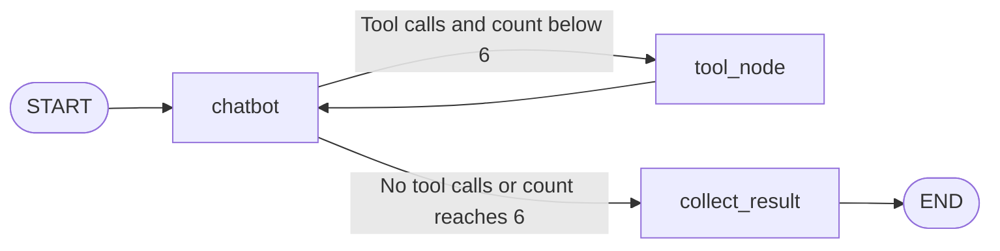

# Agent Workflow

## Request context

This guide describes the application's LangGraph agents. The API supplies a user message and runnable configuration with `thread_id` and `project_id`. SQLite checkpoints restore parent conversation state; LanceDB retrieval supplies facts shared across chats in the same project.

## Models

These identifiers are hardcoded in source rather than selected through environment variables:

| Role | Model | Temperature | Source |
|---|---|---|---|
| Planner | `gpt-5.4-mini` | 0.2 | `agente.py` |
| Worker | `gpt-5.4-nano` | 0.0 | `worker.py` |
| Synthesizer | `gpt-5.4` | 0.2 | `agente.py` |
| Memory selection | `gpt-5.4-mini` | 0.0 | `agente.py` |
| HTML summary | `gpt-4o-mini` | 0 | `local_tools.py` |
| Embeddings | `text-embedding-3-small` | Not applicable | Graph helpers, local tools, MCP server |

Provider account access determines runtime availability. This table describes the source, without verifying access to these models.

## 1. Planning

The planner retrieves up to five project facts relevant to the latest user message. Retrieval failure gives empty context and does not abort planning. A fresh system prompt combines project memory with checkpointed conversation history.

Structured `PlannerOutput` contains `needs_research`, `angles`, and `direct_response`. Its prompt asks for three to five angles for new information, prefers history or memory for follow-ups, and allows greetings/general questions to be answered directly. Angle count is a prompt instruction, not a schema constraint.

Routing checks whether `research_angles` is nonempty. Direct answers append an assistant message, clear the angles, and proceed to memory selection.

## 2. Research fan-out and worker loop

For each angle, the parent issues `Send("research_worker", ...)` with a system prompt, the angle/current question, and counter zero. Workers do not receive the entire parent conversation as message input. Runnable configuration supplies project scope to tools.



Every chatbot invocation increments the counter. At count six, collection occurs before another tool step, even if tools were requested. The limit is therefore six model invocations and at most five tool-node passes; each pass can execute multiple calls. Findings can be incomplete when the limit is reached during tool use.

### Local worker tools

| Tool | Inputs | Behavior |
|---|---|---|
| `search_web` | `query` | Tavily advanced search with `num_results=10`; returns result data |
| `scrape_web` | `urls`, `query`, injected config | Routes recognized PDF URLs to indexing; extracts HTML, truncates to 8000 characters, summarizes |
| `process_pdf` | `url`, injected config | Checks global URL cache; downloads/parses/chunks/embeds, appends project vectors, saves structural map |
| `rag_pdf_local` | `url`, `query`, injected config | Embeds query; retrieves up to five chunks filtered by URL and project |
| `list_indexed_pdfs` | None | Lists global URL-cache metadata without project filtering |

PDF downloads follow redirects and use a 60-second HTTPX timeout. Parsing uses PyMuPDF4LLM with a page-text fallback. Chunking targets 3200 characters at paragraph boundaries; long individual paragraphs can exceed this. Structural maps heuristically extract title, abstract, headings, pages, and chunk ranges.

The intended sequence is discovery, `process_pdf`, then `rag_pdf_local` for content. A cached URL returns immediately without ensuring active-project chunks exist. URL processing and tool selection rely on model compliance.

### Collected result

`WorkerResult` contains `angle`, `findings`, `sources`, and `tool_history`. Findings are the last assistant message. Tool history comes from assistant tool-call metadata. Sources are extracted only from `[Source: https://...]` markers in final worker text; the prompt does not enforce this format, so structured sources can be empty.

## 3. Synthesis

The parent appends results with `operator.add`. Because results persist across turns, synthesis reads the last N entries for the current N angles. It sends findings, source lists, and the current original question to `gpt-5.4`, requesting a Spanish response with citations.

Synthesis does not receive the entire parent history or full tool transcripts. Its response appends to parent messages. There is no separate citation-validation node.

## 4. Durable memory

Both response paths run `memory_node`. It examines the latest user/assistant pair and requests structured `MemoryDecision` with `should_save` and `facts`.

The prompt favors durable personal facts, project decisions, goals, constraints, and useful confirmed information. It excludes requests, empty greetings, redundant repetition, and one-use temporal facts. Each selected standalone statement is embedded and appended to project-scoped `hechos` with a timestamp.

Selection/write failures are suppressed so the conversation finishes. There is no deduplication or storage-success event. A completed answer does not prove that memory was saved.

## MCP integration

The backend starts and initializes the stdio MCP server, exposing:

| Tool | Behavior |
|---|---|
| `guardar_si_es_hecho(texto, project_id)` | Store supplied text; the tool itself does not classify factuality |
| `search_best_hecho(query, project_id)` | Retrieve one relevant fact |
| `rag_hechos(query, project_id)` | Retrieve up to five facts |
| `rag_pdf(url, query, chunk_range, project_id)` | Retrieve up to five semantic matches or an inclusive ordered chunk range; range takes precedence |

`mcp_client.py` exports four async wrappers and `mcp_tools_list`. Current workers bind only `local_tools`. Planner memory retrieval and memory-node saving use direct LanceDB helpers, so this chat flow does not call the MCP wrappers.

## Streaming contract

`POST /api/chat/stream` emits blank-line-delimited SSE records containing JSON in `data:` lines. There are no named SSE `event:` fields.

| `type` | Fields | Meaning |
|---|---|---|
| `planner` | `angles` | Research plan available |
| `direct` | `content` | Complete direct answer |
| `worker_done` | `angle`, `findings`, `sources` | Worker completed |
| `token` | `text` | Synthesizer text fragment |
| `done` | None | Graph finished, including memory |
| `error` | `message` | Stream failed |

Example wire record (followed by a blank line):

```text
data: {"type": "planner", "angles": ["Evidence", "Limitations"]}

```

Research normally emits a plan, worker completion events, synthesis tokens, then `done`. Worker completion order can vary. Direct flow emits `direct`, then `done` after memory processing. An execution error emits `error` without a subsequent `done`. There is no heartbeat, cancellation endpoint, or dedicated memory progress event.

## Manual scenarios

After [setup](SETUP_GUIDE.md), use a disposable project:

1. Send a greeting to inspect the direct-response path.
2. State a durable preference, inspect MEMORY, and ask about it in another chat in the same project.
3. Ask a new research question; inspect plan angles, worker completion, synthesis, citations.
4. Ask a follow-up and observe whether history avoids new research.
5. Research a public PDF; inspect DOCS, CHUNKS, and download availability.
6. Reload and select the same chat to verify visible history restoration.

Model decisions are nondeterministic; these are behavioral checks, not guaranteed routing assertions. They create persistent data and use external APIs.
