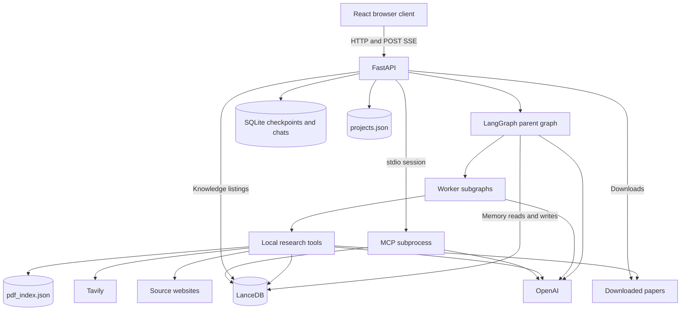
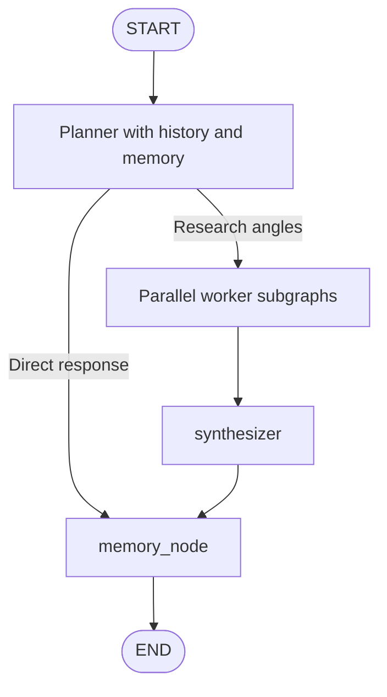

# Architecture

## Runtime structure

A Vite-served React client calls FastAPI. FastAPI owns a checkpointed LangGraph and starts an MCP subprocess using the same Python interpreter. Graph helpers, local tools, API knowledge routes, and the MCP server share embedded LanceDB files.

The MCP connection is initialized and kept alive. Current graph memory operations use direct LanceDB helpers; worker tools do not invoke MCP wrappers. There is no remote database, task queue, or independent worker service.

## Startup and shutdown

1. Uvicorn imports `api.py`, graph definitions, model objects, and chat persistence. Importing `chats.py` ensures the chat metadata schema exists.
2. The FastAPI lifespan opens `AsyncSqliteSaver` on `agente_langgraph/checkpoints.db`.
3. It compiles the graph with this checkpointer and assigns it to `agente.graph`.
4. The nested MCP lifespan launches `mcp_hechos/server.py` through `sys.executable`, opens its stdio session, and initializes it.
5. Requests use the compiled graph after startup completes.
6. Shutdown closes MCP contexts and clears the graph reference before the checkpoint context exits.

MCP startup failure prevents normal API startup, even though the current graph memory path is local. The module-level graph placeholder is not a ready standalone CLI agent.

## Graph topology

The planner emits one `Send` per angle. Workers receive independent prompts containing the assigned angle and latest user question. Their results append into parent state. The synthesizer combines current-turn findings. Both response paths finish with durable-fact selection and optional storage.

See [AGENT_WORKFLOW.md](AGENT_WORKFLOW.md) for detailed behavior, tools, and event contracts.

## State and project boundaries

`OverallState.messages` uses LangGraph's `add_messages` reducer. `research_angles` is replaced each turn. `worker_results` uses `operator.add`, allowing parallel append and preserving results across checkpointed turns. Synthesis reads the last N results for the current N angles.

| Identifier | Purpose | Limitation |
|---|---|---|
| `thread_id` | Conversation checkpoint key, from `chat_id` or fallback `project_id` | Project configuration does not provide a separate namespace for the same thread ID |
| `project_id` | Fact/PDF filters, propagated through runnable configuration | Client supplied, without ownership validation |

Separate chats can share project memory. This organization does not provide tenant security. The global URL cache and filename-based downloads also cross project boundaries.

## Persistence boundaries

Project metadata lives in JSON. Chat metadata and graph checkpoints share SQLite but have separate deletion behavior. Facts and PDF vectors share LanceDB. Downloads and URL-cache metadata are separate from vector records.

There is no transaction spanning these stores. Downloads may exist before indexing completes, and chunks may exist before cache persistence succeeds. Deleting or restoring one store does not reconcile others. The checkout contains existing data artifacts.

For backups, stop the backend and its MCP child first, then preserve `projects.json`, the complete SQLite database and relevant WAL state, the LanceDB directory, `pdf_index.json`, and the papers directory together. SQLite WAL/SHM sidecars alone are not a complete database backup.

## Browser and API boundary

The browser POSTs to a hardcoded localhost API origin. Streaming uses `fetch`, UTF-8 decoding, and SSE record splitting at blank lines. The client updates its pending assistant message for plan, worker completion, direct response, synthesis token, and terminal events.

Only synthesizer text is streamed as token events. Direct responses arrive whole; findings arrive when each worker completes. Memory has no dedicated progress event. History restoration returns visible text and does not reconstruct live worker progress.

Knowledge listings read LanceDB directly rather than invoking MCP. Download routes serve files from the backend papers directory.

## Operational tradeoffs

Embedded storage and stdio keep local setup small. The backend working directory matters because modules use sibling imports and PDF writing uses relative `papers/`. Start from `agente_langgraph/` as shown in [SETUP_GUIDE.md](SETUP_GUIDE.md).

Distributed scheduling, user access control, application-level provider retry policies, server pagination, retention, and atomic cross-store updates are absent. Synchronous calls and shared JSON files constrain concurrency. Shared hosting would require addressing these limits, unrestricted CORS, and the hardcoded browser API origin.
