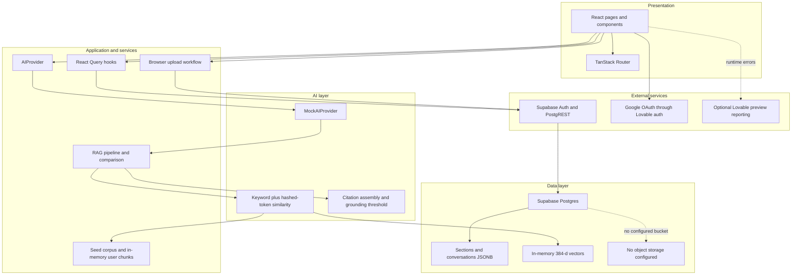
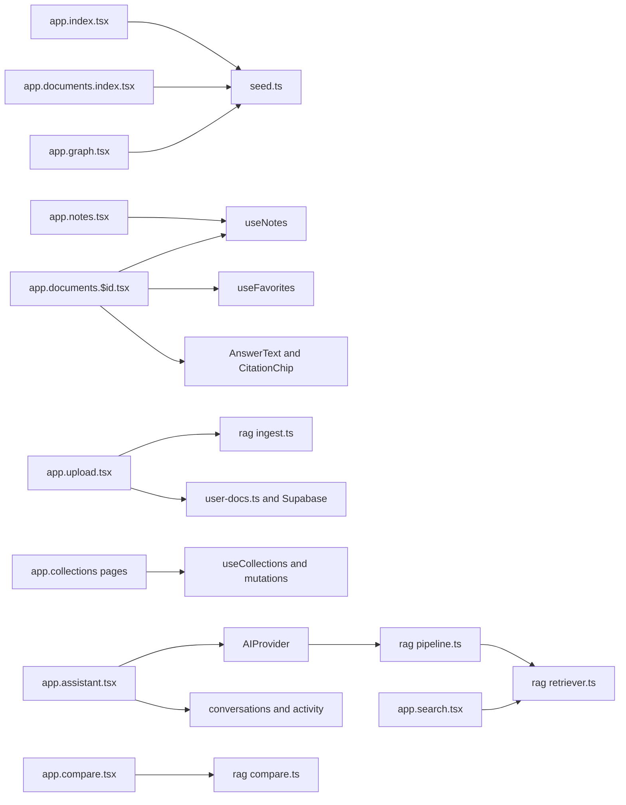
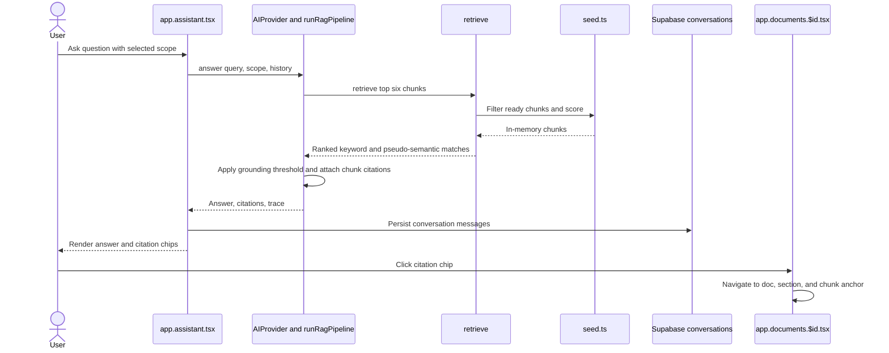

# Architecture Diagram

## Purpose and Scope
This describes the checked-in KnowFlow implementation. It separates the application as built from future architecture recommendations. The repo uses TanStack Start and Supabase, while answer generation and retrieval currently run as deterministic TypeScript in the browser; no live LLM or vector database is configured.

## As Built

### Layered Architecture



`client.ts` uses the Supabase publishable key from the browser. The admin client in `client.server.ts` uses `SUPABASE_SERVICE_ROLE_KEY` server-side only. RAG reads `src/data/seed.ts` after `src/lib/user-docs.ts` registers the signed-in user's DB documents in the browser's imported module state.

### Frontend Feature Components



### Trust Boundaries

| Boundary | Data crossing it | Controls as built | Finding |
|---|---|---|---|
| Browser, untrusted | User prompts, file/pasted text, browser session | Client validation is limited; Supabase session stored persistently | User documents and the mock retrieval corpus are available to browser code. |
| Authenticated app session | User identity and DB requests | `_authenticated/route.tsx` checks `supabase.auth.getUser()`; browser requests carry the signed-in session | UI route guard is not a substitute for database authorization. |
| Server functions | Demo provisioning request and service-role operations | `src/start.ts` installs CSRF middleware for server functions; server key is in `client.server.ts` | `ensureDemoAccount` has no authentication middleware and returns fixed demo credentials. |
| Database with access policies | Profiles, user records, messages, uploaded sections | SQL migrations enable RLS and mostly scope rows by `auth.uid()` | Direct authenticated client access relies on RLS. |
| External services | Auth tokens, OAuth redirect, DB query payloads | Supabase JS; Lovable Google OAuth adapter | No prompt/document content is sent to an external AI provider in this implementation. |

### Integrations

| Service | Purpose | Protocol | Auth method | Configuration location |
|---|---|---|---|---|
| Supabase Auth and Postgres API | Sign-in and user data CRUD | Supabase JS over HTTPS | Publishable key plus user session; server admin client uses service-role key | `src/integrations/supabase/client.ts`, `client.server.ts`; env vars in README |
| Google OAuth via Lovable | Optional identity provider | OAuth redirect | Provider configuration managed outside this repo | `src/routes/auth.tsx`, `src/integrations/lovable/index.ts` |
| Lovable preview error hooks | Optional runtime reporting in editor preview | Browser hooks | Editor-provided runtime | `src/lib/lovable-error-reporting.ts` |
| Live LLM / embedding / object storage | None configured | Not applicable | Not applicable | Not implemented — recommended |

### Sequence: Upload and Index

```mermaid
sequenceDiagram
  actor User
  participant Page as app.upload.tsx
  participant Browser as File API and ingestText
  participant DB as Supabase Postgres
  participant Corpus as seed.ts in browser
  User->>Page: Select text or Markdown file
  Page->>DB: Insert user_documents queued
  Page->>DB: Update status processing
  Page->>Browser: Read text and split sections and chunks
  Browser-->>Page: Sections and tags
  Page->>DB: Save sections JSONB and ready status
  Page->>Corpus: Invalidate user docs query
  Corpus->>DB: Select current user's user_documents
  DB-->>Corpus: RLS-filtered rows
  Corpus->>Corpus: Register chunks in module memory
  Note over Page,Corpus: Embed and Index stages are UI labels; no persistent vector index is written
```

### Sequence: Assistant, Retrieval, and Citation Click-Through



### Technology Stack

| Area | As built |
|---|---|
| Language/UI | TypeScript `^5.8.3`, React `^19.2.0` |
| Framework/router | TanStack Start `1.168.60`, TanStack Router `1.170.41` |
| Build/runtime | Vite `8.1.5`, Nitro `3.0.260603-beta`; Lovable Vite config notes Cloudflare as its default Nitro target |
| Data/auth | Supabase JS `^2.117.2`, Supabase Postgres; schema migrations are SQL under `drizzle/migrations/` |
| Query/UI | TanStack Query `^5.101.1`, Tailwind `^4.2.0`, Radix UI |
| AI/retrieval | Local TypeScript deterministic Mock AI; no model SDK or vector extension configured |
| Tests | Vitest `^4.1.10`, Testing Library; current routing test is a mount smoke test |

### Architecture Decisions

| Decision | Reason evident in code | Trade-off |
|---|---|---|
| Seed corpus is TypeScript data | Predictable demo corpus in `src/data/seed.ts` | Built-in corpus changes require an application release. |
| AI provider interface wraps Mock AI | `AIProvider` allows a future implementation swap | Current interface does not make processing server-side or provide a live model. |
| User uploads are stored as JSONB sections | Simple persistence for text and Markdown | No original file, durable embedding index, or background job. |
| Browser calls Supabase directly | Uses user session and database RLS | Authorization correctness depends on every table's RLS. |
| Authenticated route is client-only | Sessions live in browser storage | No SSR protection for private page rendering; API/database policies remain necessary. |

## Findings & Risks
- `drizzle/schema.ts` is intentionally blank while SQL migrations define the schema; Drizzle schema-driven tooling cannot infer those tables from that file.
- `Upload` displays Extract, Chunk, Embed, and Index stages, but only text parsing/chunk creation and JSONB persistence are implemented. Pseudo-vectors are computed lazily in browser memory during retrieval.
- `AIProvider` always returns `MockAIProvider`; answers are extractive and no content is sent to an LLM.
- No storage bucket, edge-function folder, durable vector search, or production analytics pipeline is configured.
- `ensureDemoAccount` uses the service role in a server function callable from the public auth screen; the screen also exposes fixed demo/admin login details.

## Recommended Improvements
- **Not implemented — recommended:** Move ingestion and AI calls to authenticated server-side jobs; persist status transitions and retry metadata.
- **Not implemented — recommended:** Add a real model adapter, explicit data-sharing consent, provider-side retention controls, and validated citations.
- **Not implemented — recommended:** Persist embeddings in a scoped vector store with per-user filtering and bounded top-k retrieval.
- **Not implemented — recommended:** Remove public admin demo provisioning and credentials before production; protect any privileged operation with authorization.
- **Not implemented — recommended:** Keep SQL migrations as source of truth or generate/maintain a matching Drizzle schema, and add integration tests for RLS and upload boundaries.
