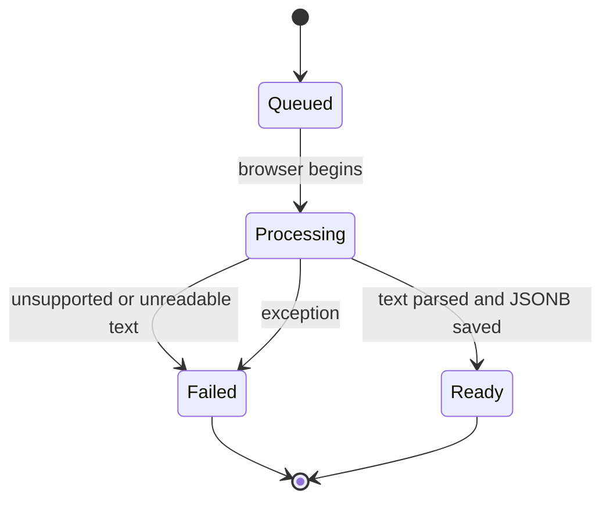
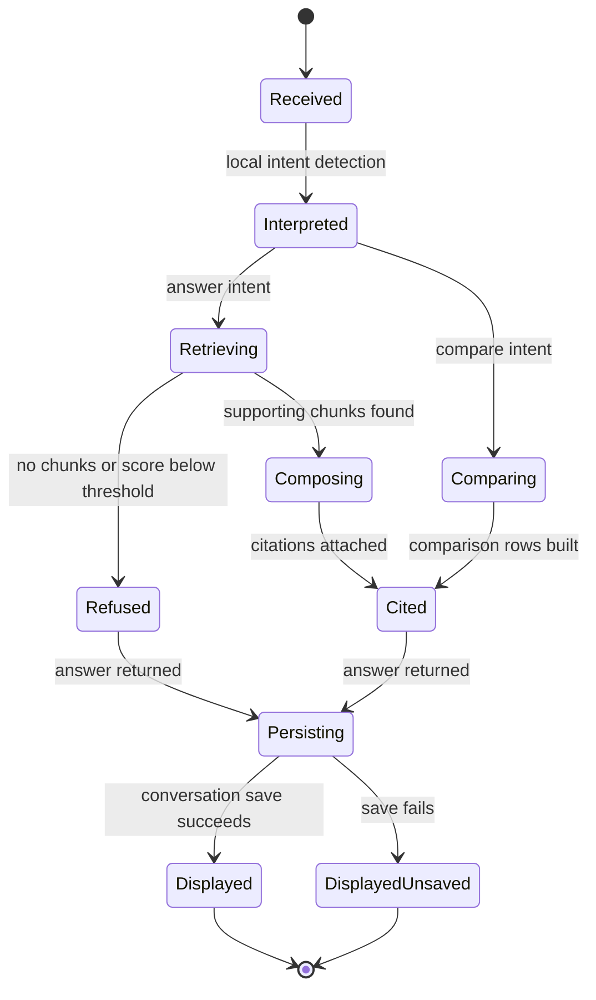
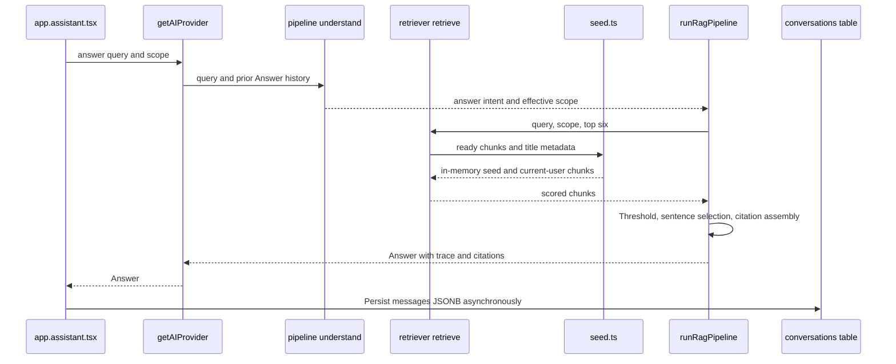

# Agent Workflow Design

## Scope
“Agent” below means a logical code responsibility, not an autonomous LLM agent. The implementation is deterministic TypeScript; it does not call an LLM, use tools dynamically, or run durable jobs.

## As Built

### Agent Catalog

| Agent / role | Responsibility | Tools used | Inputs | Outputs | Code location |
|---|---|---|---|---|---|
| Upload Intake | Accept text/Markdown or pasted text; create DB row and browser job UI | File API, Supabase `user_documents` CRUD | File name/text, category | Queued/processing/ready/failed row and UI job state | `src/routes/_authenticated/app.upload.tsx` |
| Text Ingestor | Parse headings/paragraphs into sections and chunks; infer tags | `ingestText`, `detectTags` | Plain text and document id | Sections/chunks, optional title, tags | `src/services/rag/ingest.ts` |
| Corpus Loader | Load current user's uploads and register in shared browser module | Supabase select, `setUserDocs` | Auth session | `KDocument[]` and in-memory corpus entries | `src/lib/user-docs.ts`, `src/data/seed.ts` |
| Query Interpreter | Detect compare intent and mentioned seed document titles | Regex/string matching, conversation history | Query and previous answers | Answer/compare intent and document ids | `src/services/rag/pipeline.ts` `understand` |
| Retriever | Filter scope, score lexical matches and hashed-token vectors | `tokenize`, `embed`, cosine, BM25-like formula | Query, scope, chunk pool | Ranked `ScoredChunk[]` | `src/services/rag/retriever.ts` |
| Answer Composer | Enforce a low-score/no-result refusal; select sentences; compose markdown and citations | Retriever, concepts, `getDoc` | Query, scope, history | `Answer` with text, citations, trace, `grounded` | `src/services/rag/pipeline.ts` `runRagPipeline` |
| Comparison | Retrieve one passage per aspect per document and compose a fixed narrative | `retrieve`, `getDoc` | Two document ids | Five comparison rows and citation references | `src/services/rag/compare.ts` |
| Conversation Store | Save user/assistant message JSON and scope | Supabase `conversations`, `activity` | Conversation id, messages, title, scope | Persisted conversation | `src/routes/_authenticated/app.assistant.tsx` |

### Workflow Coverage

| Workflow | As built | Gaps |
|---|---|---|
| Document ingestion/processing | Browser reads `.txt`, `.md`, `.markdown`; headings/paragraphs become sections/chunks; tags come from seeded concepts; status saved in `user_documents`. | No PDF/Office extraction, binary object storage, server queue, persistent embedding/index, retry worker, or real job lifecycle. |
| RAG question answering | `getAIProvider().answer()` calls `runRagPipeline`; retrieve top six; no-match/score `< 0.12` refusal; sentence extraction and citation chips. | No LLM generation, reranker, prompt isolation, policy classifier, or robust claim-level verification. |
| Summarization | No dedicated summary API/workflow. A suggested prompt such as “Summarize...” still uses extractive RAG answer composition. | Not implemented — recommended: bounded, cited document summary operation with length controls. |
| Document comparison | `compareDocs` searches fixed aspects independently and picks first sentence; assistant detects compare prompts in some cases. | Fixed heuristic aspects; narrative is templated, not generated; comparison trace reports verification but does not independently verify claims. |
| Insights generation | Concepts, relations, and graph are static seed data. | Not implemented — recommended: clearly labeled, source-backed insights over authorized data. |
| Study-question generation | No study-question generator, route, or study-session table. | Not implemented — recommended: generate answerable questions from selected cited chunks and capture user feedback. |

### Document Processing State Machine

The UI's stage labels include Embed and Index, but the persisted lifecycle state only describes the document row; a crashed tab can leave a row at `processing`.

### RAG Query State Machine

### RAG Handoff Sequence

### Human Approval and Guardrails

| Point | As built | Recommended |
|---|---|---|
| Delete custom collection | Browser `confirm()` in collection detail; document upload deletion has no confirmation | Consistent confirmation, undo or soft-delete, and audit record. |
| Delete note | Immediate mutation from note controls | Confirm/undo for destructive operations. |
| Scope restriction | Query scope filters to all, collection, or chosen document ids; uploaded user docs are loaded using current-session RLS | Enforce tenant/document scope server-side for any live AI service; test cross-user isolation. |
| Grounding/citations | Refuse if no hit or top score `< 0.12`; cite selected retrieved chunks; chip links to source section/chunk | Validate each claim against source text and reject malformed citation ids. |
| Prompt injection | No specific detection or instruction/data separation is present; currently no external model prompt | Add model-specific injection controls and treat retrieved text as untrusted data if a live model is introduced. |
| Output rendering | `AnswerText` supports a small inline Markdown subset and renders text through React nodes, not raw HTML | Keep any future Markdown/HTML renderer allowlisted and test unsafe payloads. |

### Failure-Path Matrix

| Failure | Detection | Current fallback | User-visible behavior | Log recommendation |
|---|---|---|---|---|
| User document insert fails | Supabase error/result missing | Stop processing | “Could not save” message | Event with user/document correlation id and sanitized error code |
| Unsupported file or too little text | Extension/length checks | Mark row failed | Specific failure text | Reason code, bytes, file type; never raw content |
| Processing exception | `catch` in upload handler | Mark failed | Generic retry suggestion; no actual retry button | Stage, duration, safe stack/error id |
| Retrieval has no strong match | Empty list or first score `< 0.12` | Refusal answer | Scope/add-document suggestion | Query metadata only, scope, scores, refusal reason |
| Conversation save fails | Supabase error | Keep answer in UI | Save error text | Error code and request id; do not log prompt by default |
| AI provider unavailable | No external provider is called today | Not applicable | Not applicable | Add timeout/fallback events when live provider exists |

### Retry and Timeout Policy
- **As built:** No retry/backoff or explicit request timeout for upload or database mutations. Upload failure is persisted where possible; no resumable worker exists. Assistant introduces a fixed 450 ms delay before local generation and then persists asynchronously. RAG itself is local synchronous computation; simulated upload delays do not bound processing time.
- **Recommended:** Use idempotent background jobs, bounded retries with exponential backoff, explicit max file/text sizes and timeouts, terminal failure reasons, and an operator-visible dead-letter/reprocess path.

## Recommended Improvements
- **Not implemented — recommended:** Define formal server-side workflows and versioned inputs/outputs around current modules before replacing the provider.
- **Not implemented — recommended:** Add dedicated summary, insights, and study-question actions rather than implying the generic answer path supports those products.
- **Not implemented — recommended:** Add trace ids, structured events, redaction, and privacy-reviewed prompt logging policy.
