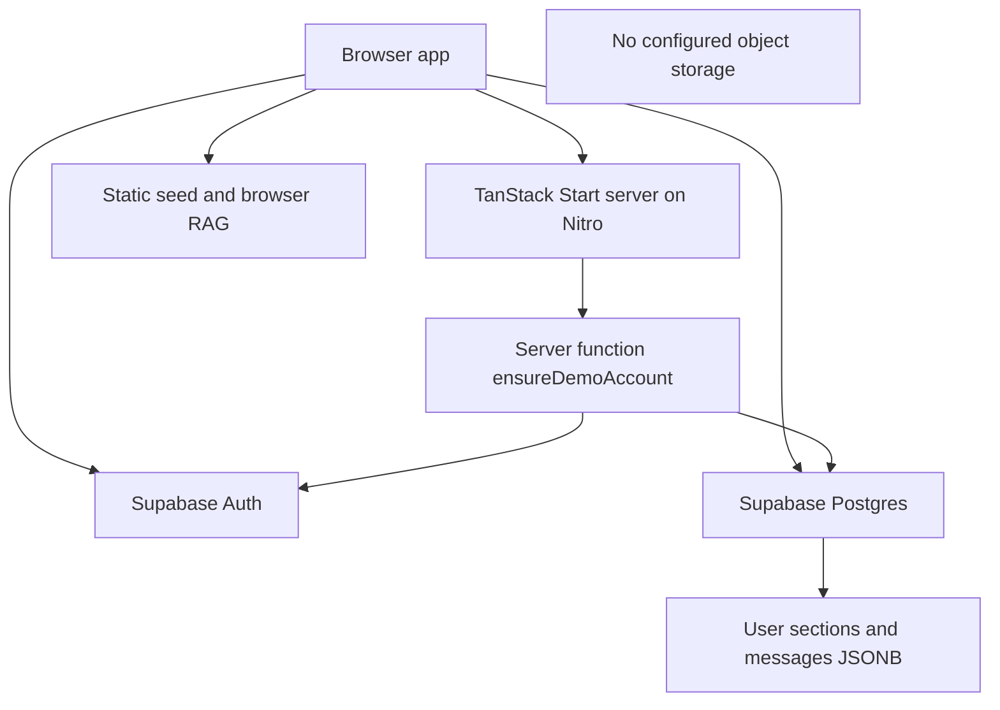

# Deployment Strategy

## Runtime Topology

### As Built

`vite.config.ts` delegates to `@lovable.dev/vite-tanstack-config`; its comments state Nitro is configured with Cloudflare as the default target. The repository does not identify a production hosting account or contain a release workflow. `supabase/config.toml` identifies the Supabase project; no bucket configuration is present.

### Environments and Configuration

| Environment | As-built behavior | Configuration |
|---|---|---|
| Local | `npm run dev`; Supabase services still required for auth and DB-backed pages | `.env`-style values may be supplied by local tooling; no `.env*` file was present in the workspace listing. Never commit secrets. |
| Preview | Lovable-connected project; optional editor reporting hooks; client Vite env injection | Set matching Supabase URL/publishable key in preview settings; verify OAuth redirect origins. |
| Production | Buildable TanStack Start/Nitro app; hosting target and promotion process are not specified here | Set server and client envs in hosting/Supabase settings; configure Supabase auth providers, allowed origins, migrations, and backups. |

Environment variable names found in code/config only:

| Variable | Use | Exposure |
|---|---|---|
| `VITE_SUPABASE_URL` | Browser Supabase URL | Public configuration |
| `VITE_SUPABASE_PUBLISHABLE_KEY` | Browser Supabase publishable key | Public configuration; RLS is mandatory |
| `SUPABASE_URL` | Server Supabase URL and browser fallback | Public endpoint configuration |
| `SUPABASE_PUBLISHABLE_KEY` | Server auth middleware and browser fallback | Publishable key; not a substitute for user identity |
| `SUPABASE_SERVICE_ROLE_KEY` | Admin Supabase client | Server-only secret; bypasses RLS |
| `LOVABLE_DB_MIGRATION_URL` | Drizzle Kit DB connection | Migration operator/CI secret; never browser-side |
| `LOVABLE_CRON_SECRET` | Cron authorization helper | Server-only secret; helper is not wired to an application route in the checked-in code |
| `LOVABLE_CRON_SECRET_PREVIOUS` | Cron secret rotation overlap | Server-only secret; same caveat |

### Build, Release, Migrations, and Rollback

Package scripts in `package.json`:

| Purpose | Command |
|---|---|
| Development | `npm run dev` |
| Production build | `npm run build` |
| Development-mode build | `npm run build:dev` |
| Preview build | `npm run preview` |
| Lint | `npm run lint` |
| Tests | `npm test` |
| Formatting | `npm run format` (writes formatting changes; do not use as a release check) |

Database structure is defined in ordered SQL files `drizzle/migrations/0000_migration.sql` and `0001_notes_favorites_activity_uploads.sql`. No migration/deploy script is declared in `package.json`; `drizzle.config.ts` points Drizzle Kit at `drizzle/schema.ts` and requires `LOVABLE_DB_MIGRATION_URL`, but `drizzle/schema.ts` is intentionally blank. Do not assume `drizzle-kit push` is safe or reflects the SQL files. Apply reviewed SQL migrations using the project's approved Supabase migration workflow and record the applied version. `src/data/seed.ts` is app-bundled demo content, not a database seed command. Demo accounts are provisioned on demand by `ensureDemoAccount`.

**Rollback:** Redeploy the previous known-good application artifact. For schema rollback, prefer forward corrective migrations; take a verified database backup before destructive DDL. The repo contains no automatic rollback command or schema rollback scripts. Coordinate app rollback with backward-compatible schema changes.

### Scaling and Resilience

| Concern | As built | At scale |
|---|---|---|
| Compute | Nitro-hosted app plus browser retrieval | Host/serverless autoscaling depends on deployment target; browser RAG does not shift compute off clients. |
| Search/vector | Full ready-chunk pool is rescored in JS per query; chunk embeddings are lazily cached in module memory | At 10x, benchmark bundle/memory/query latency; at 100x, use durable indexed full-text/vector search with tenant filters. |
| Uploads | Browser file reading; no configured size cap, object storage, or asynchronous worker | Large text can exhaust browser memory and increase JSONB row size; add size limits, object storage, and queued extraction. |
| AI latency | Mock AI has no network/model latency | Live provider introduces variable latency, quota, cost, and timeout/failure risk. |
| Caching | Local in-memory chunk embedding cache and React Query client | Cache is process/tab scoped and not shared; add bounded caches only after measuring. |
| Rate limiting | No application rate limiter found | Add per-user/IP limits for uploads, server functions, and model spend. |
| Backups | Not configured in repo | Set managed Postgres backup/PITR policy and regularly test restore. |
| Graceful degradation | Retrieval works locally if corpus is loaded; Supabase-backed auth/data needs Supabase | Keep read/search where possible, surface sync degradation, and use explicit AI timeout/fallback for live provider. |

**Cost:** Current AI inference and embedding API cost is zero because all retrieval/generation are local deterministic logic. Supabase database/compute, hosting, and egress are deployment-plan dependent. A real LLM will add token, embedding, storage, and network costs; estimate with measured requests and tokens before rollout.

**Scaling roadmap:** At 10x documents, enforce upload bounds and benchmark client retrieval; instrument load/latency; move indexing off the browser. At 100x, use background workers, object storage, Postgres FTS/vector index or managed vector search with RLS-aware filtering, quotas, and aggregate telemetry.

### Project-Specific Deploy Checklist

1. Confirm the target branch/artifact and configured Nitro hosting target; verify no local-only Lovable dependency is required at runtime.
2. Set `SUPABASE_URL`, `SUPABASE_PUBLISHABLE_KEY`, and `VITE_SUPABASE_URL`/`VITE_SUPABASE_PUBLISHABLE_KEY`; set `SUPABASE_SERVICE_ROLE_KEY` only in server runtime secrets.
3. Set `LOVABLE_DB_MIGRATION_URL` only in the migration operator/CI context; never put server secrets in a `VITE_` variable.
4. Configure Supabase Auth email/password and Google OAuth redirect URLs for the environment; test password reset and sign-out.
5. Review and apply `drizzle/migrations/0000_migration.sql` then `0001_notes_favorites_activity_uploads.sql` through an approved migration process; verify RLS is enabled on every application table.
6. Take/verify a backup before schema changes; confirm restore owner and recovery point objective.
7. Run `npm ci` (or the selected lockfile package manager), `npm run lint`, `npm test`, and `npm run build` in CI. The checked-in scripts do not provide a deploy command.
8. Verify browser bundle contains only public Supabase configuration; inspect server environment separately without printing values.
9. Smoke test sign-up/sign-in/reset, collections CRUD, upload and delete, notes/favorites, scoped RAG, citation navigation, and database RLS using two distinct accounts.
10. Verify server errors reach the hosting log sink, alerting is configured externally, and release rollback points to a known artifact.

## Recommended Improvements
- **Not implemented — recommended:** Add pinned, reproducible release automation, migration validation, and staged preview-to-production promotion.
- **Not implemented — recommended:** Add a real migration execution workflow consistent with SQL migrations or restore a matching Drizzle schema before using Drizzle Kit schema commands.
- **Not implemented — recommended:** Add object storage/background ingestion, quotas, and provider-level timeout/cost limits before large-scale use.
