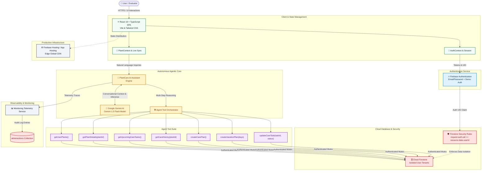

# Architecture Document — PlantCare AI

## 1. Enterprise Architecture Overview

**PlantCare AI** is an enterprise-grade, agentic plant care assistant platform engineered to provide automated botanical maintenance, proactive care scheduling, diagnostic reasoning, and multi-tenant security. The system bridges responsive client-side interactions with cloud persistence and autonomous AI function orchestration.

---

## 2. High-Level Architecture Diagram

---

## 3. Component Breakdown

### 3.1 Client Presentation Layer
- **Framework**: React 19 with strict TypeScript typing.
- **Styling**: Tailwind CSS with an ecological palette (`forest-600`, `sage`, `earth`) and subtle soft shadows.
- **Routing**: `react-router-dom` handling public landing/auth routes and guarded protected application routes.
- **Icons & Visuals**: `lucide-react` modern icon library and `canvas-confetti` reward micro-interactions.

### 3.2 Authentication & State Management
- **`AuthContext`**: Wraps the application with user session persistence, token synchronization, and a 1-click Demo Account login option for frictionless evaluation.
- **`PlantContext`**: Central state coordinating live botanical collections, tasks, historical records, and caching.

### 3.3 Agentic AI Engine
- **Autonomous Reasoning Core**: Evaluates incoming natural language requests, determines missing context, selects the appropriate tool from the tool suite, and structures outputs.
- **Model Integration**: Dual-engine architecture connecting to **Google Gemini 1.5 Flash** when an API key is provided, or falling back seamlessly to an internal deterministic agent engine for zero-dependency testability.
- **Human-in-the-Loop Protocol**: All mutations (rescheduling care dates, creating vacation task suites) trigger interactive confirmation cards requiring explicit user consent (`[Confirm Action]` / `[Cancel]`).

### 3.4 Data & Security Tier
- **Cloud Firestore**: Hierarchical, document-oriented collections:
  - `/users/{userId}`: Account profiles
  - `/plants/{plantId}`: Botanical records with environmental parameters and calculated watering cycles
  - `/careTasks/{taskId}`: Scheduled maintenance tasks with temporal statuses
  - `/careRecords/{recordId}`: Permanent chronological care activity logs
  - `/aiInteractions/{interactionId}`: Telemetry logs tracking latency, tools executed, and success rates
- **Security Rules (`firestore.rules`)**: Granular authorization enforcing `request.auth.uid == resource.data.userId` across all read, write, and delete operations.

### 3.5 Monitoring & Telemetry
- Observability dashboard tracking application health (Auth, Cloud Firestore, AI Agent), KPI metrics, request latencies, and real-time interaction audit trails.