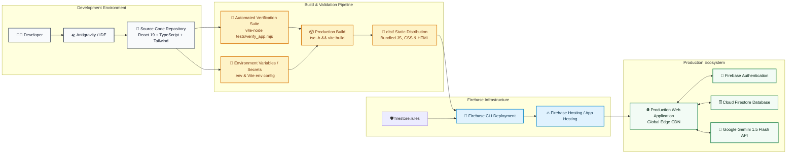

# Deployment Strategy — PlantCare AI

## 1. Production Deployment Strategy

**PlantCare AI** is designed for deployment via **Firebase Hosting** or **Firebase App Hosting**, backed by Google Cloud Firestore and the Gemini API.

---

## 2. Deployment Architecture Diagram



---

## 3. Environment Variables Configuration

The application requires the following environment variables (defined in `.env` for local environments and injected via Firebase project settings for cloud deployments):

```bash
# Firebase Client Configuration (From Firebase Console -> Project Settings)
VITE_FIREBASE_API_KEY="AIzaSy..."
VITE_FIREBASE_AUTH_DOMAIN="plantcare-ai.firebaseapp.com"
VITE_FIREBASE_PROJECT_ID="plantcare-ai"
VITE_FIREBASE_STORAGE_BUCKET="plantcare-ai.appspot.com"
VITE_FIREBASE_MESSAGING_SENDER_ID="123456789012"
VITE_FIREBASE_APP_ID="1:123456789012:web:abcdef123456"

# Google Gemini API Key (From https://aistudio.google.com/)
VITE_GEMINI_API_KEY="AIzaSy..."
```

> **Fallback Mode**: If Firebase and Gemini API keys are omitted or pending cloud setup, the application automatically activates local client persistence and the autonomous agent simulator engine, allowing evaluators to review 100% of the UI, tools, and workflows without crashing.

---

## 4. Step-by-Step Deployment Instructions

### Step 1: Install Dependencies
```bash
npm install
```

### Step 2: Run Automated Verification Tests
```bash
npx vite-node tests/verify_app.mjs
```
*Expected: 37 Passed, 0 Failed.*

### Step 3: Compile Production Bundle
```bash
npm run build
```
This runs `tsc -b` and `vite build`, generating optimized distribution artifacts in `./dist`.

### Step 4: Deploy to Firebase Hosting
```bash
# Login to Firebase
npx firebase-tools login

# Set your active Firebase project
npx firebase-tools use --add plantcare-ai

# Deploy Firestore rules and static hosting bundle
npx firebase-tools deploy --only firestore:rules,hosting
```

---

## 5. Live Application Hosting Configuration

### `firebase.json`
```json
{
  "firestore": {
    "rules": "firestore.rules"
  },
  "hosting": {
    "public": "dist",
    "ignore": ["firebase.json", "**/.*", "**/node_modules/**"],
    "rewrites": [
      {
        "source": "**",
        "destination": "/index.html"
      }
    ],
    "headers": [
      {
        "source": "**/*.@(js|css)",
        "headers": [
          {
            "key": "Cache-Control",
            "value": "max-age=31536000"
          }
        ]
      }
    ]
  }
}
```

### Local Preview Server
To preview the compiled production build locally:
```bash
npm run preview
# Serves live production bundle on http://localhost:5173/
```