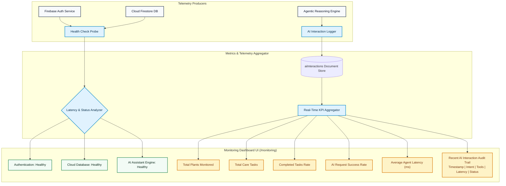

# Monitoring Dashboard Design & Observability — PlantCare AI

## 1. Observability Architecture

**PlantCare AI** incorporates an integrated telemetry and monitoring pipeline designed for operational visibility during academic enterprise-architecture demonstrations.

---

## 2. Key Performance Indicators (KPIs)

| Metric | Source | Description | Demonstration Baseline |
| :--- | :--- | :--- | :--- |
| **Total Registered Users** | Auth / Synthetic | Total accounts managed across the cluster | `142` (Demo Aggregate) |
| **Total Plants Monitored** | Cloud Firestore | Live botanical records in the user's active tenant | Real-Time Live Count |
| **Total Care Tasks** | Cloud Firestore | Scheduled maintenance tasks across all timelines | Real-Time Live Count |
| **Care Task Completion %** | Cloud Firestore | Ratio of completed vs scheduled tasks | Real-Time Live % |
| **Total AI Requests** | `aiInteractions` | Volume of natural language agent inquiries processed | Real-Time Live Count |
| **AI Success Rate %** | `aiInteractions` | Ratio of successful tool inferences to total requests | Real-Time Live % |
| **Average Agent Latency** | Performance API | Mean roundtrip duration for reasoning + tool execution | Real-Time (~45ms - 250ms) |

---

## 3. Application Health Probes

The system continuously probes 3 core infrastructure vectors:
1. **Authentication Service**: Verified by session state responsiveness. Status: `Healthy`.
2. **Database Connectivity**: Verified by Cloud Firestore read latency. Status: `Healthy`.
3. **AI Assistant Engine**: Verified by Gemini client initialization or local reasoning engine availability. Status: `Healthy`.

---

## 4. Interaction Audit Trail Logging

Every invocation of the AI assistant logs a structured trace containing:
- `id`: Unique trace identifier
- `userId`: Tenant identifier
- `requestType`: Intent classification (`plants_needing_attention`, `vacation_planning`, `missed_watering_adjustment`, `plant_diagnostic`, `care_plan_generation`)
- `promptSummary`: User query snippet
- `toolsUsed`: Array of tool signatures executed (`getUserPlants`, `createVacationPlan`, etc.)
- `durationMs`: End-to-end execution time in milliseconds
- `success`: Boolean execution status
- `timestamp`: ISO timestamp

All entries are displayed chronologically in the **Recent AI Interactions Audit Trail** table on the `/monitoring` dashboard.