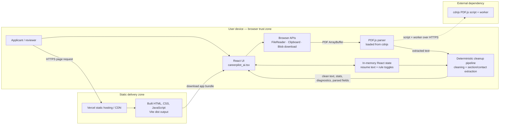
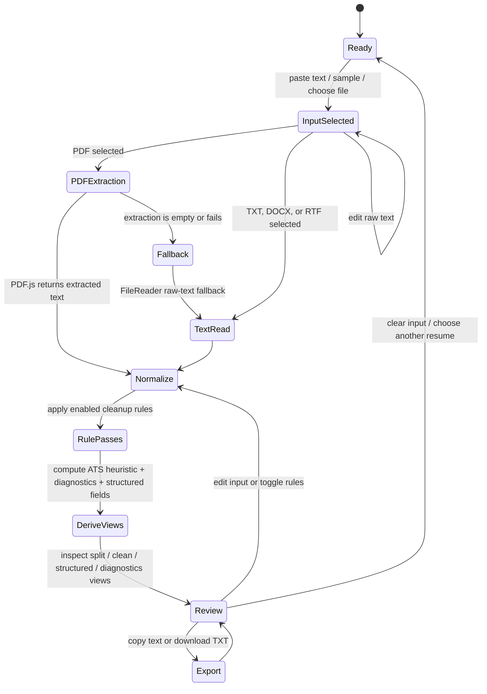

# CareerPilot AI — Capstone Architecture Deliverables

**Project:** CareerPilot AI Resume Untangler  
**Deployment:** [https://ioc-eta.vercel.app](https://ioc-eta.vercel.app)  
**Architecture status:** Describes the current implementation and clearly labels proposed production extensions. The application is a client-side resume text processing tool; despite the product name, it does not currently call an LLM or run autonomous AI agents.

## 1. Architecture Diagram

### 1.1 Current system context and trust boundaries

### 1.2 Components and data flow

| Component | Responsibility | Current implementation |
|---|---|---|
| Presentation | Upload, editable raw text, side-by-side output, clean text, structured fields, diagnostics, rule toggles, score | React single-page UI, Tailwind CSS, Lucide icons |
| Input | Select PDF, DOCX, TXT, or RTF; paste/edit text; choose built-in sample resumes | Browser file input and React state. PDF is parsed via PDF.js; other accepted formats currently go through `FileReader` as text, so DOCX/RTF fidelity is not guaranteed. |
| PDF extraction | Extract text page by page from a selected PDF | PDF.js 3.11.174 loaded at runtime from cdnjs; worker also loaded from cdnjs |
| Normalization | Purge PDF-like syntax; repair selected ligatures, split words and bullets; optionally untangle columns, remove headers/footers, normalize whitespace | Synchronous deterministic functions in `careerpilot_ai.tsx` |
| Structured extraction | Regex contact extraction and heuristic section grouping | Runs locally in the browser; output is an approximate convenience view, not a validated resume schema |
| Export | Copy clean text or download `.txt` | Browser Clipboard API and Blob/object URL; no application server or persistent storage |
| Hosting/build | Compile and serve static single-page app | Vite + React; Vercel serves the generated `dist` output |

**Data path:** selected file or pasted text → browser memory → optional PDF.js extraction → cleanup rules → computed views/stats → optional browser clipboard or TXT download. The current app has no API server, database, account system, or server-side resume-processing endpoint.

## 2. Agent Workflow Design

### 2.1 Current workflow (deterministic pipeline, not an LLM agent)

### 2.2 Processing stages and responsibilities

1. **Input handler** — accepts a sample, editable text, or local file. It records the file name in component state and shows processing feedback.
2. **Format dispatch** — PDFs use PDF.js. Other accepted extensions are read with `FileReader`; DOCX and RTF are not decoded by dedicated parsers in the current version.
3. **Extraction / fallback** — PDF.js extracts text per page. If extraction returns no text or errors, the app attempts a raw text read. This fallback is not a reliable way to decode a binary PDF.
4. **Normalization** — runs enabled operations: PDF-syntax cleanup, selected Unicode/ligature substitutions, heuristic two-column untangling, line-wrap hyphen rejoining, bullet normalization, header/footer removal, and whitespace normalization.
5. **Derivation** — computes character/line/bullet counts, a simple ATS heuristic score, diagnostics, contact fields, and approximate resume sections. Derived data is recalculated from current text and settings; it is not persisted.
6. **Human review** — the user compares raw and cleaned text, reviews parsed fields/diagnostics, and decides whether output is acceptable. The tool does not autonomously submit a resume or make external decisions.
7. **Export** — the user explicitly copies or downloads cleaned plain text.

### 2.3 Handoffs, approvals, and failure paths

- **Human approval:** user reviews and initiates export; no unattended processing or third-party submission.
- **PDF.js load/extraction failure:** logged to the browser console and handled by a text-reader fallback; show a clear user-facing failure state in a future hardening pass.
- **Unsupported or binary input:** reject or explain unsupported format rather than implying DOCX/RTF are fully parsed (recommended improvement).
- **No useful extracted text:** let the user paste text or choose another file; do not treat an empty extraction as success.
- **Clipboard unavailable/denied:** provide a visible fallback and error message (recommended; current copy handler assumes clipboard write succeeds).
- **Heuristic uncertainty:** preserve the raw input and let the user edit it; do not represent the score as a guarantee of ATS acceptance.

## 3. Deployment Strategy

### 3.1 Current deployment topology

- **Build tool:** Vite, with React and Tailwind CSS Vite plugins.
- **Build command:** `npm run build`.
- **Build artifact:** `dist/` static output.
- **Hosting:** Vercel static hosting/CDN; the live application is [https://ioc-eta.vercel.app](https://ioc-eta.vercel.app).
- **Deployment config:** `vercel.json` identifies the Vite framework, build command, and output directory.
- **Current delivery method:** Vercel dashboard folder upload (not Git-connected); deployment does not currently imply automatic build-on-push previews.

### 3.2 Environments and release flow (recommended)

| Environment | Purpose | Suggested source / controls |
|---|---|---|
| Local | Developer iteration | `npm install`, `npm run dev`; validate with `npm run build` before release |
| Preview | Review candidate changes | Connect a Git repository to Vercel and use branch/deployment previews; keep test data synthetic |
| Production | Public stable application | Promote a reviewed build; restrict production deployment permissions; verify the deployment URL and smoke-test upload, cleanup, views, and export |

**Release gates:** dependency installation succeeds → production build succeeds → manual smoke tests on representative PDF and text fixtures → inspect deployed UI and browser console → promote/confirm production. Keep `dist/` generated from source for production builds rather than treating checked-in/deployed `dist` as the source of truth.

### 3.3 Resilience and rollback

- Static assets are served by Vercel's CDN; there is no application server or database to scale in the current design.
- Keep the previous healthy Vercel deployment available and use Vercel's rollback/promote controls if a release fails.
- PDF.js is an external runtime dependency: an outage or blocked CDN can break PDF parsing while manual text input can remain usable. Consider bundling a pinned PDF.js dependency locally, with a reviewed upgrade process.
- The app is client-only; adding APIs, accounts, analytics, or persistent storage changes the operational and security design and requires separate deployment configuration and review.

## 4. Security Model

### 4.1 Assets, actors, and boundaries

| Asset / boundary | Security concern | Current control / status |
|---|---|---|
| Resume content (highly sensitive PII) | Exposure, retention, unintended sharing | Processing is implemented in the browser; no resume API or database is present. Content exists in page memory and may be included in browser clipboard/download only when user requests it. |
| Browser runtime | Malicious input or unsafe rendering | React renders extracted values as text; do not add raw HTML rendering. File selection is user initiated. |
| PDF.js dependency | Third-party code execution / supply-chain compromise | Loaded from a pinned versioned cdnjs URL over HTTPS; still an external trust dependency. Consider self-hosting, integrity controls where practical, and dependency review. |
| Static hosting | Tampering or transport interception | Vercel-hosted HTTPS delivery. Restrict deployment access and review production changes. |
| Browser clipboard/download | User-authorized data egress | Copy and TXT download require explicit user action. The user controls the resulting clipboard/file destination. |
| Browser diagnostics | Accidental sensitive data in logs | Current diagnostic messages describe repairs; avoid logging raw resume text, filenames with PII, contact fields, or document contents. |

### 4.2 Threats and mitigations

- **PII leakage:** never send resume text to analytics, logs, crash reports, or an external model without explicit consent and a reviewed privacy policy. Any future telemetry should contain aggregate counters only and exclude content, contact values, and full filenames.
- **Untrusted file input:** validate extension and MIME as hints, enforce size/page limits, handle parser errors, and avoid evaluating file content. Browser-side parsing reduces server exposure but does not make hostile PDFs harmless; keep PDF.js patched and use browser sandbox protections.
- **Cross-site scripting:** continue treating resume text as plain text. Do not use `dangerouslySetInnerHTML` or inject parsed input into script/HTML contexts.
- **Third-party runtime dependency:** minimize and pin third-party code, consider serving PDF.js locally, and review dependency provenance/updates.
- **Misleading output:** the ATS percentage is a simplistic heuristic based on contact/section/bullet indicators, not an ATS compatibility test or employment recommendation. Clearly label it as an estimate and preserve raw content for comparison.
- **Availability and errors:** catch file read, PDF parse, and clipboard errors; provide actionable user messages without including resume contents.
- **Privacy claim boundary:** local processing means the application's parsing flow does not require a resume backend; it does not promise that the user's browser, extensions, network, or hosting/CDN requests collect no metadata.

### 4.3 Future controls before enterprise use

If server-side processing, analytics, or accounts are introduced, add authentication/authorization, TLS, strict upload limits, malware scanning or isolated parsing, data minimization, encryption at rest, defined retention/deletion, access auditing, rate limiting, privacy notice/consent, incident response, and a threat-model review. Do not add persistence by default for resume data.

## 5. Monitoring Dashboard Design

### 5.1 Existing observability surface

The UI currently provides a per-document heuristic score, line/character/bullet counts, and a repair diagnostics view. These are **local user-facing results**, not service-wide monitoring. There is no telemetry pipeline, backend health endpoint, distributed tracing, or centralized dashboard in the current project. PDF extraction errors are written to the browser console.

### 5.2 Proposed privacy-preserving dashboard

| Dashboard panel | Proposed signal | View / alert guidance |
|---|---|---|
| Availability | Vercel deployment status and synthetic GET of `/` | Uptime trend; alert on repeated failed probes |
| Frontend health | JavaScript runtime error count, grouped by release and error class | Trend by deployment; never capture resume text or input values |
| PDF processing | Parse attempts, success/failure counts, duration buckets, file-size/page-count buckets | Success rate and p50/p95 duration; exclude filenames and document content |
| User flow | Counts for upload start, parse completion, cleanup completion, copy/download action | Funnel totals only; do not record raw text, extracted contact details, or unique document identifiers |
| Output quality proxy | Distribution of heuristic score buckets and diagnostics types | Clearly mark as heuristic; avoid storing per-document content or stable user identifiers |
| Dependency health | PDF.js load failures and version currently deployed | Alert on CDN/load failure increase; evaluate moving the dependency into the app bundle |
| Build/release | Build success/failure, deployment ID, commit/release version, rollback events | Annotate dashboard with deployments; block promotion when build fails |

### 5.3 Event schema and privacy guardrails (proposed)

A minimal event may contain `event_name`, `release_id`, `timestamp`, `duration_bucket`, `file_type_category`, `file_size_bucket`, `success`, and a coarse `error_code`. Do **not** include resume text, extracted fields, email/phone/URLs, file contents, original filename, clipboard contents, or a persistent document ID. Make any analytics opt-in where required, document it in the privacy notice, and set short retention periods.

### 5.4 Initial SLOs / operational goals (proposed)

- Static application availability: target 99.9% monthly, measured with an external synthetic probe.
- Production build: 100% of promoted releases must pass the production build.
- PDF processing: establish baseline first; alert when parse failure rate or p95 duration materially regresses against that baseline.
- Client errors: investigate new error classes introduced by a release; keep resume contents out of error reports.
- Rollback readiness: document who can roll back and verify the procedure before production changes.

These are proposed operational targets, not measured claims about the current deployment.

## Current-state summary and next steps

**Implemented:** React/Vite single-page frontend, local deterministic cleanup and heuristic extraction, PDF.js-based PDF text extraction, editable raw input, local sample resumes, diagnostic display, copy/download, and Vercel static hosting.

**Not implemented:** LLM/agent orchestration, backend APIs, user accounts, database/storage, server-side file processing, DOCX/RTF-specific extraction, production analytics, centralized monitoring, automated test suite, or Git-based CI/CD.

**Recommended next steps:** add automated unit/fixture tests for cleaning and parsing; correct file-format claims or add dedicated DOCX/RTF parsers; improve error/size handling; label the score as heuristic; decide whether to self-host PDF.js; connect Git to Vercel for previews and repeatable releases; add privacy-reviewed aggregate monitoring only if needed.
