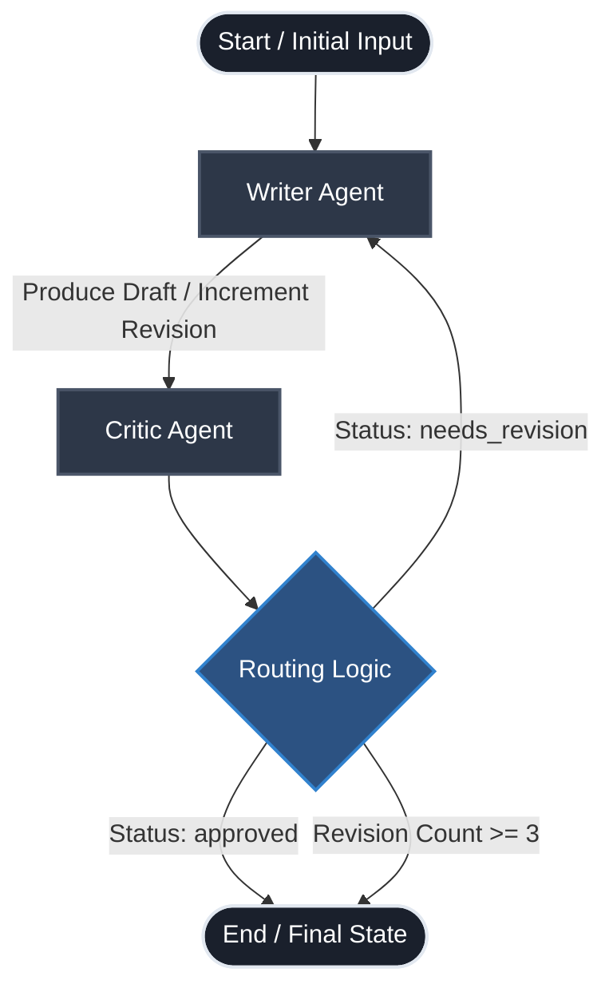
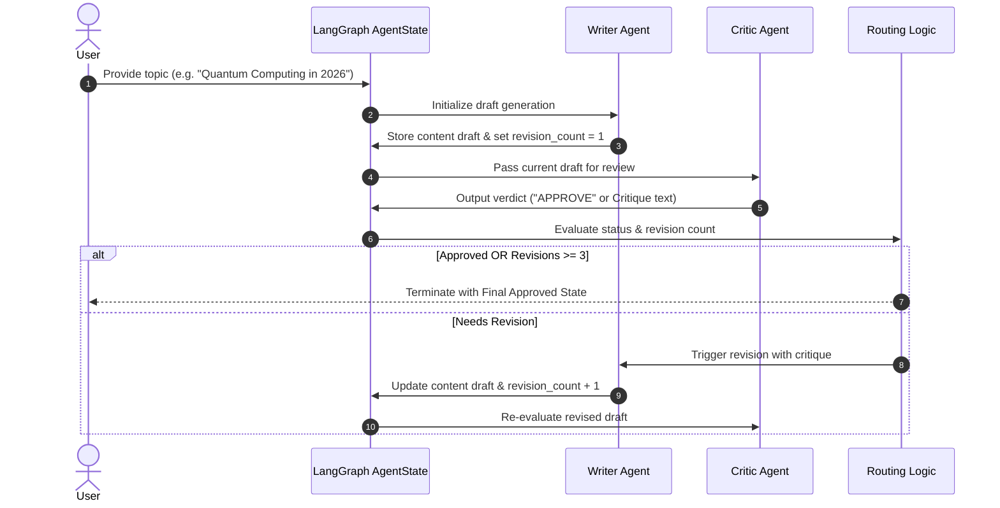

# Agent 1: Iterative Writer-Critic Refinement Graph

A LangGraph-powered autonomous multi-agent system implementing an **Iterative Refinement (Writer-Critic)** pattern for content creation, quality verification, and automated revisions.

---

## 1. System Scope & Objective

### 1.1 Objective
To autonomously generate high-quality, focused summaries on any given topic by creating an active critique-and-revision feedback loop between specialized agent nodes.

### 1.2 Scope
* **Draft Generation:** Writes initial content tailored to the requested topic.
* **Autonomous Peer Review:** An editor agent evaluates the draft for clarity, depth, and accuracy.
* **Targeted Revision:** If the draft does not meet approval criteria, feedback is fed back into the writer to address specific shortcomings.
* **Safety Bound:** Built-in breakout limit to avoid infinite revision cycles.
* **State Persistence:** Uses memory checkpointing to enable step-by-step state inspection and resumption.

---

## 2. Architecture & Design Diagram

### 2.1 Control Flow (Mermaid Diagram)



### 2.2 Sequence Diagram



---

## 3. State Schema Definition

The shared state is modeled using Python's `TypedDict` and flows through all graph nodes:

```python
class AgentState(TypedDict):
    topic: str             # Target subject matter provided by the user
    content: str           # Current draft version produced by the writer
    critique: str          # Constructive feedback provided by the critic
    revision_count: int    # Cumulative counter tracking refinement cycles
    status: str            # "approved" or "needs_revision"
```

---

## 4. Node Specifications

### 4.1 Writer Node (`writer_agent`)
* **Role:** Content Creator & Reviser.
* **Input:** `AgentState` containing `topic`, current `content`, and latest `critique`.
* **Behavior:**
  * If `content` is empty: Prompts LLM to produce a concise, engaging summary of the topic.
  * If `content` is present: Directs the LLM to rewrite the existing draft while directly resolving the issues raised in `critique`.
* **Output Update:** `{"content": "<new_text>", "revision_count": revision_count + 1}`.

### 4.2 Critic Node (`critic_agent`)
* **Role:** Quality Inspector & Editor.
* **Input:** `AgentState` containing `content`.
* **Behavior:**
  * Analyzes the draft against clarity and informative criteria.
  * Responds with exactly `"APPROVE"` if quality threshold is met.
  * Otherwise, generates a single-sentence constructive critique detailing what needs improvement.
* **Output Update:**
  * If approved: `{"status": "approved", "critique": ""}`
  * If rejected: `{"status": "needs_revision", "critique": "<feedback_text>"}`

---

## 5. Routing Logic & Termination Criteria

The conditional edge (`routing_logic`) evaluates state transitions after the critic runs:

1. **Safety Bound:** If `revision_count >= 3`, forces completion (`END`) to avoid infinite loops and token exhaustion.
2. **Success Criterion:** If `status == "approved"`, routes directly to `END`.
3. **Loop Continuation:** If `status == "needs_revision"`, routes control back to `writer`.

---

## 6. Execution & Persistence

### 6.1 Checkpointer Configuration
```python
memory = MemorySaver()
app = workflow.compile(checkpointer=memory)
```
Enables point-in-time state queries via `app.get_state(config={"configurable": {"thread_id": "1"}})` for debugging and auditing.

### 6.2 Running the Agent
```powershell
& "d:/develop/learnpython/venv/python.exe" d:/develop/agent1/app.py
```

---

## 7. Future Enhancements & Extensions
* **Pluggable Scoring:** Introduce numeric quality rubrics (e.g., readability index, tone score).
* **Multi-Critic Panel:** Add specialized reviewers (Fact-Checker, Style Editor, SEO Evaluator).
* **Human-in-the-Loop:** Pause graph execution using `interrupt_before=["writer"]` for human approval on draft versions.
