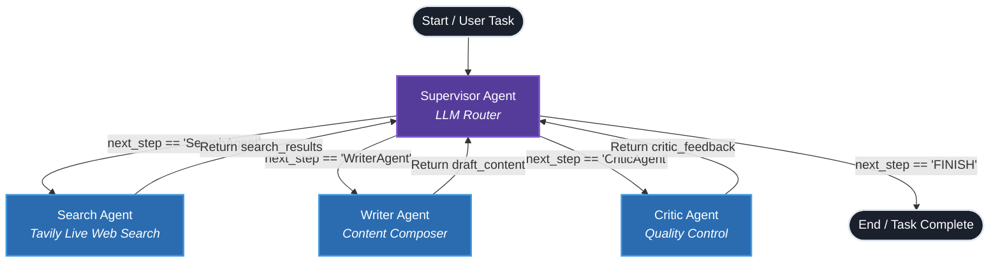

# Agent 2: Hierarchical Multi-Agent Supervisor System

A LangGraph-based **Hierarchical Multi-Agent System (Supervisor Pattern)** that coordinates real-time web research, content composition, and quality assurance through a centralized LLM team lead.

---

## 1. System Scope & Objective

### 1.1 Objective
To solve open-ended research and reporting tasks by autonomously delegating sub-tasks to specialized worker agents (Search, Writer, Critic) under the supervision of an orchestrator agent.

### 1.2 Scope
* **Intelligent Orchestration:** A Supervisor agent dynamically plans the workflow, inspects intermediate findings, and delegates the next action based on structured reasoning.
* **Live Web Intelligence:** Integrates external search tools (Tavily API) to ground drafts in current, verified facts.
* **Context-Aware Drafting:** Synthesizes collected facts into multi-paragraph reports.
* **Quality Assurance Loop:** Independent critic inspects factual consistency and completeness before granting final approval.
* **Dynamic Routing:** Supports non-linear transitions (e.g. searching again if critic finds missing facts).

---

## 2. Architecture & Design Diagram

### 2.1 Control Flow (Mermaid Diagram)



### 2.2 Sequence Diagram

```mermaid
sequenceDiagram
    autonumber
    actor User
    participant State as TeamState
    participant Sup as Supervisor (LLM)
    participant Search as SearchAgent (Tavily)
    participant Writer as WriterAgent
    participant Critic as CriticAgent

    User->>State: Provide Research Task
    State->>Sup: Evaluate initial state
    
    rect rgb(30, 41, 59)
        Note over Sup,Search: Phase 1: Fact Gathering
        Sup->>State: Select 'SearchAgent'
        State->>Search: Execute web query
        Search-->>State: Append structured search_results
        State->>Sup: Return to Supervisor
    end

    rect rgb(23, 37, 84)
        Note over Sup,Writer: Phase 2: Content Synthesis
        Sup->>State: Select 'WriterAgent'
        State->>Writer: Draft report using verified facts
        Writer-->>State: Update draft_content
        State->>Sup: Return to Supervisor
    end

    rect rgb(67, 24, 75)
        Note over Sup,Critic: Phase 3: Validation & Quality Control
        Sup->>State: Select 'CriticAgent'
        State->>Critic: Inspect draft against task
        Critic-->>State: Return 'APPROVED' or Critique
        State->>Sup: Return to Supervisor
    end

    Sup->>State: Select 'FINISH'
    State-->>User: Output Final Validated Report
```



---

## 3. State Schema & Structured Output

### 3.1 Shared Team State (`TeamState`)
```python
class TeamState(TypedDict):
    task: str             # High-level user query or research goal
    search_results: str   # Accumulated factual excerpts from web queries
    draft_content: str    # Current working draft of the report
    critic_feedback: str  # Latest review from the Critic
    next_step: str        # 'SearchAgent' | 'WriterAgent' | 'CriticAgent' | 'FINISH'
```

### 3.2 Supervisor Structured Output (`SupervisorDecision`)
Enforces deterministic routing from the supervisor using Pydantic:
```python
class SupervisorDecision(BaseModel):
    reasoning: str = Field(description="Internal logic for choosing the next action.")
    next_agent: Literal["SearchAgent", "WriterAgent", "CriticAgent", "FINISH"] = Field(
        description="The next specialized agent to call, or FINISH if content is fully approved."
    )
```

---

## 4. Specialized Worker Specifications

### 4.1 Supervisor Node (`supervisor_agent`)
* **Role:** Team Lead & Task Coordinator.
* **Prompt Rules:**
  1. If factual data is missing → Route to `SearchAgent`.
  2. If facts are present without a draft (or needs revision) → Route to `WriterAgent`.
  3. If a fresh draft is produced → Route to `CriticAgent`.
  4. Only route to `FINISH` when the Critic explicitly confirms approval.

### 4.2 Search Node (`search_agent`)
* **Role:** External Web Researcher.
* **Tool:** `TavilySearch(max_results=2)`
* **Output:** Formats source URLs and text content into structured context blocks for the writer.

### 4.3 Writer Node (`writer_agent`)
* **Role:** Technical Report Writer.
* **Behavior:** Combines the user query, accumulated research facts, and any prior critic feedback into a cohesive multi-paragraph report.

### 4.4 Critic Node (`critic_agent`)
* **Role:** Quality Assurance & Fact Reviewer.
* **Behavior:** Verifies completeness and quality. Outputs `"APPROVED"` or exact correction requirements.

---

## 5. Routing Map

Conditional routing from the supervisor is handled via `supervisor_router`:

```python
def supervisor_router(state: TeamState) -> Literal["SearchAgent", "WriterAgent", "CriticAgent", "__end__"]:
    destination = state["next_step"]
    if destination == "FINISH":
        return END
    return destination
```

Every worker node has a direct edge returning back to `Supervisor` to allow continuous re-evaluation of state.

---

## 6. Execution & Setup

### 6.1 Requirements
* Local LLM runtime (e.g., **Ollama** running `llama3.2:3b`) or Cloud LLM (OpenAI / Groq).
* `TAVILY_API_KEY` configured in `.env` for web search execution.

### 6.2 Running the Team
```powershell
& "d:/develop/learnpython/venv/python.exe" d:/develop/agent2/app.py
```

---

## 7. Future Enhancements & Extensions
* **Parallel Tool Execution:** Allow simultaneous search across multiple query variations.
* **Specialized Sub-teams:** Add Code Execution or Data Visualization worker nodes.
* **Dynamic Tool Selection:** Let the Supervisor select from a tool registry dynamically rather than fixed node routing.
