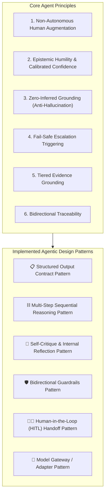
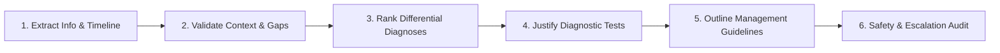
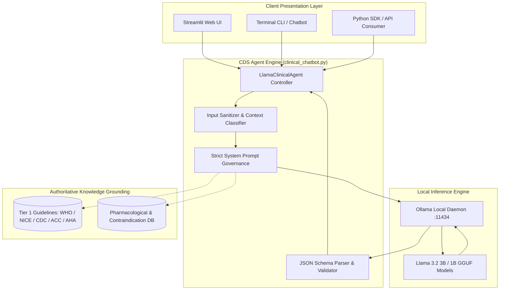
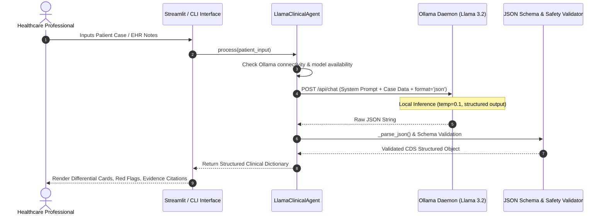
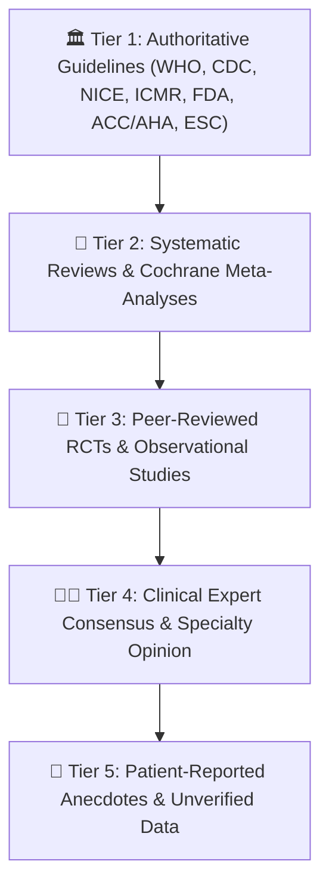

# 🩺 Clinical Decision-Support (CDS) Agent

An enterprise-grade, safety-first **Clinical Decision-Support (CDS) Agent** powered by local Large Language Models (**Llama 3.2** via Ollama). Designed to assist qualified healthcare professionals by analyzing patient data and producing structured, evidence-grounded differential evaluations, diagnostic recommendations, and safety triage without relying on external cloud APIs.

---

## 📑 Table of Contents

1. [Executive Summary & Scope](#-executive-summary--scope)
2. [Agent System Principles & Design Patterns](#-agent-system-principles--design-patterns)
   - [Core Agent Principles (The 6 Pillars)](#1-core-agent-principles-the-6-pillars)
   - [Agentic Design Patterns Implemented](#2-agentic-design-patterns-implemented)
3. [High-Level Design (HLD)](#-high-level-design-hld)
4. [Low-Level Design (LLD) & Components](#-low-level-design-lld--components)
5. [Safety, Guardrails & Non-Goals](#-safety-guardrails--non-goals)
6. [Evidence Policy & Guideline Hierarchy](#-evidence-policy--guideline-hierarchy)
7. [Clinical Reasoning Pipeline](#-clinical-reasoning-pipeline)
8. [Input & Output Schema Contract](#-input--output-schema-contract)
9. [Setup & Installation](#-setup--installation)
10. [Running the Application](#-running-the-application)
    - [Web UI Dashboard (Streamlit)](#1-web-ui-dashboard-streamlit)
    - [Interactive Terminal CLI](#2-interactive-terminal-cli)
    - [Programmatic Python SDK](#3-programmatic-python-sdk)
11. [Design Constraints & Assumptions](#-design-constraints--assumptions)
12. [Roadmap & Future Extensions](#-roadmap--future-extensions)

---

## 🎯 Executive Summary & Scope

### In-Scope
* **Differential Diagnostic Ranking:** Formulating a calibrated, ranked differential diagnosis based on patient demographics, symptoms, history, and vitals.
* **Evidence-Grounded Rationale:** Mapping every medical consideration to Tier 1 clinical guidelines (WHO, CDC, NICE, ACC/AHA, ICMR, FDA).
* **Missing Data & Contradiction Detection:** Proactively flagging missing critical history (e.g., allergies, baseline meds) and conflicting signs.
* **Safety Triage & Red Flag Warnings:** Identifying life-threatening presentations (e.g., acute pulmonary embolism, ACS, sepsis) and issuing emergency clinician escalation flags.
* **Air-Gapped & Local Execution:** Full on-premise execution via Ollama (Llama 3.2 3B/1B) ensuring HIPAA-compatible privacy and data isolation.

### Non-Goals (Out of Scope)
* ❌ **No Autonomous Prescribing or Diagnosis:** The agent does not prescribe medications or make unilateral clinical determinations.
* ❌ **No Direct Patient Triaging:** Designed strictly as decision-support for qualified clinicians, not as a direct-to-consumer emergency triage bot.
* ❌ **No Data Hallucination:** The agent strictly prohibits inferring missing physiological data.

---

## 🧠 Agent System Principles & Design Patterns

The architecture of this Clinical Decision-Support Agent is built upon rigorous AI agent engineering principles and formalized agentic design patterns to guarantee clinical safety, explainability, and determinism.



---

### 1. Core Agent Principles (The 6 Pillars)

| # | Principle | Description & Clinical Guarantee |
| :--- | :--- | :--- |
| **1** | **Augmentative, Non-Autonomous Agency** | The agent never acts as a primary physician. It acts exclusively as a cognitive amplifier, organizing complex data so clinicians make the final determination. |
| **2** | **Epistemic Humility & Calibrated Confidence** | The agent must explicitly know what it does not know. Confidence scores (0.0–1.0) reflect objective evidence density, preventing unjustified certainty in ambiguous presentations. |
| **3** | **Zero-Inferred Grounding (Anti-Hallucination)** | Every piece of patient information is categorized (`VERIFIED`, `PATIENT_REPORTED`, `MISSING`, `CONTRADICTORY`). The agent is forbidden from assuming unstated physiological values. |
| **4** | **Fail-Safe Safety Escalation** | Patient safety supersedes all other goals. In any high-acuity, contradictory, or low-confidence scenario, the agent immediately sets `clinician_review_required: true`. |
| **5** | **Tiered Evidence Grounding** | Medical reasoning must adhere to an authoritative evidence hierarchy (Tier 1 Guidelines > Tier 2 Systematic Reviews > Tier 3 Studies). |
| **6** | **Bidirectional Traceability** | For every differential diagnosis, the agent must output both **supporting evidence** and **contradicting evidence**, preventing confirmation bias. |

---

### 2. Agentic Design Patterns Implemented

#### A. Structured Output Contract Pattern (Grammar-Constrained Generation)
* **Problem:** Traditional LLMs produce unstructured conversational prose that is brittle and difficult for clinical software to parse reliably.
* **Implementation:** The agent enforces a strict, machine-readable JSON contract with zero explanatory Markdown outside the schema (`format="json"` with regex validation fallbacks). Every response cleanly populates structured clinical arrays.

#### B. Plan-and-Solve / Multi-Step Sequential Reasoning Pattern
* **Problem:** Single-shot LLM inference often jumps to premature diagnostic conclusions without thorough differential analysis.
* **Implementation:** The prompt enforces a deterministic 6-phase reasoning chain:
  $$\text{Extract} \longrightarrow \text{Validate} \longrightarrow \text{Rank Differential} \longrightarrow \text{Justify Tests} \longrightarrow \text{Recommend Guidelines} \longrightarrow \text{Safety Audit}$$



#### C. Self-Critique & Internal Reflection Pattern (Iterative Control Loop)
* **Problem:** AI models can miss drug contraindications or generate ungrounded claims on initial draft generation.
* **Implementation:** Implements an internal 3-iteration control loop:
  - **Iteration 1 (Extraction & Drafting):** Ingests raw input and creates baseline differential.
  - **Iteration 2 (Guideline & Contradiction Verification):** Checks drafted conditions against contraindications and guidelines.
  - **Iteration 3 (Safety & Output Validation):** Audits confidence scores, flags life-threatening red flags, and ensures schema validity before emitting output.

#### D. Human-in-the-Loop (HITL) Handoff Pattern
* **Problem:** Medical decisions require certified human accountability and bedside clinical examination.
* **Implementation:** The system design establishes an explicit HITL boundary:
  - Generates actionable next-steps for the clinician.
  - Explicitly states `missing_information` needed before definitive action.
  - Generates clear triage warning badges (`CRITICAL`, `WARNING`, `INFO`).

#### E. Bidirectional Guardrails Pattern
* **Input Guardrails:** Validates completeness and categorizes input sources (e.g., patient-reported vs. verified lab test).
* **Output Guardrails:** Verifies that no autonomous prescriptions are made and flags high-risk pharmacological contraindications.

#### F. Model Adapter / Gateway Pattern
* **Problem:** Different clinical environments require local air-gapped models (Ollama), cloud LLMs, or offline simulators.
* **Implementation:** `LlamaClinicalAgent` abstracts the underlying inference backend, supporting local Ollama (`llama3.2:3b`, `llama3.2:1b`, `phi3`), OpenAI, Anthropic, or mock offline fallback seamlessly.

---

## 🏗️ High-Level Design (HLD)

The system is architected around a multi-tier pipeline separating ingestion, prompt governance, local inference execution, and UI presentation.



---

## ⚙️ Low-Level Design (LLD) & Components



### Module Responsibilities

| File | Component | Description |
| :--- | :--- | :--- |
| `clinical_chatbot.py` | `LlamaClinicalAgent` | Primary controller managing Ollama communication, system prompt governance, auto-model detection (`llama3.2:3b`), and response normalization. |
| `clinical_chatbot.py` | `SYSTEM_PROMPT` | Grounded clinical prompt enforcing evidence tiers, confidence calibration (0.0–1.0), and strict JSON contract. |
| `streamlit_app.py` | Web UI Dashboard | Reactive web application featuring clinical triage tabs, differential confidence bars, safety alerts, and benchmark test cases. |

---

## 🛡️ Safety, Guardrails & Non-Goals

The CDS Agent operates under the **Core Safety Principle**:
> *"Never guess when patient safety is involved. When evidence is insufficient: state uncertainty → identify missing info → explain impact → recommend clinician review."*

### 1. Confidence Calibration Protocol
Confidence scores must reflect objective evidence density rather than subjective probability:
* `0.90 – 1.00`: **Strong Evidence** (Definitive objective labs/imaging matching Tier 1 criteria).
* `0.75 – 0.89`: **Good Evidence** (Consistent clinical picture with authoritative guideline alignment).
* `0.60 – 0.74`: **Moderate Evidence** (Compatible presentation; critical confirmatory tests pending).
* `0.40 – 0.59`: **Low Evidence** (Atypical features or missing core diagnostic markers).
* `< 0.40`: **Very Low Evidence** (Speculative or insufficient data).

### 2. Mandatory Escalation Triggers
The field `clinician_review_required: true` is triggered whenever:
1. Overall confidence falls below `0.60`.
2. Conflicting or contradictory patient data is detected.
3. High-acuity safety flags are raised (e.g., SpO2 < 90%, ischemic ECG changes, unstable vitals).
4. High-risk medications have known contraindications in the presenting context.

---

## 📚 Evidence Policy & Guideline Hierarchy

All diagnostic considerations and management insights adhere to a strict evidence hierarchy:



* Guidelines must include **Organization**, **Title**, **Year**, and **DOI/URL**.
* If currency is uncertain, `citation_status` is marked as `"NOT_VERIFIED"`.

---

## 🔄 Clinical Reasoning Pipeline

The agent executes a 6-step internal clinical reasoning loop for every input case:

1. **Information Extraction:** Extracts symptoms, timeline, abnormal vitals, risk factors, medications, and allergies.
2. **Context Classification:** Classifies each piece of data as `VERIFIED`, `PATIENT_REPORTED`, `INFERRED`, `MISSING`, or `CONTRADICTORY`.
3. **Differential Generation:** Builds a ranked differential with explicit supporting and contradicting evidence points.
4. **Diagnostic Pathway Justification:** Recommends targeted diagnostic tests accompanied by rationale and guideline citations.
5. **Management Considerations:** Formulates guideline-supported therapeutic considerations and contraindications.
6. **Safety & Completeness Audit:** Scans for hallucinations, verifies red flags, and determines clinician review requirement.

---

## 📋 Input & Output Schema Contract

The agent guarantees an output conforming strictly to the following JSON specification:

```json
{
  "patient_info": {
    "demographics": {
      "age": "number | null",
      "sex": "string | null"
    },
    "classified_inputs": [
      {
        "field": "string",
        "value": "string",
        "classification": "VERIFIED | PATIENT_REPORTED | INFERRED | MISSING | CONTRADICTORY"
      }
    ]
  },
  "clinical_summary": {
    "timeline": "string",
    "key_findings": ["string"]
  },
  "possible_conditions": [
    {
      "condition": "string",
      "rank": 1,
      "confidence": 0.85,
      "supporting_evidence": ["string"],
      "contradicting_evidence": ["string"]
    }
  ],
  "recommended_tests": [
    {
      "test_name": "string",
      "rationale": "string",
      "guideline_support": "string"
    }
  ],
  "treatment_guidelines": [
    {
      "consideration": "string",
      "guideline_source": "string",
      "contraindications": ["string"]
    }
  ],
  "missing_information": [
    {
      "information_type": "string",
      "value": "Unknown"
    }
  ],
  "contradictions": ["string"],
  "safety_flags": [
    {
      "severity": "CRITICAL | WARNING | INFO",
      "flag": "string",
      "recommended_action": "string"
    }
  ],
  "clinician_review": {
    "clinician_review_required": true,
    "reasons": ["string"]
  },
  "citations": [
    {
      "organization": "string",
      "title": "string",
      "year": "string",
      "doi_or_url": "string",
      "citation_status": "VERIFIED | NOT_VERIFIED"
    }
  ],
  "error_fields": []
}
```

---

## 🚀 Setup & Installation

### Prerequisites
* **Python 3.10+**
* **Ollama** installed on your system ([Download Ollama](https://ollama.com/download))
* Pull the Llama 3.2 model:
  ```bash
  ollama pull llama3.2:3b
  ```

### Virtual Environment Setup
```bash
# Clone or navigate to the workspace
cd d:\develop\CEG\3.clinicalagent

# Activate virtual environment (if using existing venv)
& d:/develop/learnpython/venv/python.exe -m pip install streamlit langchain-ollama
```

---

## 💻 Running the Application

### 1. Web UI Dashboard (Streamlit)
Launch the interactive web UI:
```powershell
& d:/develop/learnpython/venv/python.exe -m streamlit run d:\develop\CEG\3.clinicalagent\streamlit_app.py
```
Open your browser at `http://localhost:8501`.

### 2. Interactive Terminal CLI
Run directly in PowerShell or Command Prompt:
```powershell
& d:/develop/learnpython/venv/python.exe d:\develop\CEG\3.clinicalagent\clinical_chatbot.py
```

### 3. Programmatic Python SDK
Integrate the agent into any existing Python pipeline:
```python
from clinical_chatbot import LlamaClinicalAgent

# Auto-connects to local Ollama daemon
agent = LlamaClinicalAgent()

case_notes = """
62yo female presenting with acute pleuritic chest pain and dyspnea.
Recent right total knee arthroplasty 10 days ago.
Vitals: BP 100/65, HR 118 bpm, SpO2 88% on room air.
Exam: Right calf swollen and tender.
"""

response = agent.process(case_notes)

# Access structured insights
print("Top Diagnosis:", response["possible_conditions"][0]["condition"])
print("Confidence:", response["possible_conditions"][0]["confidence"])
print("Critical Flags:", response["safety_flags"])
```

---

## ⚠️ Design Constraints & Assumptions

1. **On-Device Compute:** The agent is designed for local inference with quantization (`llama3.2:3b` Q4_K_M ~ 2.0 GB VRAM/RAM), allowing execution on standard clinician workstations without dedicated GPUs.
2. **Context Window:** Model context is optimized for clinical notes up to 8k tokens.
3. **Structured JSON Output:** Utilizes Ollama's native JSON enforcement (`format="json"`) coupled with secondary regex/parser sanitizers to prevent token generation breaks.
4. **Latency:** Local inference typically completes in 2–5 seconds depending on hardware CPU/GPU offload.

---

## 🗺️ Roadmap & Future Extensions

- [ ] **FHIR / HL7 Integration:** Direct ingestion of FHIR JSON patient bundles.
- [ ] **DICOM / Medical Imaging Multimodal Support:** Integration with vision-language models (e.g. `llama3.2-vision`) for X-ray and CT triage.
- [ ] **Live PubMed / RAG Verification:** Vector database lookup for real-time validation against the latest 2025/2026 medical literature.
- [ ] **EHR Smart-on-FHIR App:** Packaging the Streamlit dashboard as an embedded SMART-on-FHIR clinical widget.
